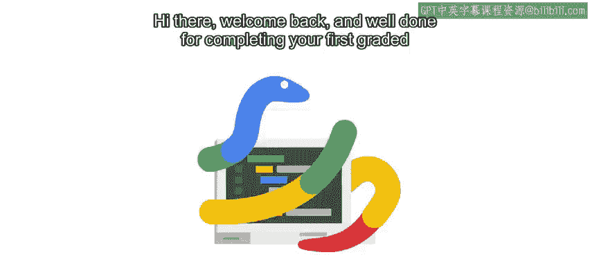

#  020：Python基本语法介绍 🐍

在本节课中，我们将要学习Python编程语言的基本语法。我们将探讨变量、表达式、函数和条件语句等核心构建块。理解这些基础概念是编写有效Python代码的关键。

***

欢迎回来。恭喜你完成了第一次分级评估。

到目前为止，你做得非常出色。我们已涵盖的一些主题有时可能有点棘手，尤其是如果你完全是编程新手。

如果某些内容没有立刻理解，请不要担心。我们介绍了很多新概念，可能需要反复学习几次才能熟练掌握。这完全正常。我们每个人在学习编码时都经历过这个过程。

***

在之前的模块中，我们探讨了一些基本概念，如编程和自动化。我们提到每种编程语言都有特定的语法，我们需要学习这些语法才能告诉计算机该做什么。

我们随后预览了可以用Python完成的一些事情。

接下来，我们将更深入地探讨Python语法的一些基本构建块，例如变量、表达式、函数和条件语句块。乍一看，这些部分可能看起来相当简单。但当我们开始组合它们时，它们会变得更加强大。

***

理解编程语言的语法与学习口语没有太大不同。例如，学习西班牙语的最佳方法是访问一个说西班牙语的国家，沉浸在该文化中，倾听人们说话，然后弄清楚如何排列单词以形成另一个说话者能理解的句子。编程也是如此。

当你沉浸在Python编程中时，你将学习如何制定计算机能理解的代码语句。这被称为语法。

***

好的，在接下来的几个视频中，请记住我们的主要目标是学习语言的语法。因此，我们将专注于如何告诉计算机做什么，而不是如何让它执行复杂的任务。

像之前一样，我们将进行一些简单的练习，帮助你看到这些概念的实际应用。

随着你掌握新技能并熟悉不同的工具，我们将开始编写更高级的脚本来解决更具挑战性的问题。

***

再次强调，如果在任何时候你感到困惑或觉得某些内容不清楚，请记住，你可以根据需要多次观看视频和进行练习测验。精通编程的关键在于练习、练习、再练习。你必须不断锻炼你的编程“肌肉”才能变得强大，就像在健身房锻炼肌肉一样。努力训练，定期训练，你很快就能处理更复杂的编码问题。

***

好的，准备好继续学习了吗？在下一个视频中，我们将全面学习数据类型。

让我们开始吧。

***

本节课中，我们一起学习了Python语法的重要性及其与学习口语的相似之处。我们回顾了之前模块的内容，并预告了接下来将深入学习的核心构建块：变量、表达式、函数和条件语句。掌握这些基础是迈向编写强大Python脚本的第一步。