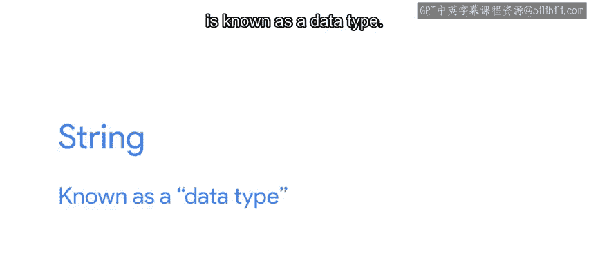
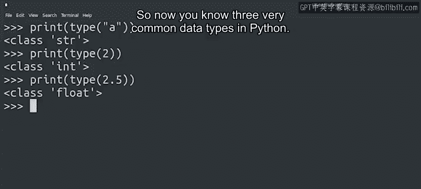

#  021：Python数据类型 🧱




在本节课中，我们将要学习Python编程中的核心概念之一：数据类型。我们将了解什么是数据类型，为什么它们很重要，以及如何识别和使用几种最常见的数据类型。

## 概述

在之前的视频中，我们提到在引号之间书写的文本在Python中被称为字符串。在编程术语中，字符串被称为一种**数据类型**。

无论是手机游戏还是用于自动创建用户帐户的脚本，大多数程序都需要处理某种数据，而这些数据可以有许多不同的形式，我们称之为**数据类型**。

## 什么是数据类型？

字符串只是Python中的一种数据类型。还有很多其他类型，例如：
*   **整数**：表示没有小数部分的整数，如 `1`。
*   **浮点数**：表示实数，即带有小数部分的数字，如 `2.5`。

通常，你的计算机不知道如何混合不同的数据类型。例如，将两个整数相加对计算机来说完全合理，就像这样：
```python
7 + 8
```
将两个字符串相加也有意义。我们最终会得到一个包含这两个字符串的更长字符串，就像这样：
```python
"Hello" + "World"
```
但是你的计算机不知道如何将一个整数和一个字符串相加。如果你让它混合这两种不同的数据类型，你的计算机将不知道该怎么办，并会“引发一个错误”。

## 处理类型错误

让我们看看会发生什么：
```python
7 + "8"
```
哦不，我们的第一个错误。但不要惊慌。错误是编程中常见的一部分，你可能需要经常处理它们。诀窍是把错误看作是计算机给你的小提示，帮助你提高编程技能。

仔细阅读错误信息，理解它们告诉你的内容，然后利用这些新知识来帮助你修复错误。在这个例子中，错误信息的最后一行显示我们遇到了一个叫做**类型错误**的东西。我们得到了一些解释性文本，告诉我们不能在`int`类型和`str`类型之间使用加号，`int`和`str`分别是整数和字符串的简称。

根据我们已经学到的关于字符串、整数和混合数据类型的知识，你能猜出这个错误试图告诉我们什么吗？

“unsupported operand type”这条信息告诉我们，不能将整数`7`和字符串`"8"`相加，因为它们是不同的数据类型。

但如果你没有老师来指出这一点，你怎么会知道呢？你需要运用你的研究技能和我们在课程前面提到的资源来进行一些调查。例如，你可以通过将类型错误信息粘贴到你最喜欢的搜索引擎的搜索栏中来查找有关该错误的信息。这是几乎所有学习编码的人，甚至是有经验的开发人员常用的技巧。你通常会发现互联网上的其他人也报告过类似的错误并解决了它们。

回到我们的例子，也许你在想，我们这里不是在加两个数字吗？看起来有点像，对吧？那么，仔细看，记住在Python中，任何用引号包裹的东西都被视为字符串。所以`"8"`在这里是一个字符串，而`7`对计算机来说是一个整数。`7`加`"8"`对我们来说就像`7`加`"a"`一样奇怪，而`7`加`"a"`完全没有意义。

## 识别数据类型

从它们能代表的信息角度来思考数据类型可能会有所帮助。例如，文件名可以表示为**字符串**数据类型，而该文件的大小可能是一个**整数**数据类型。



如果你不能100%确定某个值是什么数据类型，Python提供了一种方便的方法来找出答案。你可以使用`type()`函数让计算机告诉你类型。在处理别人编写的代码，并且你不确定它使用什么数据类型时，这可能会派上用场。例如：
```python
type("a")
type(2)
type(2.5)
```
这告诉我们`"a"`属于`str`类，正如我们之前所说，它是`string`的缩写。数字`2`属于`int`类，它是`integer`的缩写。`2.5`属于`float`类。我们将在课程后面更多地讨论“类”的含义。现在，你可以直接把它当作数据类型的同义词。

## 总结

本节课中我们一起学习了Python中三种非常常见的数据类型：**字符串**、**整数**和**浮点数**。很快你还会用到许多其他数据类型，但目前不必担心。随着课程的继续，我们会遇到更多的数据类型，并学习如何与它们中的每一个进行交互。目前，只需记住混合数据类型会让你的计算机……嗯，完全混乱。所以，让你的字符串和字符串在一起，整数和整数在一起，浮点数和浮点数在一起，这样你就不会陷入太多麻烦。