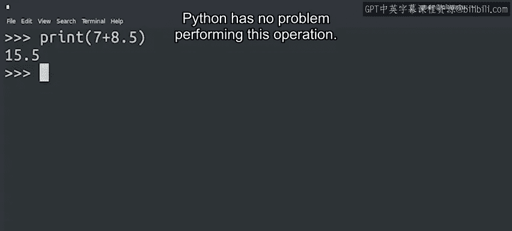
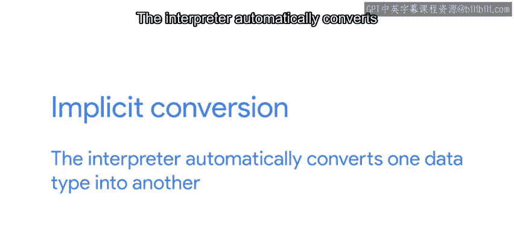
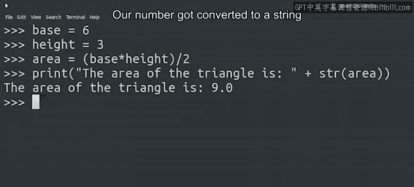

#  022：表达式、数字与类型转换 🧮

在本节课中，我们将学习Python中不同类型数据之间的运算规则，特别是数字类型（整数和浮点数）的隐式转换，以及如何通过显式转换将数字与字符串结合使用。我们还会回顾字符串拼接的基本操作。

---

在之前的视频中，我们了解到不能在整数和字符串之间使用加号运算符，因为它们是不同的数据类型。

但如果尝试用整数和浮点数进行运算，会发生什么？让我们来探索一下。

Python可以毫无问题地执行这个操作。

但这是怎么回事？整数和浮点数不是两种不同的数据类型吗？确实是。

但幕后发生了很多事情。在后台，计算机正忙着自动将我们的整数7转换为浮点数7.0。

这使得Python能够将两个值相加，返回一个同样是浮点数的结果。我们称这个过程为**隐式转换**。解释器自动将一种数据类型转换为另一种。

---

我们之前提到过这一点，但值得再次强调：Python的运算不仅限于数字。

你也可以使用加号运算符来拼接字符串。这让你能够将单个单词组合成句子。

只是别忘了在每个单词之间添加空格。否则，计算机会将它们全部连在一起。

---

那么，如果你真的想将一个字符串和一个数字结合起来，可能吗？当然可能。

但这需要通过**显式转换**来实现。在Python中，要在不同数据类型之间转换，我们需要调用一个以目标类型命名的函数。让我们看看这是如何工作的。

现在，事情变得稍微复杂一些。让我们花点时间来解析一下，确保一切都清晰明了。

在这个脚本中，我们首先计算一个三角形的面积。在打印时，我们将其添加到一个字符串中。为此，我们需要调用`str()`函数来将数字转换为字符串。

让我们执行它，看看会发生什么。

我们的数字被转换成了字符串，并与消息一起打印了出来。

---

我们学习了一些关于变量、值、表达式和转换的知识。接下来，有一个练习测验来帮助你巩固所学知识。

像往常一样，如果需要，请花时间复习内容。你完全可以做到。

完成后，我们下一个视频再见。