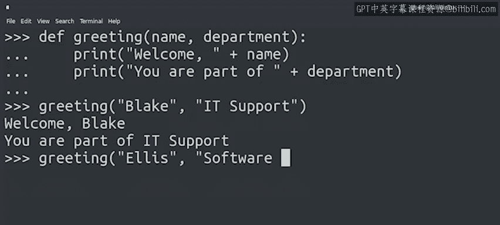

#  023：Python函数定义 🧱


在本节课中，我们将要学习Python编程中的一个核心概念：函数。函数是组织代码、实现特定任务的重要工具。我们将从定义函数的基本语法开始，逐步理解其结构和用法。

---

## 概述

到目前为止，我们已经学习了变量、表达式和操作，它们是脚本中最小的组成部分。接下来，我们将学习函数，这是另一个关键的编程构建块。

在我们的示例中，我们已经遇到过一些Python内置函数，例如用于在屏幕上输出文本的`print`函数、用于确定值类型的`type`函数，以及将数字转换为字符串的`str`函数。这些函数是语言的一部分。在本课程中，我们将探索更多Python内置函数。

现在，我们将学习如何定义自己的函数，以指示计算机执行语言内置函数所不具备的功能。

---

## 定义第一个函数

让我们从一个简单的例子开始。

```python
def greeting(name):
    print("Welcome, " + name)
```

在这段代码中，我们定义了一个函数。该函数接收一个参数`name`，并为该名字打印一条问候语。

这个代码片段虽然简短，但已经展示了在Python中定义函数的许多重要要点。让我们逐步分析。

要定义一个函数，我们使用`def`关键字。函数名是关键字之后的部分。在这个例子中，函数名是`greeting`。因此，在脚本后面调用该函数时，我们将使用`greeting`这个词。

在函数名之后，我们列出函数的参数，它们写在括号内。在这个例子中，我们只有一个参数`name`，行末有一个冒号。

冒号之后是函数体，这是我们声明希望函数执行什么操作的地方。请注意函数体是如何向右缩进的。这是Python的一个关键特性，我们会经常遇到。目前，只需记住函数体必须在定义的右侧。

在这个例子中，函数体只包含一行代码，即调用`print`函数。看起来很简单，对吧？

但创建函数实际上可以非常强大。函数体可以包含任意多行代码，并执行各种有趣的操作。我们将在后续视频中详细探讨。现在，让我们执行我们的函数，看看会发生什么。

```python
greeting("Kay")
```

输出：
```
Welcome, Kay
```

---

## 增强函数功能

这很好，但还不够有趣。让我们让它做更多事情。

上一节我们介绍了如何定义一个简单的单参数函数。本节中我们来看看如何定义接收多个参数、执行更复杂操作的函数。

以下是增强版的`greeting`函数：

```python
def greeting(name, department):
    print("Welcome, " + name)
    print("You are part of " + department)
```

我们的函数现在接收两个参数，而不是一个：`name`和`department`。它输出两条独立的消息。再次注意缩进。我们可以在函数体中添加任意多行代码，但每一行必须向右缩进相同数量的空格。在这个例子中，我们使用了四个空格。我们也可以使用两个、八个或任何其他数量的空格，只要它们都保持一致。

让我们尝试调用我们新的、增强版的`greeting`函数。

```python
greeting("Blake", "IT Support")
```

输出：
```
Welcome, Blake
You are part of IT Support
```

这更有用了。我们只是刚刚触及了使用函数所能实现功能的表面。



---

## 函数的能力与回顾

请记住，这些只是简单的例子。函数能做的远不止打印消息。在本课程以及接下来的课程中，我们将探索使用Python可以完成的一系列其他任务，并且通常我们会将它们写在函数内部。

到目前为止，你感觉如何？这些新概念来得又快又多。现在，你是否开始掌握这一切了？如果是，那太好了！如果有些内容仍然有些模糊，现在是一个回顾我们迄今为止所涵盖的所有内容的好时机。

一旦你感觉良好，请在下一个视频中与我见面。

---

## 总结

本节课中我们一起学习了Python函数的基础知识。我们了解了使用`def`关键字定义函数的基本语法，包括函数名、参数和函数体。我们看到了如何通过缩进来组织函数体内的代码，并实践了定义和调用接收不同数量参数的函数。函数是封装代码逻辑、提高代码可重用性的强大工具，是我们后续学习的重要基础。