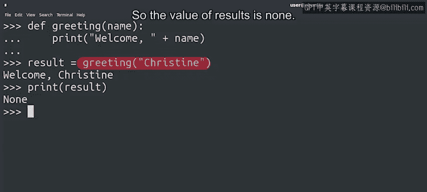
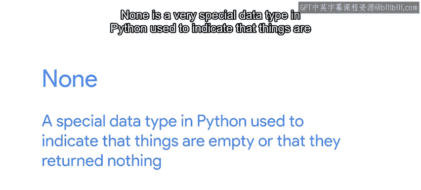

#  024：Python 函数返回值详解 📤


在本节课中，我们将要学习函数中一个至关重要的概念：返回值。我们将了解如何从函数中获取计算结果，以及如何利用这些值进行更复杂的操作。

## 概述

我们已经了解了如何通过参数将值传递给函数。但是，如何从函数中获取值呢？这就是返回值发挥作用的地方。函数执行的工作可以产生新的结果。我们可以将这些结果打印到屏幕上，但如果我们想在脚本的后续部分使用这些结果，或者根本不想打印它们，该怎么办呢？我们可以通过从自定义的函数中返回值来实现这一点。

## 从函数中返回值

让我们回到计算三角形面积的例子。你是否还记得我们之前练习中的三角形示例？三角形的面积计算公式是：**`面积 = 底 * 高 / 2`**。想象一下，如果我们需要在代码中多次计算这个值，那么拥有一个能为我们完成此功能的函数将会非常有用。

以下是这个函数的样子：

```python
def area_triangle(base, height):
    return base * height / 2
```

我们使用关键字 **`return`** 来告诉 Python，这是函数的返回值。当我们调用函数时，可以将该值存储在一个变量中。

假设我们有两个三角形，并且想计算它们面积的总和。以下是我们的做法：

首先，我们分别计算两个面积。然后，将两个面积相加。最后，打印结果，并将其转换为字符串。

```python
area_a = area_triangle(5, 4)
area_b = area_triangle(7, 3)
sum = area_a + area_b
print("The sum of both areas is: " + str(sum))
```

在这个例子中，`area_triangle` 函数返回一个值，即三角形的面积。我们为每次函数调用将该值存储在不同的变量中（本例中是 `area_a` 和 `area_b`）。然后，我们使用这些值进行操作，将它们相加到名为 `sum` 的变量中，并且只打印这个最终结果。

这展示了 **`return`** 语句的强大之处。它允许我们将函数调用组合成更复杂的操作，从而使你的代码更具可重用性。

## 返回多个值

Python 中的返回语句更有趣，因为我们可以用它来返回多个值。假设你有一个以秒为单位的时间长度，你想将其转换为等效的小时、分钟和秒数。

以下是如何在 Python 中实现：

```python
def convert_seconds(seconds):
    hours = seconds // 3600
    minutes = (seconds - hours * 3600) // 60
    remaining_seconds = seconds - hours * 3600 - minutes * 60
    return hours, minutes, remaining_seconds
```

你发现这个函数中的新运算符了吗？那个双斜杠运算符叫做 **地板除法**。

地板除法将一个数除以另一个数，并取除法结果的整数部分。例如，**`5 // 2`** 的结果是 2，而不是 2.5。

在我们的例子中，第一个操作是计算给定秒数中有多少小时。第二个操作则是在减去小时数后，计算剩余多少分钟，以及在减去分钟数后，还剩下多少秒。

我们最终得到三个数字作为结果，因此函数返回所有这三个值。

让我们看看调用这个函数时的样子：

```python
hours, minutes, seconds = convert_seconds(5000)
print(hours, minutes, seconds)
```

因为我们知道函数返回三个值，所以我们将函数的结果分配给三个不同的变量。

## 返回“空”值（None）

关于返回值，还有最后一点需要说明：函数可以什么都不返回，这是完全可以的。让我们看一个之前视频中的例子：

```python
def greeting(name):
    print("Welcome, " + name)
```

这个函数只是打印了一条消息，没有返回任何内容。如果我们尝试将这个函数的“值”赋给一个变量，你认为会发生什么？让我们试试看：



```python
result = greeting("Alice")
print(result)
```



这里，当我们调用函数时，它如预期一样打印了一条消息。我们将返回值存储在 `result` 变量中，但函数中没有 `return` 语句。所以 `result` 的值是 **`None`**。

**`None`** 是 Python 中一种非常特殊的数据类型，用于表示事物是空的或者它们没有返回任何内容。

## 总结

本节课中，我们一起学习了关于函数和返回值的丰富知识。我们了解了如何使用 `return` 语句从函数中获取单个或多个结果，以及如何处理不返回任何内容的函数（其结果为 `None`）。记住，掌握这些概念的关键是尽可能多地练习编写你刚刚学到的代码。函数和返回值可能是需要掌握的比较棘手的概念，但它们让我们能够做很多很酷的事情。所以，投入时间和精力去学习它，你会获得非常有价值的回报。😊