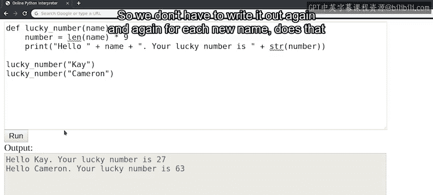

#  025：代码重用原则 🧩


在本节课中，我们将要学习如何通过函数来组织和重用代码，从而让脚本更加清晰、高效。

---

## 函数的力量

上一节我们介绍了函数的基本概念，本节中我们来看看函数如何帮助我们重用代码。

函数之所以强大，是因为你可以创建自己的函数。你可以使用函数将脚本中的代码组织成逻辑块，这使得你编写的代码更容易使用和重用。

请看以下示例：

```python
name = "Kay"
number = len(name) * 9

print("Hello " + name + ". Your lucky number is " + str(number))

name = "Cameron"
number = len(name) * 9

print("Hello " + name + ". Your lucky number is " + str(number))
```

这段脚本使用了 `len` 函数，该函数返回其字符串的长度。在示例中，脚本随后使用该长度计算一个数字，我们称之为幸运数字。最后，它打印一条包含姓名和数字的消息。

每次我们想要执行计算时，都需要更改变量的值、编写公式，然后打印问候语和幸运数字。

注意代码的第一部分和第二部分中有两行完全相同。

---

## 识别并消除重复代码

当你在脚本中发现代码重复时，最好检查是否可以通过使用函数来简化代码。

以下是重写后的代码，我们创建了一个函数，将所有重复的代码合并到一行中：

```python
def lucky_number(name):
    number = len(name) * 9
    print("Hello " + name + ". Your lucky number is " + str(number))

lucky_number("Kay")
lucky_number("Cameron")
```

更新后的脚本与原始脚本的结果完全相同，但看起来更加简洁。首先，我们定义了一个名为 `lucky_number` 的函数，该函数执行计算并为我们打印结果。然后我们调用该函数两次，每次使用一个不同的姓名。

由于我们将计算和打印语句分组到一个函数中，我们的代码不仅更易于阅读，而且现在可以重用。我们只需使用不同的姓名调用它，就可以根据需要多次执行 `lucky_number` 函数中的代码。



因此，我们不必为每个新姓名反复编写相同的代码。

---

## 函数的输入与输出

希望这些示例有助于解释函数的使用和定义方式，并展示它们的有用性。

你是否注意到我们通过参数向函数输入信息？这是我们可以向代码输入数据的多种方式之一。这些参数的值可能来自不同的地方，例如计算机上的文件或网站上的表单。但这不会影响我们的代码。无论参数来自何处，函数的结果仍然相同。

函数是你的朋友。它们可以帮助清理你的代码并执行计算，这样你就不必手动操作。在本课程和你的编程生涯中，你将会频繁使用函数。

所以，准备好与函数建立真正的友好关系吧。😊

---

## 总结

本节课中我们一起学习了如何通过创建函数来组织和重用代码。我们看到了识别重复代码、将其封装进函数，以及通过参数向函数传递信息的方法。掌握函数的使用将使你的代码更加模块化、易于维护和扩展。