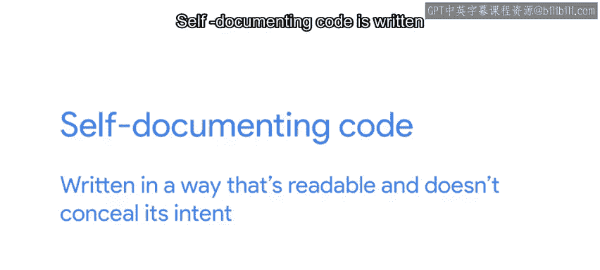
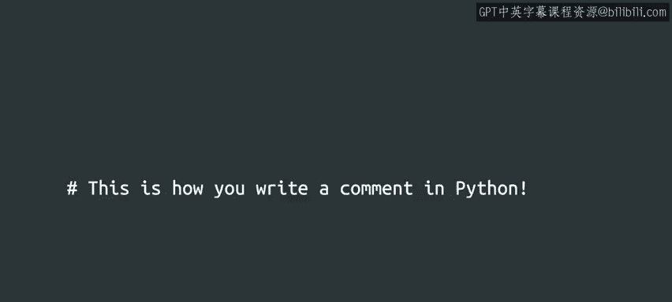

#  026：Python代码风格指南 🎨


在本节课中，我们将要学习如何编写清晰、易读的Python代码。良好的代码风格不仅能让你的代码更易于理解和维护，还能减少错误，并让你在团队协作中更受欢迎。

---

## 概述

到目前为止，我们已经学习了Python语法在变量、表达式以及定义和使用函数方面的应用。虽然还有更多语法知识等待探索，但在深入之前，让我们先谈谈编程的另一个重要方面——代码风格。

从整体上看，代码风格的好坏通常不会直接影响脚本能否成功运行或崩溃。然而，它对于使用和修改代码的人来说，却可能产生巨大的影响。

---

## 为什么代码风格很重要？🤔

上一节我们介绍了代码风格的概念，本节中我们来看看它为何如此重要。

糟糕的编程风格会给IT专家或系统管理员带来困难，他们可能需要在脚本编写后阅读它或对其进行修改，以适应新的系统。即使对于脚本的作者本人，如果时隔很久再回头看自己写的代码，糟糕的风格也可能让人头疼。想象一下，因为代码过于混乱而无法理解，不得不重写自己的代码，这无疑是一种糟糕的体验。

相反，良好的风格可以让脚本看起来几乎像自然的人类语言。它能使脚本的意图和结构对读者一目了然。😊

良好的风格让维护代码的人生活更轻松，帮助他们理解代码的功能和实现方式。它还可以减少错误，因为更新代码变得更加容易和直接。最重要的是，良好的风格让你看起来很酷，对吧？所以我们都同意，我们的代码应该是有风格的。

---

## 什么是好的代码风格？✨

那么，是什么决定了一段代码风格的好坏呢？虽然没有适用于所有编程语言和情况的硬性规定，但牢记几个原则将大大有助于创建良好、有风格的代码。

以下是几个核心原则：

### 1. 代码应尽可能自文档化



自文档化代码的编写方式是可读的，并且不隐藏其意图。😊

这个原则可以应用于编写代码的所有方面，从选择变量名到编写清晰、简洁的表达式。以下是一个代码片段示例：

```python
a = 10
b = 5
c = a * b
```

仅通过查看这段代码，很难确定其目的。变量的名称没有给读者提供太多信息。虽然你可能可以计算出结果，但没有任何线索表明这个结果可能用于什么。

在编程术语中，当我们重写代码使其更具自文档化时，我们称这个过程为**重构**。

那么，如果我们重构这段代码，它会是什么样子呢？

```python
hours_worked = 10
hourly_rate = 5
total_pay = hours_worked * hourly_rate
```

通过这段重构后的代码，其意图现在应该更加清晰。变量和函数的名称反映了它们的用途，这有助于读者更快地理解代码。

你应该始终致力于让你的代码自文档化。

### 2. 适时使用注释

然而，即使如此，有时你可能需要在脚本中使用一段特别复杂的代码。当良好的命名和清晰的组织无法使代码变得清晰时，你可以向代码中添加一些解释性文本。这是通过添加我们称之为**注释**的内容来实现的。

在Python中，注释由井号（`#`）字符表示。当你的计算机看到一个井号时，它会理解应该忽略该行中该字符之后的所有内容。



看看这是如何实现的：

```python
# 计算员工总薪酬
hours_worked = 10  # 员工本周工作的小时数
hourly_rate = 5    # 员工的小时工资率
total_pay = hours_worked * hourly_rate  # 总薪酬 = 工时 * 时薪
```

使用注释可以让你解释为什么某个函数以某种特定方式工作。它还允许你给自己或其他程序员留下笔记，提醒你需要改进什么以及为什么。

显然，阅读自己的代码比阅读别人的代码要容易得多。但在我的工作中，我需要处理由许多不同人编写的代码，每个人的设计方式都略有不同。这就是为什么注释和记录你的代码如此重要。

---

## 总结与过渡

在本节课中，我们一起学习了良好代码风格的重要性、自文档化代码的原则以及如何使用注释来增强代码的可读性。

更重要的是，你的代码最终很可能会被除你之外的其他人使用。所以，做一个好邻居，使用风格指南来构建你的代码，使其在六个月后当你忘记当初为什么写那段代码时，仍然能被他人或你自己读懂。

在本课程接下来的练习中，我们将使用注释来告诉你需要对代码做什么。你总是可以根据需要编写任意多的额外注释。

现在，来一个小测验，巩固你新获得的关于函数和代码风格的知识。别担心，你能做到的。😊