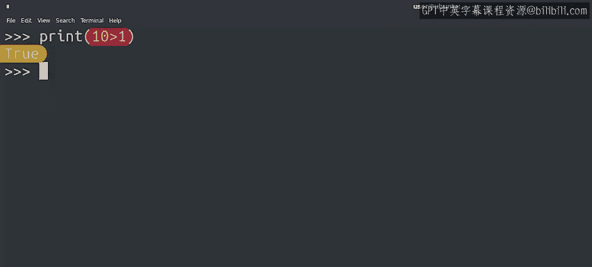
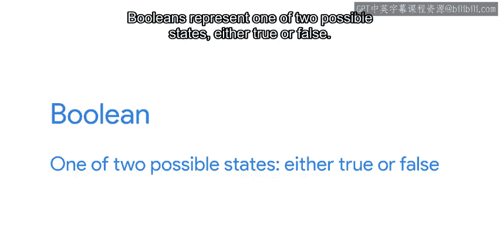
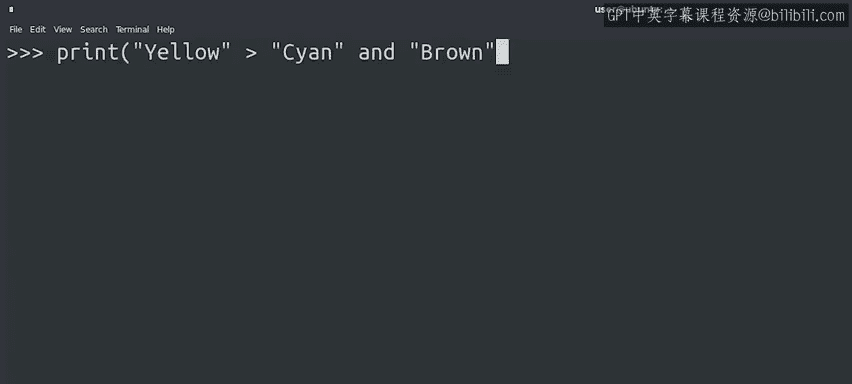
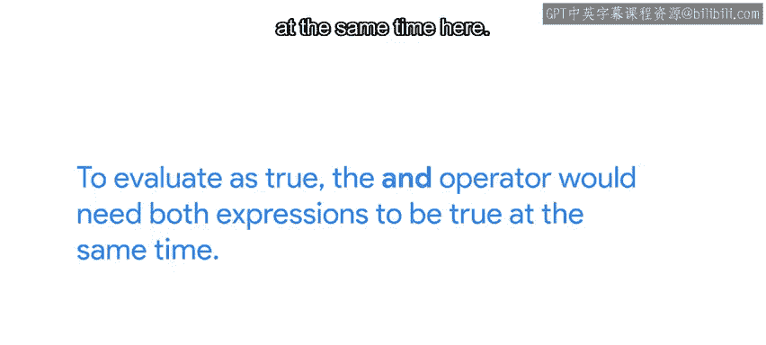
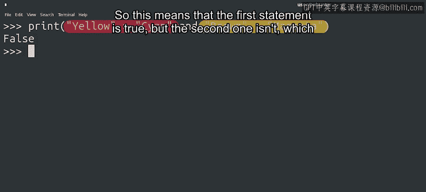
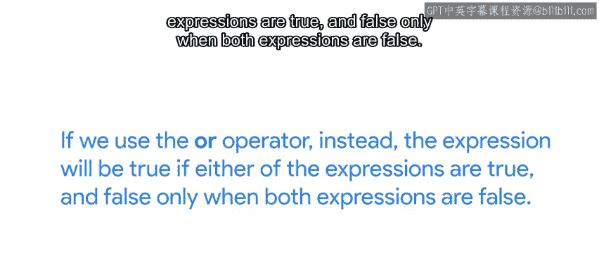
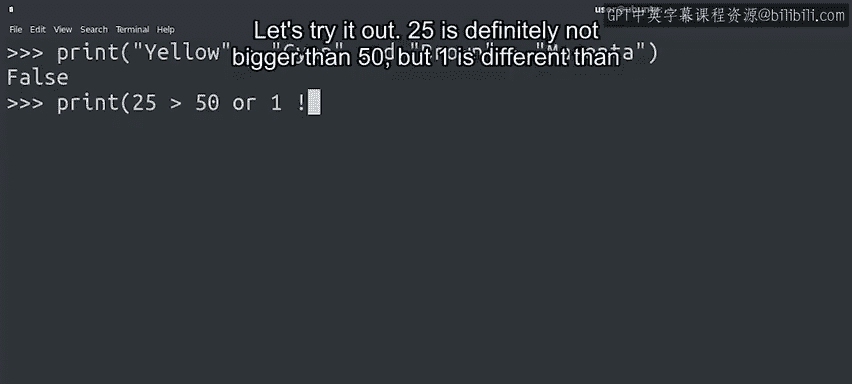
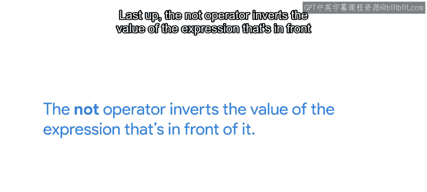
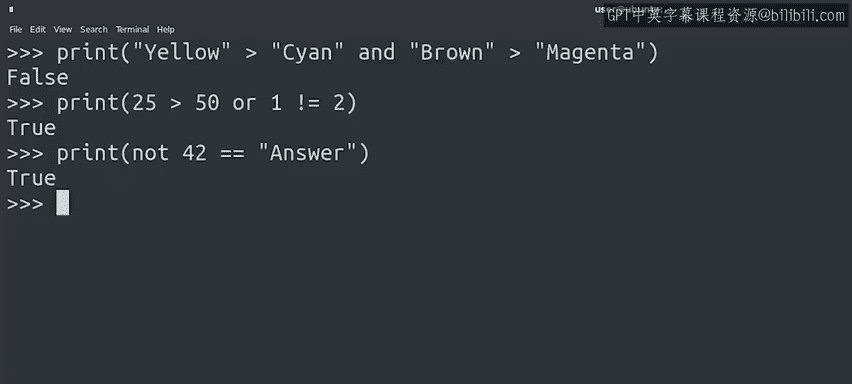

#  027：Python中的比较与逻辑运算 🧮


在本节课中，我们将要学习Python中如何比较数值，以及如何使用逻辑运算符连接多个比较条件。这些知识是编写能够做出判断的自动化脚本的基础。

我们已经见过一些算术表达式，例如加法、减法和除法。还记得我们将Python当作计算器使用的时候吗？实际上，Python还可以比较数值。这让我们能够检查一个值是否小于、等于或大于另一个值。通过比较运算，我们可以利用表达式的结果来做出决策。



请看以下三个例子。



以下是三个基本的比较运算示例：
*   在第一个例子中，`10 > 1`，因此打印出的结果是 `True`。
*   在第二个例子中，我们使用了由两个等号组成的**相等运算符** `==`，用于测试两个事物是否相等。这里，字符串 `"cat"` 不等于 `"dog"`，因此打印出布尔值 `False`。
*   在第三个例子中，我们通过组合感叹号和等号 `!=` 进行相反的比较，这是**不相等运算符**。在这行特定代码中，运算符检查 `1` 是否不等于 `2`。

`True` 是一种属于另一种名为**布尔型**的数据类型的值。布尔型代表两种可能的状态之一：`True`（真）或 `False`（假）。每次在Python中进行比较，结果都是一个相应值的布尔值。

之前我们提到过，加号运算符不能在整数和字符串之间使用。那么，如果我们尝试比较一个整数和一个字符串会发生什么呢？让我们通过检查数字 `1` 是否小于字符串 `"1"` 来找出答案。

```python
1 < "1"
```

我们会得到一个 `TypeError`（类型错误）。这是因为Python不知道如何检查一个数字是否小于一个字符串。

那么相等运算符呢？在这种情况下，解释器可以毫无问题地告诉我们整数 `1` 和字符串 `"1"` 不相同。为什么会这样？本质上，尽管它们在我们看来可能相似，因为它们都包含相同的数字，但对计算机而言，一个数字和一个字符串是清晰不同的。对计算机来说，它们显然是两个完全不同的实体。

除了比较和相等运算符，Python还有一组逻辑运算符。这些运算符允许你连接多个语句，并执行更复杂的比较。

在Python中，逻辑运算符是单词 `and`、`or` 和 `not`。让我们看一些例子。

要评估 `and` 运算符的结果是否为真，需要**两个表达式同时为真**。

```python
(1 < 2) and (2 < 3)  # 结果为 True
```



这里，我们比较字符串，`>` 和 `<` 运算符指的是字母顺序。`"Yellow"` 在 `"Cyan"` 之后，但 `"Brown"` 不在 `"Magenta"` 之后。这意味着第一个语句为真，但第二个不是，从而导致整个表达式的结果为 `False`。



```python
("Yellow" > "Cyan") and ("Brown" > "Magenta")  # 结果为 False
```

如果我们使用 `or` 运算符，那么**只要有一个表达式为真**，整个表达式就为真；只有当两个表达式都为假时，结果才为假。



```python
(25 > 50) or (1 != 2)  # 结果为 True
```



让我们试一下。`25` 绝对不大于 `50`。但是 `1` 不等于 `2`。所以最终，整个表达式为 `True`。



最后，`not` 运算符会**反转**其前面表达式的值。如果表达式为真，它就变为假；如果为假，则变为真。



```python
not (1 == 1)  # 结果为 False
```

逻辑运算符非常重要，因为它们帮助我们编写更复杂的表达式。我们将在接下来的几个视频中看到它们的实际应用。如果这是你第一次接触这些运算符，可能会觉得有很多东西要记。但别担心，通过练习，你会很快掌握大部分内容。在下一篇阅读材料中，我们有一个速查表，列出了所有可用的运算符及其功能。这是一个方便的资源，在你编写自己的脚本时肯定会发现它很有用。

---



本节课中，我们一起学习了Python中的比较运算符（如 `>`、`<`、`==`、`!=`）和逻辑运算符（`and`、`or`、`not`）。我们了解到比较运算的结果是布尔值（`True` 或 `False`），并且不同类型（如整数和字符串）之间通常不能直接比较。掌握这些运算符是让程序能够根据条件做出判断的关键一步。