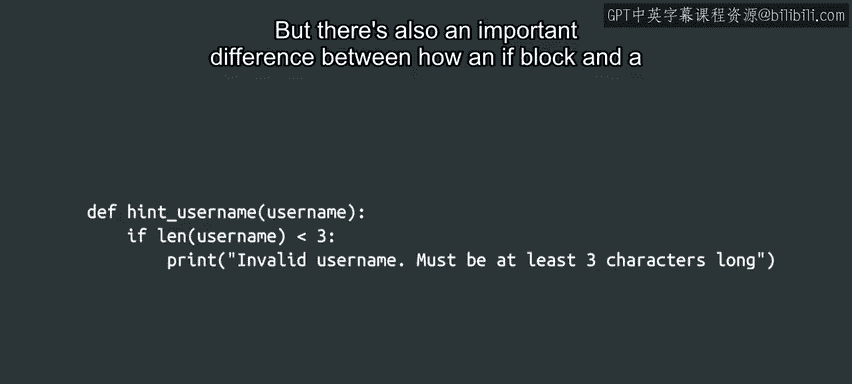
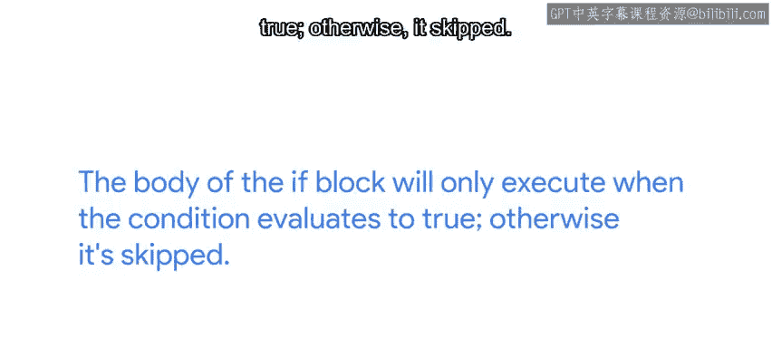

#  028：使用if语句进行分支 🧭


## 概述

在本节课中，我们将要学习如何使用Python的`if`语句来实现程序的分支执行。分支是程序根据条件判断选择不同执行路径的能力，它是编写实用脚本的关键组成部分。我们将通过一个IT相关的具体例子，讲解如何编写条件判断，并理解其语法结构。

---

掌握了Python表达式、比较运算符和变量的知识后，我们现在可以深入探讨如何在脚本中使用它们，根据不同的值执行不同的操作。程序改变其执行顺序的能力被称为**分支**。


分支是使你的脚本变得有用的关键组成部分。你可能在日常生活中经常使用分支的概念。例如，如果是在中午之前，你可能会用“早上好”来问候某人，而不是“下午好”或“晚上好”。如果外面在下雨，你可能会选择带伞。如果天气冷，你可能会穿外套。

在你的脚本中，你也可以指示计算机根据输入做出决策。

让我们来看一个以IT为重点的例子。在许多公司，新员工可以选择他们用于访问公司系统的用户名，通常所选用户名需要符合一套给定的准则。公司可以为有效用户名的外观设置不同的标准。目前，我们假设在你的公司，一个有效的用户名必须至少有三个字符。

你被指派编写一个程序，告诉用户他们的选择是否有效。为此，你可以编写一个像下面这样的函数。

以下是定义该函数的代码：

```python
def validate_username(username):
    if len(username) < 3:
        print("Invalid username. Must be at least 3 characters long.")
```

这个函数检查用户名的长度是否小于3。如果是，函数会打印一条消息，说明用户名无效。

仔细观察`if`语句是如何编写的。我们写下关键字`if`，后跟我们想要检查的条件，然后是一个冒号。之后是`if`代码块的主体，它进一步向右缩进。

你可能会注意到`if`代码块和函数的定义方式有一些相似之处。关键字（无论是`def`还是`if`）表示一个特殊代码块的开始。在第一行的末尾，我们使用冒号，然后函数体或`if`代码块的主体向右缩进。

但`if`代码块和函数的定义方式也有一个重要区别。`if`代码块的主体只有在条件评估为**真**时才会执行。否则，它将被跳过。

---



当然，在`if`代码块的主体内部，你可以做的事情远不止打印信息。随着我们编程能力的扩展，我们将学习如何执行诸如缩短过长的文本、删除存在的文件、启动未运行的服务等更多操作。



如果你的代码在一个函数内部，你也可以选择根据是否满足某个条件来返回一个值。你能想象那会是什么样子吗？

---

## 总结

本节课中我们一起学习了Python中`if`语句的基本用法。我们了解了分支的概念，即程序根据条件判断执行不同代码路径的能力。我们通过一个验证用户名的具体例子，学习了`if`语句的语法结构：`if`关键字、条件表达式、冒号以及缩进的代码块。我们还比较了`if`语句与函数定义的异同，并认识到`if`代码块仅在条件为真时执行。

现在你已经知道如何定义函数，并且可以在这些函数中，让你的程序仅在满足特定条件时才执行某些操作。

准备好进一步扩展分支功能，用`else`语句让我们的分支更有趣了吗？那么请继续观看下一个视频，否则你可能会错过精彩内容。😊