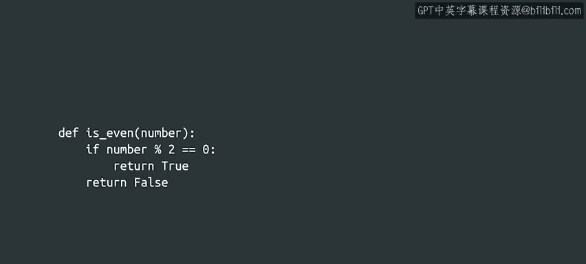
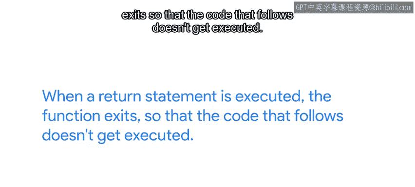
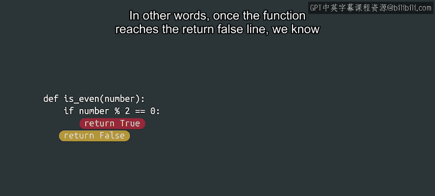

#  029：else语句 🚦


在本节课中，我们将要学习如何扩展`if`语句的功能，通过引入`else`语句来创建更强大的条件分支逻辑。我们将通过具体的例子，理解`else`语句的语法、作用以及如何在实际编程中应用它。

---

## `if`语句的扩展：`else`语句

上一节我们介绍了`if`语句的基本用法，它允许我们根据条件是否为真来执行特定的代码块。本节中我们来看看如何通过`else`语句，为条件为假的情况也提供一个执行路径。

`if`语句本身已经是一个非常有用的结构，但我们可以扩展它，使其功能更加强大。回想一下上一视频中的用户名验证例子。如果我们不仅想在用户名无效时打印消息，还想在用户名有效时也打印一条确认消息，该怎么办？

这里，我们引入了一个`else`语句来实现这个目标。现在，程序可以根据用户名的长度，在两个方向中选择一个执行。

```python
username = input("请输入用户名：")
if len(username) < 3:
    print("用户名无效，长度至少需要3个字符。")
else:
    print("用户名有效！")
```

如果用户名长度不够，我们会收到一条指示用户名无效的消息。但如果程序验证用户名长度足够，它将打印一条消息说明用户名有效。

请注意`else`语句的写法。它使用`else`关键字，后跟一个冒号，表示`else`代码块的开始。同样，代码块的主体需要进一步向右缩进。

---

## `else`代码块的细节

正如我们之前提到的，这些代码块可以包含多行代码，并且不仅仅是打印消息。它们可以进行计算、修改变量值、返回值等等。

以下是关于缩进的重要规则：
*   你可以选择任意数量的空格进行缩进。
*   但你**必须**进行缩进。
*   在同一个代码块中，你**必须**使用相同数量的空格。

---

## 何时可以省略`else`语句

`else`语句非常有用，但我们并不总是需要它。假设我们想编写一个函数来检查一个值是偶数还是奇数。

我们可能会写出下面这样的代码：

```python
def is_even(number):
    if number % 2 == 0:
        return True
    else:
        return False
```

这里我们使用了一个新的运算符，让我们先解释一下。取模运算符由百分号 `%` 表示，它返回两个数**整数除法**的余数。

整数除法是一种在整数之间进行的运算，它产生两个结果（都是整数）：**商**和**余数**。
*   `5` 除以 `2`，商是 `2`，余数是 `1`。
*   `11` 除以 `3`，商是 `3`，余数是 `2`。

偶数是 `2` 的倍数，这意味着一个偶数与 `2` 进行整数除法时，余数总是 `0`。在这个函数中，我们正是利用这个原理来判断一个数是否为偶数。

---

## 一种更简洁的写法





那么，为什么我们可以在没有`else`语句的情况下，写出下面这样两个`return`语句一上一下的代码呢？

```python
def is_even(number):
    if number % 2 == 0:
        return True
    return False
```

关键在于：当`return`语句被执行时，函数会立即退出，其后的代码不会被执行。

这意味着如果数字是偶数，计算机将执行`return True`语句并退出函数。只有在`if`语句中的条件为假时，其后的任何代码才会被执行。



换句话说，一旦函数执行到`return False`这一行，我们就可以确定`if`条件为假，这意味着数字是奇数。

---

## 总结与建议

起初，你可能会觉得即使不需要，也加上`else`语句会更舒服。这完全没问题。重要的是要知道，这两种写法都是正确的。

请记住，这种省略`else`的技巧**只能**在`if`语句内部返回值时使用。

让我们来回顾一下：
*   `if`语句允许我们根据特定条件是否为真来分支执行。
*   `else`语句让我们可以设置一段代码，仅在`if`语句的条件为假时运行。
*   如果你在`if`代码块中返回一个值，那么该代码块之后的代码将只在条件为假时执行。

如果这些`if`和`else`开始让你感到有点困惑，没关系。这里有很多内容需要消化。最好的方法就是，是的，你猜对了——**练习**。

所以，请复习这些内容，并根据需要尽可能多地自己动手练习。完成后，我们下一个视频再见。

---

本节课中我们一起学习了`else`语句如何与`if`语句配合，为程序提供完整的条件分支逻辑。我们探讨了其基本语法、缩进规则，并学习了在特定情况下（如在`if`块中返回值）如何省略`else`语句以写出更简洁的代码。理解并熟练运用条件控制是编程的基础，请务必通过实践来巩固这些概念。