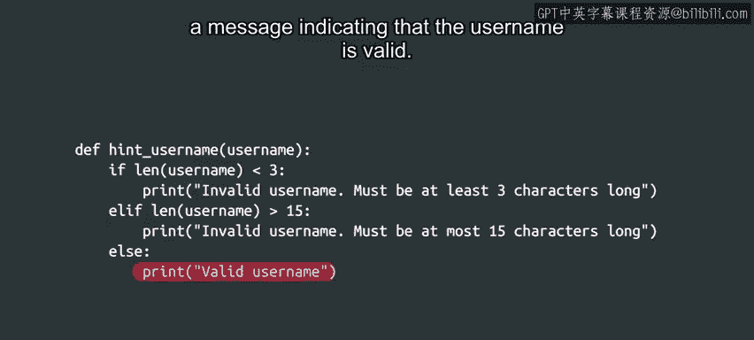

#  030：Python条件分支进阶 - `elif`语句详解 🧩


在本节课中，我们将要学习Python中`elif`语句的使用。`elif`是“else if”的缩写，它允许我们在程序中处理多个条件分支，从而使代码更加清晰和灵活。

## 概述

`if`和`else`语句允许我们根据条件的真假来分支执行代码。但是，当需要考虑更多条件时，`elif`语句就派上用场了。在开始学习如何使用它之前，我们先来看看为什么需要它。

## 为什么需要`elif`语句？

让我们回到之前用户名验证的例子。现在，假设你的公司还有一条规则：用户名不能超过15个字符。我们如何告知用户他们选择的用户名太长呢？可以这样做：

```python
if len(username) < 3:
    print("Invalid username. Must be at least 3 characters long.")
else:
    if len(username) > 15:
        print("Invalid username. Must be at most 15 characters long.")
    else:
        print("Valid username!")
```

这种方法虽然可行，但代码的嵌套结构使其难以阅读。为了避免不必要的嵌套并使代码更清晰，Python提供了`elif`关键字。

## 如何使用`elif`语句？

`elif`语句看起来与`if`语句非常相似。它后面跟着一个条件和一个冒号，然后是一个向右缩进的代码块，构成其主体。只有当条件为真时，`elif`块的主体才会执行。

`elif`和`if`语句的主要区别在于，`elif`块只能作为`if`块的伴侣出现。这是因为只有在`if`语句的条件不成立时，才会检查`elif`语句的条件。

以下是使用`elif`的示例：



```python
if len(username) < 3:
    print("Invalid username. Must be at least 3 characters long.")
elif len(username) > 15:
    print("Invalid username. Must be at most 15 characters long.")
else:
    print("Valid username!")
```

在这个例子中，程序首先检查用户名是否少于3个字符，如果是，则打印一条消息。如果用户名至少有3个字符，程序接着检查它是否超过15个字符，如果是，则打印相应的消息。最后，如果以上条件都不满足，程序打印用户名有效的消息。

## 添加更多条件

我们可以添加的条件数量没有限制，并且很容易包含新的条件。例如，假设公司决定用户名不应包含数字。我们可以轻松地添加一个额外的`elif`条件来检查这一点：

```python
if len(username) < 3:
    print("Invalid username. Must be at least 3 characters long.")
elif len(username) > 15:
    print("Invalid username. Must be at most 15 characters long.")
elif any(char.isdigit() for char in username):
    print("Invalid username. Must not contain numbers.")
else:
    print("Valid username!")
```

## 总结

本节课中我们一起学习了如何使用`elif`语句来处理多个条件分支。你现在已经知道如何比较事物，并在`if`、`elif`和`else`语句中使用这些比较。通过在函数中使用所有这些语句，利用分支来确定程序的流程，你的脚本将开启全新的可能性。

你可以使用比较来选择执行不同的代码片段，这使得你的脚本非常灵活。分支还可以帮助你完成各种实际任务，例如仅备份特定扩展名的文件，或仅在一天中的特定时间允许登录服务器访问。每当你的程序需要做出决定时，都可以使用分支语句来指定其行为。

你是否开始注意到日常工作中可以通过脚本变得更高效的任务？编程能帮助你做的事情有很多可能性，而我们才刚刚开始探索所有酷炫的东西。

在接下来的阅读材料中，我们为你整理了一份速查表。你会在那里找到一个方便的资源，列出了所有这些运算符和分支块。当你需要快速复习时，它会非常有用。所以不要跳过阅读。