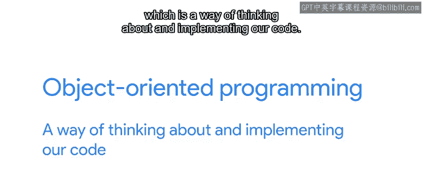

#  031：面向对象编程介绍（可选） 🐍


在本节课中，我们将学习面向对象编程（OOP）的基本概念。我们将了解如何创建自己的对象，并探索Python中一些有趣的功能。课程还会介绍许多新的术语。

## 概述

到目前为止，我们已经学习了Python的所有基础语法，并检查了最常见的数据结构，如字符串、列表和字典。这些脚本能够执行许多有趣的操作，例如处理文本、遍历元素以对每个元素执行操作、找出元素出现的频率等等。

在接下来的视频中，我们将重点学习一系列新概念。我们将深入探讨面向对象编程，这是一种思考和实现代码的方式。

## 面向对象编程简介

上一节我们回顾了Python的基础知识，本节中我们来看看面向对象编程（OOP）。面向对象编程是一种编程范式，它使用“对象”来设计应用程序和软件。对象可以包含数据（属性）和代码（方法）。



以下是面向对象编程的核心概念：

*   **类 (Class)**： 类是创建对象的蓝图或模板。它定义了一组属性和方法，这些属性和方法将由该类的所有对象共享。
    ```python
    class Dog:
        def __init__(self, name, age):
            self.name = name  # 属性
            self.age = age    # 属性

        def bark(self):       # 方法
            return "Woof!"
    ```
*   **对象 (Object)**： 对象是类的实例。它是根据类定义创建的具体实体。
    ```python
    my_dog = Dog("Buddy", 5)  # 创建一个Dog类的对象
    ```
*   **属性 (Attribute)**： 属性是与对象关联的变量，用于存储对象的数据。
    ```python
    print(my_dog.name)  # 输出: Buddy
    ```
*   **方法 (Method)**： 方法是与对象关联的函数，用于定义对象的行为。
    ```python
    print(my_dog.bark())  # 输出: Woof!
    ```

## 课程总结

本节课中，我们一起学习了面向对象编程的基本介绍。我们了解了类、对象、属性和方法这些核心概念，并看到了如何使用简单的代码来定义类和创建对象。面向对象编程帮助我们以更模块化和可重用的方式组织代码，是Python中一个非常强大的功能。