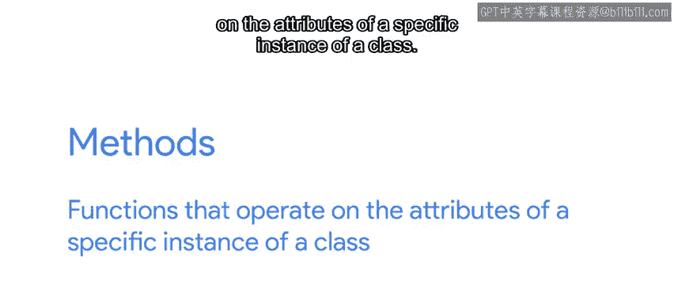
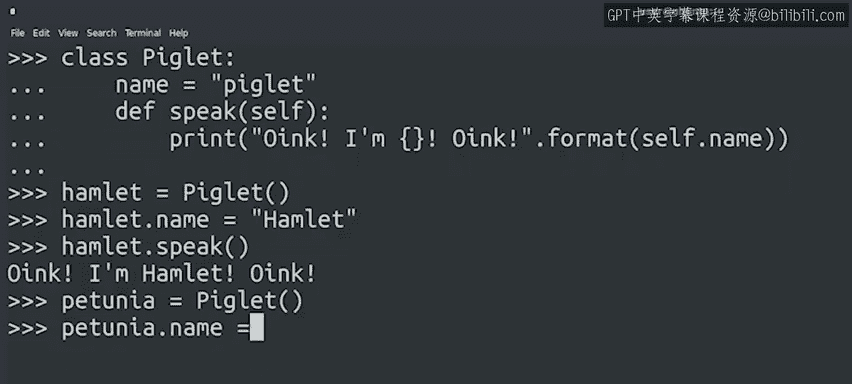
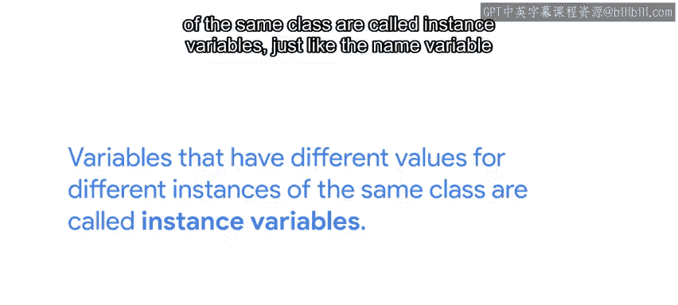
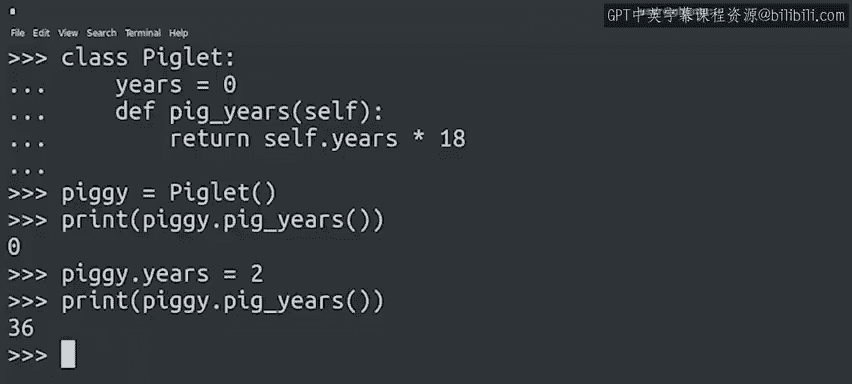

#  032：Python面向对象编程 - 实例方法详解 🐷


在本节课中，我们将要学习Python中面向对象编程的一个核心概念：**实例方法**。我们将通过创建一个可爱的小猪类来理解方法如何操作对象的属性，以及如何让不同的对象实例表现出不同的行为。

---

## 什么是实例方法？ 🤔

上一节我们介绍了类和对象的基本概念，本节中我们来看看如何让对象“动起来”。

实例方法是属于类的函数，它操作**特定类实例**的属性。当我们对列表调用`append`方法时，我们是在向**那个特定列表**的末尾添加元素，而不是其他列表。当我们对字符串调用`lower`方法时，我们是将**那个特定字符串**的内容转换为小写。



理解方法的关键在于：**方法是作用于某个类特定实例属性上的函数**。

---

## 创建第一个方法 🛠️

首先，我们需要定义一个类并创建它的一个实例。

```python
class Piglet:
    pass
```

我们创建了一个`Piglet`类。虽然我们的小猪可能很可爱，但它现在还做不了什么。如果我们想给它一个“声音”，对象就需要方法来执行动作。

以下是定义一个方法的步骤：

1.  在类内部，使用`def`关键字定义函数。
2.  该函数的第一个参数必须是`self`，它代表正在执行该方法的实例本身。
3.  函数体需要缩进，以表明它是类的一部分。

让我们给类添加一个`speak`方法：

```python
class Piglet:
    def speak(self):
        print("Oink Oink!")
```

现在，让我们创建一个实例并调用这个方法：

```python
hamlet = Piglet()
hamlet.speak()
# 输出：Oink Oink!
```

小猪会叫了！但所有`Piglet`类的实例都会说同样的话，这有点无聊。

---

## 让方法依赖实例属性 🎭

为了让方法根据实例的不同属性产生不同的行为，我们需要使用**实例变量**。

实例变量是那些对于同一个类的不同实例可以拥有不同值的变量。我们可以在类中初始化它们，并在方法中通过`self.变量名`来访问。

让我们改进`Piglet`类，为每只小猪起个名字：

```python
class Piglet:
    name = "piglet"  # 初始化一个实例变量，默认值为"piglet"

    def speak(self):
        print(f"Oink! I'm {self.name}! Oink!")
```

在这个新的`speak`方法中，它使用`self.name`的值来知道要打印什么名字。这意味着它从当前的小猪实例中访问`name`属性。

让我们来试试：

```python
hamlet = Piglet()
hamlet.name = "Hamlet"  # 设置实例的name属性
hamlet.speak()
# 输出：Oink! I'm Hamlet! Oink!
```

我们创建了会说话的Python小猪！如果我们用不同的名字创建另一个实例呢？

```python
petunia = Piglet()
petunia.name = "Petunia"
petunia.speak()
# 输出：Oink! I'm Petunia! Oink!
```

我们创建了两个`Piglet`类的实例，每个都有自己的名字。当调用`speak`方法时，每个实例都打印自己的名字，而不是另一个的。这就是实例变量的作用。

---



## 带参数和返回值的方法 🔄

既然方法就是属于特定类的函数，它们就可以像其他函数一样工作：可以接收更多参数，也可以返回值。

让我们看一个返回值的例子。我们将创建一个方法，将小猪的人类年龄转换为“猪年”。

```python
class Piglet:
    years = 0

    def pig_years(self):
        return self.years * 18
```



在这个例子中，`pig_years`方法根据实例的`years`属性计算并返回一个值。

让我们创建一个实例并看看这个方法如何工作：

```python
piggy = Piglet()
print(piggy.pig_years())
# 输出：0

piggy.years = 2
print(piggy.pig_years())
# 输出：36
```

随着`years`属性值的改变，`pig_years`方法的返回值也随之改变。

---

## 总结 📚

本节课中我们一起学习了Python中的**实例方法**。



我们了解到：
*   实例方法是定义在类内部的函数，用于操作特定实例的数据。
*   方法的第一个参数总是`self`，它指向调用该方法的对象本身。
*   通过`self.属性名`，方法可以访问和修改对象的**实例变量**，从而实现每个对象独特的行为。
*   方法可以接收额外参数，也可以返回值，就像普通函数一样。

通过创建`Piglet`类并为其添加`speak`和`pig_years`方法，我们实践了如何让对象拥有自己的行为和状态。接下来，我们将学习一些特殊类型的方法，特别是被称为**构造函数**的方法。