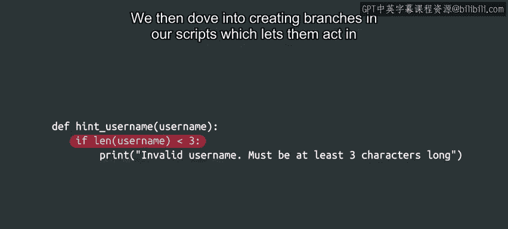

#  034：Python基础语法总结 🎉

在本节课中，我们将总结Python基础语法的核心概念。我们已经学习了如何操作不同的数据类型、创建变量和表达式、定义函数，以及如何在脚本中创建分支结构。这些知识是编写有效Python代码的基石。

---

## 模块完成与回顾

恭喜你完成了第二个模块的学习，掌握了大量Python语法知识。

我们学习了如何操作不同的数据类型，并创建了自己的变量和表达式。

我们定义了第一个函数，并学习了如何让函数返回值，以提高代码的可重用性。

---

## 条件分支结构

上一节我们介绍了函数，本节中我们来看看如何创建脚本中的分支结构。这使我们的脚本能够根据变量的值采取不同的行动。

我们学习了许多新的、非常强大的内容。了解如何组织代码和函数，以及如何根据不同的值让代码采取不同的行动，是让我们能够告诉计算机该做什么的关键。

---

## 知识的应用与巩固

我们将在整个课程中持续使用这些工具，逐步过渡到更复杂和有趣的内容。

接下来，你可以通过下一个分级评估来测试你所学的全部知识。

如果你觉得还没有完全准备好，不必担心。请记住，你可以根据需要多次回看视频并完成练习测验，以确保你完全理解我们涵盖的所有内容。

当你准备好进行测试时，请从容应对。祝你一切顺利。

在你完成测试后，我们将在下一个模块再见。在那里，我们将全面学习循环结构。

---

## 总结

本节课中我们一起学习了Python的基础语法，包括变量、数据类型、函数和条件分支。这些是构建更复杂程序的必要基础。我们将在后续课程中不断应用和深化这些概念。

---

我们下个模块见。