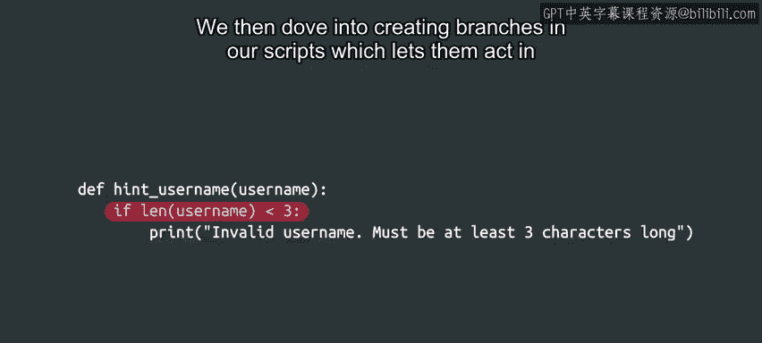

#  035：Python基础语法总结 🎯


在本节课中，我们将对Python基础语法模块进行总结，回顾已学习的关键概念，并为后续学习做好准备。

## 概述

上一节我们介绍了条件分支，本节中我们将对整个基础语法模块进行回顾与总结。我们已经学习了Python编程的多个核心组成部分。

## 核心概念回顾

以下是我们在本模块中掌握的关键技能：

*   **变量与表达式**：我们学会了如何创建变量来存储数据，并使用表达式进行计算。例如，`total = price * quantity`。
*   **数据类型操作**：我们掌握了如何操作字符串、整数、浮点数等不同数据类型。
*   **函数定义与返回值**：我们定义了第一个函数，并学会了使用`return`语句使其返回值，从而提高代码的可重用性。例如：
    ```python
    def calculate_area(length, width):
        return length * width
    ```
*   **条件分支**：我们深入学习了如何在脚本中创建分支，使代码能够根据变量的值执行不同的操作。这通过`if`、`elif`、`else`语句实现。

## 学习成果的意义

理解如何组织代码和函数，以及如何让代码根据不同的值采取不同的行动，是我们能够指挥计算机完成任务的基础。这些强大的工具将在整个课程中持续使用，帮助我们处理更复杂、更有趣的项目。

## 下一步：测验与展望

接下来，你可以在即将到来的分级评估中检验所学的一切。如果你觉得尚未完全准备好，无需担心。请记住，你可以随时回看视频并多次完成练习测验，以确保完全理解我们涵盖的所有内容。

当你准备好参加测试时，请从容应对。祝你一切顺利！

完成测试后，我们将在下一个模块再见。在那里，我们将全面学习**循环**的相关知识。

## 总结

本节课中我们一起回顾了Python基础语法模块的核心内容，包括变量、表达式、函数和条件分支。这些是构建更复杂程序的基石。我们即将通过测验巩固知识，并迈向关于循环的新篇章。



期待下次相见！ 👋