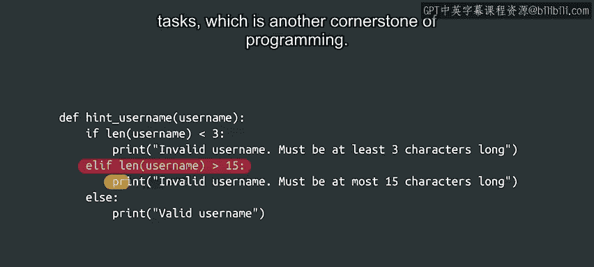
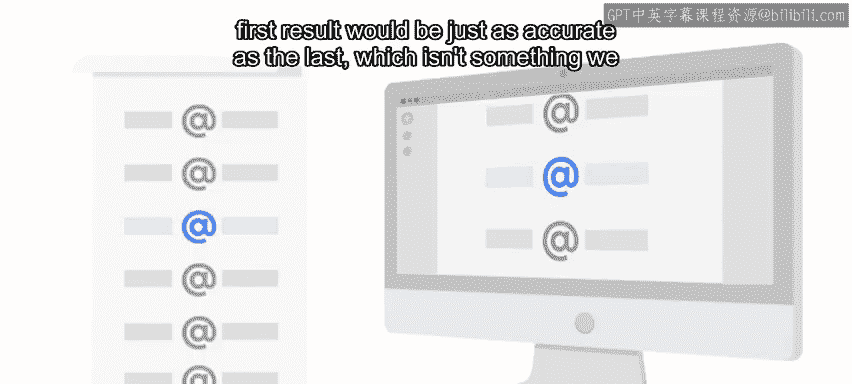

#  036：循环介绍 🔄


在本节课中，我们将要学习编程中的一个核心概念——循环。循环允许计算机自动、准确地执行重复性任务，这是实现自动化办公的关键技能。

## 概述

上一节我们介绍了如何通过函数组织代码，以及如何根据条件让代码分支执行。本节中，我们来看看如何让计算机执行重复性任务。

计算机非常擅长重复执行相同的任务。它们不会感到无聊，也不会出错。你可以让计算机进行一千次相同的计算，第一次的结果会和最后一次一样准确，这是人类难以做到的。这种准确执行重复任务且永不疲倦的能力，正是计算机在自动化领域如此强大的原因。

自动化任务可以是多种多样的，例如：将文件复制到网络上的多台计算机、向用户列表发送个性化邮件，或者验证某个进程是否仍在运行。无论任务多么复杂，计算机都会按照你的指令执行任意多次，从而让你有时间去处理更有趣的事情，比如规划未来的硬件需求或管理软件部署。

在接下来的视频中，我们将探索三种实现重复任务自动化的技术：`while`循环、`for`循环和递归。这些技术都用于指示计算机重复执行任务，但各自采用了略有不同的方法。我们将学习如何为每种技术编写代码，以及如何判断在何种情况下应使用哪一种技术。



## 三种循环技术




以下是三种主要的循环技术：

1.  **`while`循环**
    *   当**特定条件为真**时，重复执行一段代码块。
    *   代码示例：
        ```python
        while condition_is_true:
            # 执行任务
        ```

2.  **`for`循环**
    *   对**序列**（如列表、字符串）中的每个元素，重复执行一段代码块。
    *   代码示例：
        ```python
        for item in sequence:
            # 对每个item执行任务
        ```

3.  **递归**
    *   函数**调用自身**来解决问题，通常用于将复杂任务分解为更小的同类子任务。
    *   代码示例：
        ```python
        def recursive_function(parameters):
            if base_case_condition:  # 基线条件，用于停止递归
                return base_case_value
            else:
                # 处理并递归调用自身
                return recursive_function(modified_parameters)
        ```

## 总结

本节课中我们一起学习了循环在编程中的重要性。我们了解到，循环是让计算机自动化处理重复性任务的基础，它解放了人力，使我们能专注于更复杂的规划和管理工作。我们简要介绍了三种实现循环的技术：`while`循环、`for`循环和递归，并将在后续课程中详细学习每一种的具体用法和应用场景。