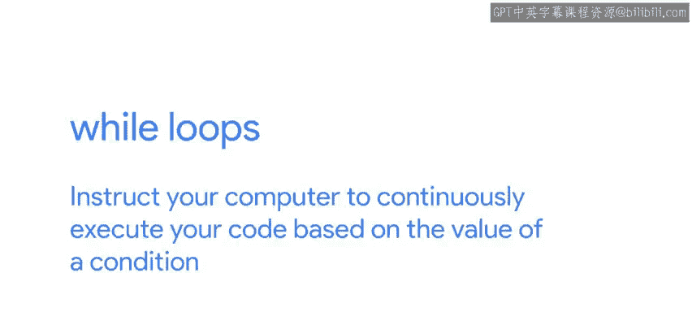
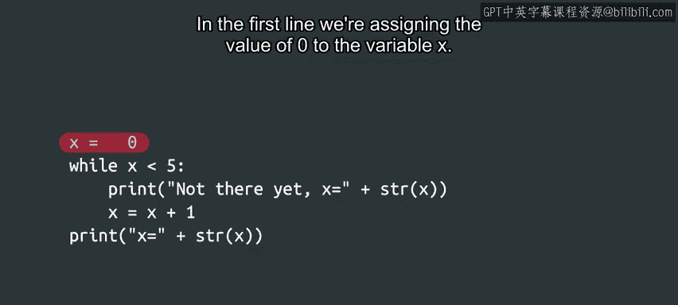
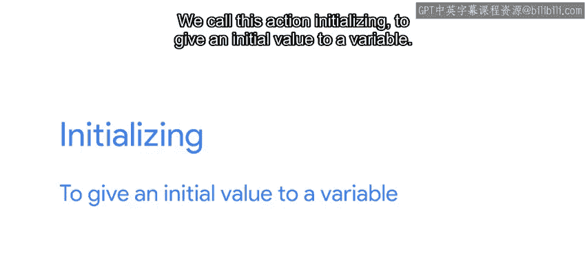
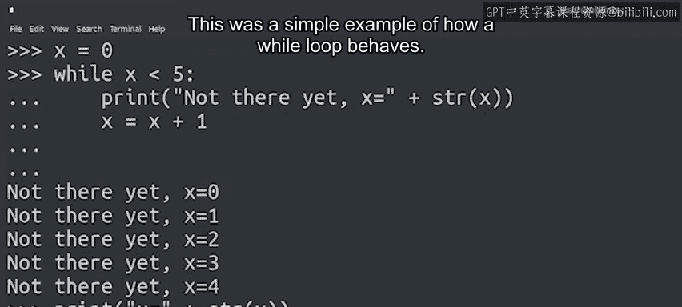

#  037：什么是while循环？🔄


在本节课中，我们将要学习Python编程中的一个核心概念——**while循环**。循环是让计算机重复执行某段代码的强大工具，它能帮助我们自动化重复性任务，是IT自动化办公中不可或缺的一部分。

---

## 概述



首先，我们来谈谈while循环。while循环指令你的计算机根据一个**条件**的值来**持续执行**你的代码。

这与我们之前学过的**分支结构（if语句）** 工作原理相似。关键区别在于，循环体中的代码块可以被执行**多次**，而不仅仅是一次。

---

## 一个简单的while循环示例

让我们来看下面这段程序。在运行它之前，你能猜出它会做什么吗？

我们将一起逐行分析它。

```python
x = 0
while x < 5:
    print("还没到呢，x的值是：", x)
    x = x + 1
print("循环结束，x的最终值是：", x)
```

### 代码解析

1.  **初始化变量**：在第一行，我们将值`0`赋给变量`x`。这个操作称为**初始化**，即给变量一个初始值。
2.  **启动循环**：在下一行，我们开始了`while`循环。我们为这个循环设置了一个条件：`x`需要**小于5**。目前，我们知道`x`是0，所以这个条件当前为**真**。
3.  **循环体**：接下来的两行代码向右缩进，根据我们学过的函数和条件语句知识，可以识别出这是`while`循环的**主体**。

以下是循环体内的两个操作：
*   第一行：打印一条消息，后面跟着`x`的当前值。
*   第二行：**递增**`x`的值。我们通过将其当前值加1，然后重新赋值给`x`来实现。

所以，在第一次执行循环体之后，`x`将从0变为1。



---



## 循环是如何工作的？

因为这是一个循环，计算机不会直接继续执行脚本中的下一行。相反，它会**循环回去**，重新评估`while`循环的条件。

由于此时`x`（值为1）仍然小于5，它会再次执行循环体。它再次打印消息，并再次将`x`增加1。现在`x`变成了2。

计算机会**持续这个过程**，直到条件不再为真。在这个例子中，当`x`不再小于5（即`x >= 5`）时，条件将变为假。

一旦条件为假，循环结束，程序继续执行循环之后的下一行代码。最后，我们代码的最后一行打印出`x`的最终值。

---

## 执行结果

现在这段代码的逻辑更清晰了，你认为当我们执行它时会发生什么？

让我们运行代码看看结果。

```
还没到呢，x的值是： 0
还没到呢，x的值是： 1
还没到呢，x的值是： 2
还没到呢，x的值是： 3
还没到呢，x的值是： 4
循环结束，x的最终值是： 5
```

我们得到了五行“还没到呢”的消息。在脚本的最后，`x`的值是5。

---

## while循环的应用场景

这是一个展示while循环行为的简单例子。正如我们之前所说，我们正在学习编程的**基础构建模块**。一旦你掌握了这些模块，就可以将它们组合起来创建更复杂的表达式。

对于IT专家来说，循环非常有用。以下是几个应用场景：
*   你可以用它来**持续请求用户名**，直到提供的用户名有效为止。
*   或者**重复尝试一个操作**，直到它成功为止。

了解如何构建这些表达式，可以帮助你用很少的代码让计算机完成大量工作，这非常强大。

---

## 另一个例子

现在你已经了解了while循环的基本工作原理，让我们用另一个例子来加深理解。

假设我们需要一个程序，让用户重复输入密码，直到输入正确为止（这里我们假设正确密码是`"secret"`）。

```python
password = ""
while password != "secret":
    password = input("请输入密码：")
print("密码正确，欢迎进入！")
```

在这个例子中：
1.  我们首先将`password`变量初始化为空字符串。
2.  `while`循环的条件是`password != "secret"`，意思是“当密码不等于‘secret’时”。
3.  只要用户输入的不是`"secret"`，循环就会一直要求输入。
4.  一旦用户输入了`"secret"`，条件变为假，循环结束，打印欢迎信息。

---

## 总结

在本节课中，我们一起学习了**while循环**。我们了解到：
*   while循环用于在条件为真时**重复执行**一段代码块。
*   它与if语句的关键区别在于**执行次数**：循环可以执行多次，而if语句的代码块只执行一次（如果条件为真）。
*   循环通常包含三个关键部分：**变量初始化**、**循环条件**和**在循环体内改变条件变量的值**（以避免无限循环）。
*   while循环是自动化重复任务、验证用户输入和处理不确定次数操作的基础工具。



掌握循环是迈向有效编程和IT自动化的重要一步。在接下来的课程中，我们将探索更多类型的循环和它们的实际应用。