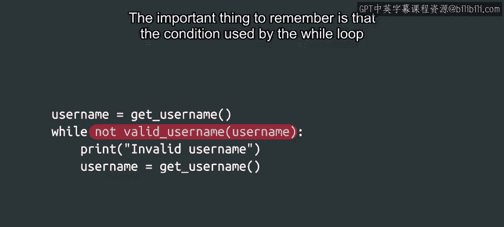

#  038：更多while循环示例 🌀


在本节课中，我们将深入学习`while`循环的更多应用示例。我们将探讨如何在函数内部使用`while`循环，以及如何通过调用其他函数和逻辑运算符来构建更复杂的循环条件。通过具体示例，帮助初学者理解`while`循环的灵活性和强大功能。

---

## 回顾简单while循环

上一节我们介绍了`while`循环的基本语法和工作原理。现在，我们将应用这些知识来解析一个类似的示例，但这次`while`循环位于函数内部。

## 函数内的while循环示例

以下是一个包含`while`循环的函数示例，请尝试分析其功能：

```python
def example_function(n):
    x = 1
    while x <= n:
        print(f"当前尝试次数：{x}")
        x += 1
```

在这个示例中，我们首先初始化一个名为`x`的变量，并将其值设为1。然后进入`while`循环，检查`x`的值是否小于或等于函数接收的参数`n`。如果比较结果为真，则执行循环体内的代码。

假设我们向该函数传递参数值5。在第一次循环中，`x`等于1，因此比较`1 <= 5`为真，进入循环体。

在循环体内，我们首先打印一条消息，显示当前尝试次数，然后将`x`的值增加1。这里使用了`x += 1`的简写形式，它等同于`x = x + 1`。两种表达式含义相同，可互换使用。

这个过程持续进行，直到比较结果不再为真，即当`x`大于`n`时。在当前示例中，当`x`的值变为6时，循环结束。

---

## 使用函数调用的循环条件

在上述示例中，我们使用了简单的数值比较条件。这些是常见条件，但并非`while`循环中唯一可用的条件类型。

例如，常见的做法是调用一个单独的函数来评估条件，如下所示：

```python
username = get_username()
while not valid_username(username):
    print("无效用户名，请重新输入。")
    username = get_username()
```

在这种情况下，大量代码隐藏在函数背后，执行我们看不到的操作。`get_username`函数用于向用户请求用户名，`valid_username`函数用于验证该用户名。所有这些操作仅通过少量字符完成。

如您所见，短短一行代码可以包含强大的功能。在此示例中，`while`循环体将一直执行，直到用户输入有效的用户名。

需要记住的重要一点是，`while`循环使用的条件必须评估为`True`或`False`。无论是通过比较运算符还是调用其他函数来实现，这一点都至关重要。

---

## 使用逻辑运算符的复杂条件

`while`循环中使用的条件也可以通过逻辑运算符（如`and`、`or`、`not`）变得更加复杂。这些运算符允许我们组合多个表达式的值，以获得所需的结果。

例如：



```python
while (x > 0) and (x < 10):
    # 循环体代码
```

---

## 常见陷阱与注意事项

我们已经介绍了`while`循环是什么，学习了其语法和基本行为。虽然其中一些内容可能有些棘手，但您做得很好，请继续保持。

接下来，我们将概述在编写自己的循环时可能遇到的一些最常见陷阱。请继续学习下一节内容以深入了解。

---

## 总结

在本节课中，我们一起学习了`while`循环的更多应用示例。我们探讨了如何在函数内部使用`while`循环，如何通过调用其他函数来构建循环条件，以及如何使用逻辑运算符创建更复杂的条件。理解这些概念将帮助您更灵活地使用`while`循环，编写出更高效、更强大的Python代码。