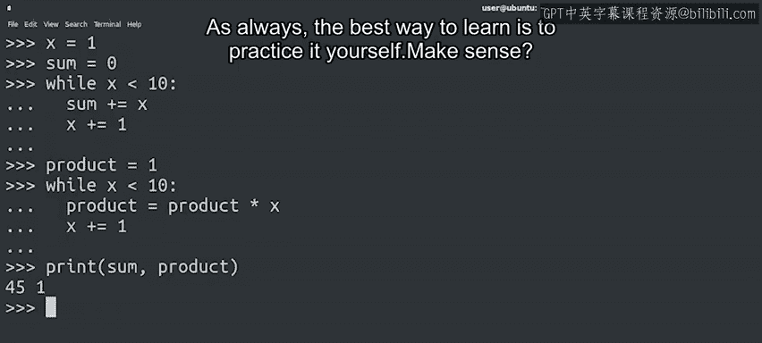
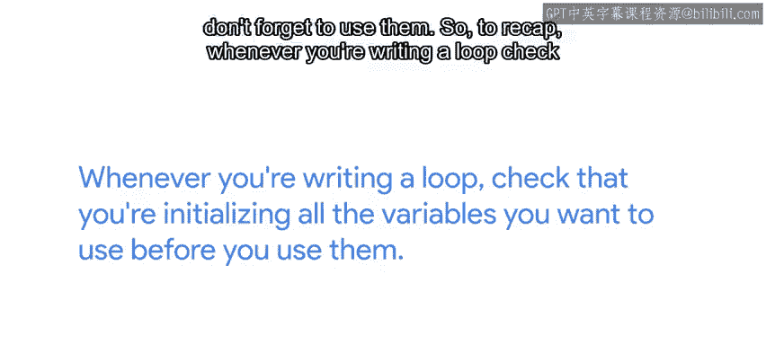

#  039：Python循环中的变量初始化 🎯
## 课程编号：P39


在本节课中，我们将要学习为什么在编写循环时正确初始化变量至关重要。我们将探讨忘记初始化变量可能导致的两种常见问题，并通过具体示例来理解如何避免这些错误。

---

在之前的课程中，我们介绍了循环如何让计算机为我们执行重复性工作。由于编写脚本和进行IT自动化的主要好处之一是通过自动化重复任务来节省时间，因此循环非常有用。本节中我们来看看编写循环时人们常犯的一些错误，并学习如何避免它们。

最常见的错误之一是忘记用正确的值初始化变量。我们刚开始学习编码时都犯过这个错误。还记得在之前的例子中，我们在一种情况下将变量`x`初始化为0，在另一种情况下初始化为1吗？

当我们忘记初始化变量时，可能会发生两种不同的事情。

以下是第一种可能的结果，也是最容易发现的：

*   Python可能会引发一个错误，告诉我们正在使用一个未定义的变量。错误信息如下所示：
    ```python
    NameError: name 'variable_name' is not defined
    ```
    正如我们处理遇到的其他错误一样，我们可以查看最后一行来了解发生了什么。这个错误类型是**NameError**，后面的信息说明我们使用了未定义的变量。

修复这个问题很简单。我们只需要在使用变量之前初始化它，像这样：
```python
variable_name = 0  # 或其他合适的初始值
# 现在可以使用 variable_name 了
```

---

上一节我们介绍了因变量未定义而导致的错误，本节中我们来看看第二种更隐蔽的问题。

如果我们忘记用正确的值初始化变量，可能会遇到的第二个问题是：变量可能已经在程序的其他地方被使用过了。在这种情况下，如果我们没有从一开始就为变量设置正确的值，它将仍然保留之前的值。这可能导致一些非常意外的行为。

请看这个脚本：
```python
# 第一部分：计算1到10的和
x = 1
sum = 0
while x <= 10:
    sum += x
    x += 1
print(f"Sum from 1 to 10 is: {sum}")

# 第二部分：计算1到10的乘积
product = 1
while x <= 10:
    product *= x
    x += 1
print(f"Product from 1 to 10 is: {product}")
```
你能发现问题吗？

在第一部分代码中，我们正确地将`x`初始化为1，`sum`初始化为0，然后迭代直到`x`等于10，累加中间的所有值。因此，在该部分代码结束时，`sum`等于从1到10所有数字相加的结果，而`x`的值是10。

在代码的第二部分，本意是获取从1到10所有数字的乘积。但如果你仔细观察，会发现我们初始化了`product`，却忘记了重新初始化`x`。所以`x`仍然是10。这意味着当检查`while`循环条件时，在迭代开始前`x`就已经是10了。`while`条件在开始前就为假，循环体永远不会执行。



在这种情况下，可能更难发现问题，因为Python不会引发错误。这里的问题是我们的`product`变量得到了错误的值。如果你的循环行为异常或不符合预期，最好检查一下是否所有变量都已正确初始化。在这个例子中，我们需要在开始第二个循环之前将`x`重置为1。

---



学习的最佳方式永远是亲自实践。如果你在某个地方感到困惑或不确定，可以随时在讨论区寻求帮助。这些论坛就是为了让你在需要时获得所需的帮助，所以别忘了使用它们。

本节课中我们一起学习了编写循环时初始化变量的重要性。总结如下：

*   每当编写循环时，请检查你是否在使用所有变量之前对它们进行了初始化。
*   如果第一次没有做对，请不要担心。我们学习编码时都经历过这个阶段。正如之前强调的，掌握编程的方法就是练习、练习、再练习。不断练习直到你感到得心应手，即便如此，犯错也是可以的。所以，不要觉得你不能回过头去复习和练习我们目前所涵盖的所有内容。