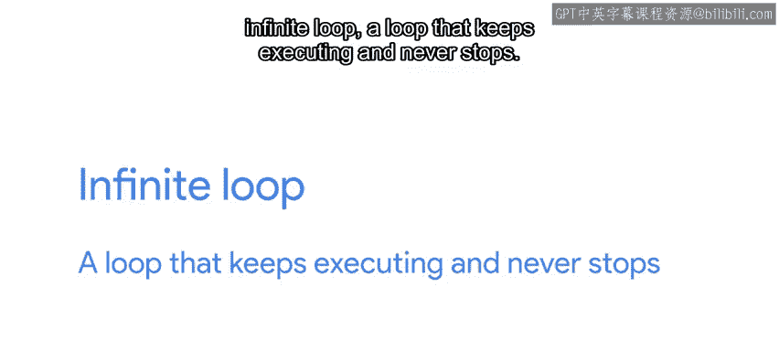
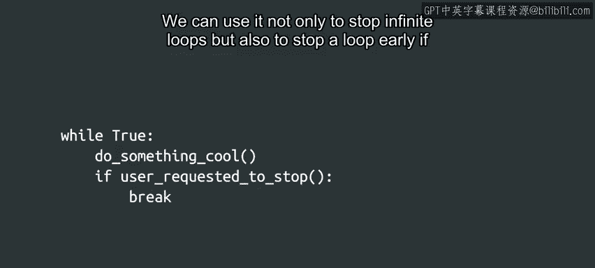

#  040：Python中的无限循环与中断方法 🔄


在本节课中，我们将要学习**无限循环**的概念、它可能带来的问题，以及如何避免或中断无限循环。理解这些内容对于编写稳定、高效的Python程序至关重要。

---



## 什么是无限循环？

上一节我们介绍了`while`循环的基本用法，它通过检查一个条件来决定是否继续执行。本节中我们来看看，如果这个条件永远不会变为`False`，会发生什么。

无限循环是指**循环条件始终为真，导致循环体永不停止执行**的情况。这通常是由于循环体内的逻辑未能改变循环条件所导致的。

例如，考虑以下代码：

```python
x = 0
while x % 2 == 0:
    x = x / 2
```

在这个例子中，如果`x`的初始值为`0`，那么`0 % 2`的结果是`0`，条件为真。循环体内`x = 0 / 2`的结果仍然是`0`，因此`x`的值永远不会改变，循环将永远执行下去。

---

## 如何避免无限循环？

为了避免程序陷入无限循环，我们需要在编写循环时仔细考虑变量的所有可能取值。

以下是两种常见的预防策略：

1.  **使用条件语句包裹循环**：在执行循环之前，先检查条件是否安全。
    ```python
    if x != 0:
        while x % 2 == 0:
            x = x / 2
    ```

2.  **在循环条件中增加逻辑判断**：将安全条件直接整合到`while`语句中。
    ```python
    while x != 0 and x % 2 == 0:
        x = x / 2
    ```

这两种方法都确保了只有当`x`不为零时，才会进入可能修改`x`值的循环体，从而避免了除零和值不变的情况。

---

## 如何主动中断循环？

虽然我们需要警惕意外的无限循环，但有时我们也会**故意创建无限循环**，让程序持续运行直到某个外部条件被触发。

例如，网络工具`ping`会持续发送数据包，直到用户手动中断（通常通过按下`Ctrl+C`）。在Python中，我们使用`break`关键字来主动跳出循环。

`break`语句的作用是**立即终止当前所在的最内层循环**。它不仅可以用于跳出无限循环，也可以在循环任务提前完成时，用于提前结束循环。

以下是一个使用`break`的无限循环示例：

```python
while True:
    # 执行一些持续性的任务，例如监控网络
    if some_external_condition_met:
        break  # 条件满足时，跳出循环
```

在这个模式中，`while True:`创建了一个条件永远为真的循环。循环的退出完全依赖于内部的`if`语句和`break`。

---

## 核心要点总结

本节课中我们一起学习了关于循环控制的重要知识：



*   **无限循环**是条件永不终止的循环，通常由编程逻辑错误引起。
*   **避免无限循环**的关键是：确保循环体内的操作能影响循环条件，并仔细考虑变量的边界值。
*   **`break`语句**是控制循环流程的强大工具，可以用于设计受控的无限循环或在满足条件时提前退出。

记住，编写循环时，花点时间思考“这个循环在什么情况下会停止”，是写出健壮代码的好习惯。

---

所有关于循环的讨论可能让人有点“晕眩”了。在你进行接下来的练习测验之前，我需要去躺一会儿休息一下。祝你好运，完成后我们下一个视频再见。😊