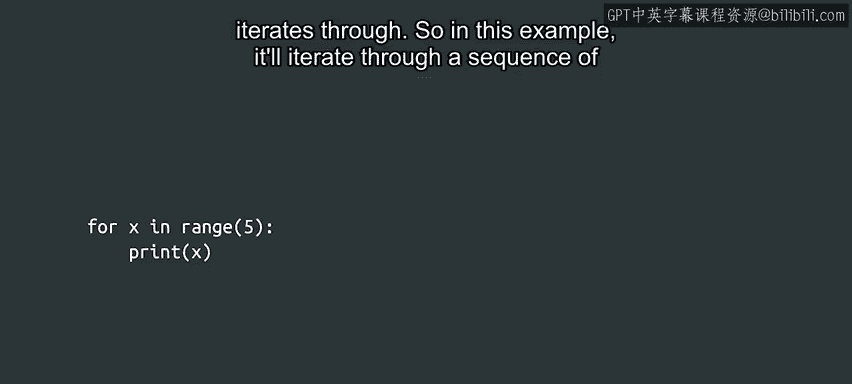
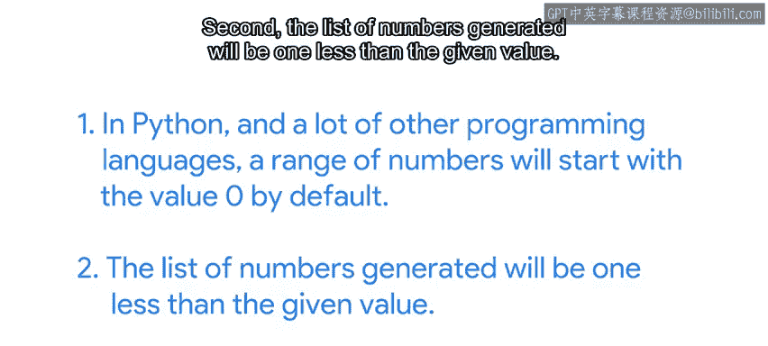
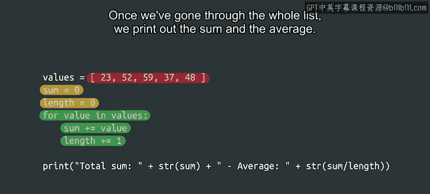
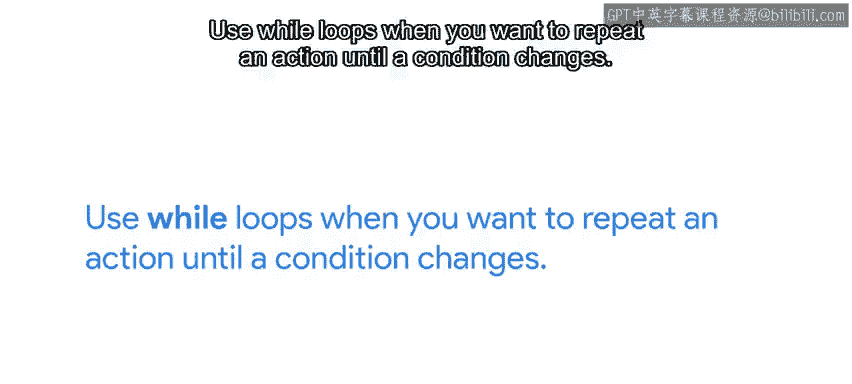

#  041：Python中的for循环 🔄


在本节课中，我们将要学习Python编程中的一种重要结构——**for循环**。for循环允许我们遍历一个序列中的每个元素，并对每个元素执行相同的操作。这在自动化任务中非常有用，比如处理文件列表、分析数据或批量操作。

---

## 什么是for循环？

上一节我们介绍了循环的基本概念，本节中我们来看看**for循环**的具体结构和工作原理。

for循环用于遍历一个序列中的值。一个非常简单的for循环示例如下，它遍历一个由数字组成的序列：

```python
for x in range(5):
    print(x)
```

请注意，这个结构与我们之前见过的结构有些相似。第一行以关键字`for`开始，并以冒号结束。循环体向右缩进，就像我们在while循环、if语句块和函数定义中看到的那样。

不同之处在于，这里我们使用了关键字`in`。此外，在`for`关键字和`in`关键字之间，我们有一个变量名。这个变量将依次取序列中的每个值。

在这个例子中，它遍历由`range`函数生成的一个数字序列。

---

## 关于range函数的重要说明



关于`range`函数，有两个重要事项需要说明：

首先，在Python以及许多其他编程语言中，默认情况下，数字范围从**0**开始。

其次，生成的数字列表将比给定的值**少一个**。

在刚才的简单示例中，变量`x`将依次取值0、1、2、3和4。让我们验证一下：



```python
for x in range(5):
    print(x)
```

这样我们就得到了一个非常基础的for循环，它遍历由`range`函数生成的数字序列。

---

## for循环的工作原理

使用for循环时，我们将定义在`for`和`in`之间的变量（在这个例子中是`x`）指向序列中的每个元素。这意味着在第一次迭代中，`x`指向0；在第二次迭代中，它指向1，依此类推。

无论我们在循环体中放入什么代码，都会在每个值上执行，一次处理一个值。

正如我们之前所说，循环体可以用它遍历的值做很多事情。例如，你可以有一个计算数字平方的函数，然后使用for循环来求一个范围内数字的平方和。

---

## 遍历不同类型的序列

遍历数字看起来与之前展示的while循环示例非常相似。你可能会想，为什么要有两个看起来做同样事情的循环呢？

for循环的强大之处在于，我们可以用它来遍历**任何类型**的值的序列，而不仅仅是数字范围。回想一下本课程中我们最初的Python示例，还记得我们可靠的“hello friends”脚本吗？在里面，我们看到了一个遍历字符串列表的for循环，它看起来像这样：

```python
for name in ["Alice", "Bob", "Charlie"]:
    print("Hello, " + name + "!")
```

我们将在后面更多地讨论列表。但现在，你只需要知道我们可以使用方括号构造列表，并用逗号分隔其中的元素。

在这个例子中，我们遍历一个字符串列表，并为列表中的每个字符串打印一条问候语。

for循环遍历的序列可以包含任何类型的元素，不仅仅是字符串。例如，我们可以遍历一个数字列表来计算总和与平均值。以下是其中一种实现方式：

```python
values = [1, 2, 3, 4, 5]
sum = 0
length = 0

for value in values:
    sum = sum + value
    length = length + 1

print("Sum:", sum)
print("Average:", sum / length)
```

这里，我们定义了一个值列表。之后，我们初始化两个变量`sum`和`length`，它们将在for循环体中更新。

在for循环中，我们遍历列表中的每个值，将当前值加到总和上，同时将`length`加1，以计算列表中有多少个元素。遍历完整个列表后，我们打印出总和与平均值。

---

## for循环在IT自动化中的应用



我们将在示例中继续使用for循环，每当我们想要遍历任何序列的元素并对它们进行操作时。

以下是一些我们可以遍历的序列示例：

*   目录中的文件
*   文件中的行
*   机器上运行的进程

还有很多其他例子。因此，作为一名IT专家，你将使用for循环来自动化大量任务。例如：

*   将文件复制到多台机器
*   处理文件内容
*   自动安装软件
*   以及更多其他任务

几周前，我不得不根据内容用不同的值更新大量文件。于是我写了一个脚本，使用for循环遍历所有文件。然后，我的脚本根据if条件采取不同的操作，并为我更新了所有这些文件。如果我手动逐个文件操作，那将花费我大量的时间。

---

## for循环与while循环的选择

如果你想知道何时应该使用for循环，何时应该使用while循环，这里有一个判断方法：

*   当存在一个你想要遍历的**元素序列**时，使用**for循环**。
*   当你想要**重复一个动作直到某个条件改变**时，使用**while循环**。

如果你尝试做的事情既可以用for循环也可以用while循环完成，那就用你最喜欢的那一个。我个人更喜欢while循环，但这完全取决于你的选择。



---

## 总结

本节课中我们一起学习了Python中的**for循环**。我们了解了它的基本语法，如何使用`range`函数生成数字序列，以及如何遍历不同类型的序列（如列表）。我们还探讨了for循环在IT自动化中的实际应用，并学习了如何根据任务需求在for循环和while循环之间做出选择。

掌握for循环是编写高效、自动化Python脚本的关键一步。接下来，我们将通过更多示例来帮助你练习使用for循环，并发现一些可以用它们实现的酷炫功能。