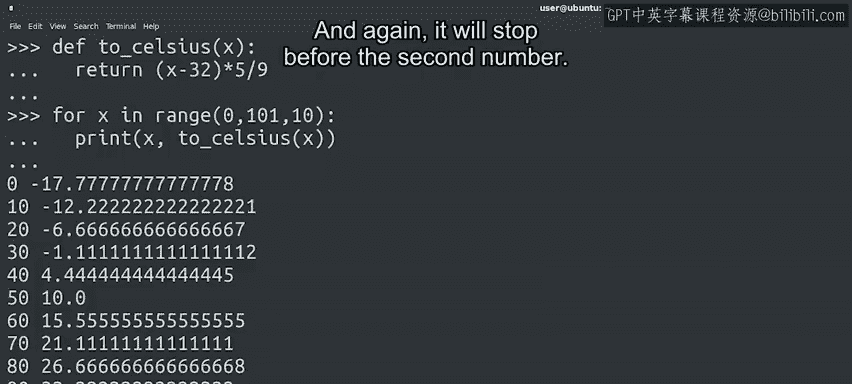

#  042：更多for循环示例 🔄


在本节课中，我们将深入学习Python中`range`函数的更多用法，特别是如何通过传递不同数量的参数来控制序列的起始值、结束值和步长。我们将通过具体的代码示例来演示这些概念，帮助你更好地理解和应用for循环。

---

## 起始值不为零的序列

上一节我们介绍了`range`函数的基本用法，它默认生成从0开始的序列。本节中我们来看看，当我们需要序列从非零值开始时该如何操作。

`range`函数允许我们通过传递两个参数来指定生成序列的起始元素。第一个参数是起始值，第二个参数是结束值（不包含）。

以下是计算1到9所有数字乘积的示例：

```python
product = 1
for n in range(1, 10):
    product = product * n
print(product)
```

在这个例子中，我们计算从1到9所有数字的乘积。这个操作必须从1开始，如果从0开始，整个乘积结果将为零。

---

## 控制序列的步长

除了起始值，我们还可以通过传递第三个参数来改变序列中每个元素之间的步长。这意味着元素之间的差值可以大于1。

以下是一个实际应用的例子，我们将创建一个华氏温度到摄氏温度的转换表：

```python
def to_celsius(x):
    return (x-32) * 5/9

for x in range(0, 101, 10):
    print(x, to_celsius(x))
```

我们定义了一个将华氏温度转换为摄氏温度的函数`to_celsius`，它使用了转换公式`(x-32) * 5/9`。

for循环从0开始，到100结束，步长为10。注意，我们使用101作为上限而不是100，因为`range`函数不包含最后一个元素，而我们希望100被包含在序列中。

循环体打印出华氏温度值及其对应的摄氏温度值，从而生成一个转换表。

---

## `range`函数参数总结

前面的例子可能包含了许多信息，但请不要担心。正如我们之前所说，你不需要死记硬背，多加练习自然会熟练掌握。

以下是`range`函数接收不同数量参数时的行为总结：



*   如果接收**一个参数**，它会创建一个从0开始，到（参数值-1）结束，步长为1的序列。
    *   公式：`range(stop)` -> 生成 `[0, 1, 2, ..., stop-1]`
*   如果接收**两个参数**，它会创建一个从第一个参数开始，到（第二个参数-1）结束，步长为1的序列。
    *   公式：`range(start, stop)` -> 生成 `[start, start+1, ..., stop-1]`
*   如果接收**三个参数**，它会创建一个从第一个参数开始，向第二个参数移动，步长为第三个参数的序列。同样，它在到达第二个参数前停止。
    *   公式：`range(start, stop, step)` -> 生成 `[start, start+step, start+2*step, ...]` (最后一个值 < stop)

---

本节课中我们一起学习了`range`函数更高级的用法，包括如何指定序列的起始值、结束值和步长。我们通过计算乘积和创建温度转换表两个实例，演示了这些参数在实际编程中的应用。记住，理解这些概念的关键在于实践，多写代码，你就能轻松掌握。