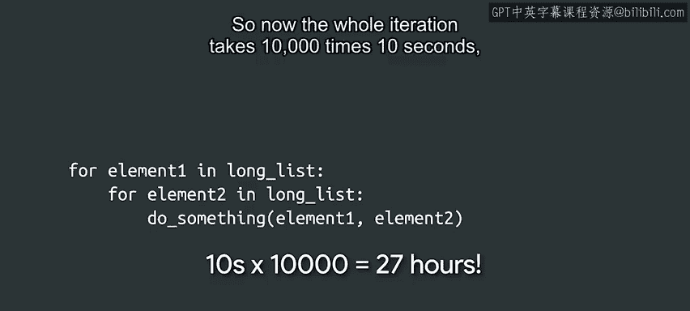

#  043：嵌套的 for 循环 🔄


在本节课中，我们将要学习嵌套的 for 循环。这是一种在循环内部再放置另一个循环的编程技巧，常用于处理需要组合或配对数据的情况。我们将通过两个具体的例子来理解其工作原理和实际应用。

## 概述

嵌套循环是指一个循环结构内部包含另一个完整的循环结构。这种结构特别适用于需要遍历多维数据或生成组合的场景。理解嵌套循环是掌握复杂数据处理的关键一步。

## 多米诺骨牌的例子 🎲

上一节我们介绍了循环的基本概念，本节中我们来看看如何用嵌套循环解决一个实际问题：打印一套多米诺骨牌的所有组合。

一套标准的多米诺骨牌，每张牌有两个数字（从0到6），且组合（如2-3和3-2）被视为同一张牌，只出现一次。我们的目标是编写程序打印出所有唯一的骨牌组合。

以下是实现此目标的思路：
*   首先处理所有左边数字为0的骨牌，右边数字可以从0打印到6。
*   接着处理左边数字为1的骨牌，但需要跳过0-1组合，因为它已经作为1-0打印过了。因此，右边数字从1打印到6。
*   以此类推，对于左边数字为 `n` 的骨牌，右边数字从 `n` 开始打印到6。

将上述思路转化为代码，就需要使用两个for循环，一个套在另一个里面，即嵌套循环。

```python
for left in range(7):
    for right in range(left, 7):
        print("[" + str(left) + "|" + str(right) + "]", end=" ")
    print()
```

在这段代码中，我们使用了一个传递给 `print` 函数的新参数：`end`。默认情况下，`print` 函数在输出内容后会添加一个换行符。通过设置 `end=" "`，我们让它在输出每个骨牌后添加一个空格而不是换行，从而使一行的输出更紧凑。注意，内部的 `for` 循环每次迭代的元素数量会随着外部循环变量 `left` 的值变化而变化。

## 篮球联赛配对的例子 🏀

嵌套循环的另一个典型应用是生成配对或组合。假设你管理一个由四支队伍组成的本地女子篮球联赛，每支队伍都需要与其他队伍进行主客场两场比赛。

我们有一个存储队伍名称的列表：
```python
teams = [‘Dragons‘, ‘Wolves‘, ‘Pandas‘, ‘Unicorns‘]
```

我们希望编写脚本输出所有可能的比赛配对。配对中名字的顺序很重要，因为第一个名字代表主队，第二个名字代表客队。当然，我们不需要一支队伍与自己比赛。

以下是生成所有有效比赛配对的步骤：
*   我们需要使用一个条件判断来确保只在两支队伍名称不同时才打印配对。

```python
for home_team in teams:
    for away_team in teams:
        if home_team != away_team:
            print(home_team + " vs " + away_team)
```

如你所见，嵌套循环是解决像队伍配对这类问题的超级有用的工具。

## 关于性能的注意事项 ⚠️

虽然嵌套循环是一个方便的工具，但我们不能盲目地将其应用于所有问题。主要原因是性能考虑：代码需要遍历的列表越长，计算机完成任务所需的时间就越长。

假设你的经理要求你对一个包含10，000个元素的列表进行操作。如果每个元素的操作耗时1毫秒，那么整个单层循环将耗时 **10秒**（10000 * 0.001秒）。

现在，想象我们添加一个嵌套循环，它也必须遍历同样的10，000个元素。这意味着外部循环的每一次迭代，都会完整地执行一次内部循环（耗时10秒）。因此，整个嵌套迭代将耗时 **100，000秒**（10000 * 10秒），这超过了27小时。



这并不意味着我们不应该使用嵌套循环。它们是解决特定问题的有用工具，但我们需要谨慎考虑在何处以及如何使用它们。在本课程及后续课程中，我们将学习许多技巧，帮助我们为不同类型的问题选择合适的工具。

## 总结

本节课中我们一起学习了嵌套的 for 循环。我们通过打印多米诺骨牌组合和生成篮球联赛赛程两个例子，理解了嵌套循环的结构和应用场景。同时，我们也认识到需要关注嵌套循环可能带来的性能影响，并学会在合适的场景下使用它。接下来，我们将探讨在编写 for 循环时可能遇到的一些常见错误及其解决方法。