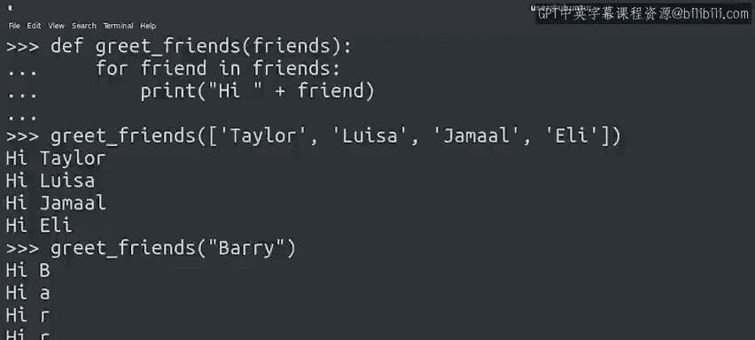

#  044：Python for循环中的常见错误 🐍


在本节课中，我们将学习在使用Python的`for`循环时可能遇到的一些常见错误。理解这些错误及其解决方法，能帮助你更顺畅地编写自动化脚本。

上一节我们介绍了如何编写`for`循环并将其与函数、嵌套循环及条件语句结合使用。本节中，我们来看看在尝试自己编写循环时可能遇到的一些典型问题。

---

## 错误类型一：尝试迭代不可迭代对象

`for`循环用于迭代序列。解释器会拒绝迭代单个非序列元素。

例如，以下代码会引发错误：
```python
for x in 25:
    print(x)
```
Python会抛出一个`TypeError`，提示整数（integers）是不可迭代的。

**解决方法取决于你的意图：**

以下是两种常见场景的解决方案：

1.  **如果想从0迭代到25**：应使用`range()`函数。
    ```python
    for x in range(25):
        print(x)
    ```

2.  **如果想迭代一个仅包含数字25的列表**：则需要将其放入列表中。
    ```python
    for x in [25]:
        print(x)
    ```

你可能会疑惑，为什么要迭代只有一个元素的列表？这通常发生在函数内部。例如，一个用于修复文件权限的函数，其参数预期接收一个文件列表。当你只想修复一个特定文件时，也需要将这个文件作为单元素列表传入。

---

## 错误类型二：意外迭代字符串的字符

让我们通过一个熟悉的例子来探讨这个问题。我们将修改“问候朋友”的代码，将问候语放在一个函数内。

我们定义了一个`greet_friends`函数，它接收一个列表作为参数，并遍历该列表来问候每个朋友。
```python
def greet_friends(friends):
    for friend in friends:
        print("Hi " + friend + "!")

greet_friends(["Alice", "Bob", "Charlie", "Diana"])
```
但如果只想问候一位朋友（例如“Mary”），直接传入字符串会如何？
```python
greet_friends("Mary")
```
输出并非预期。这是因为**字符串本身是可迭代的**。`for`循环会遍历字符串的每一个字母并执行操作（本例中是打印问候语），导致为每个字母都打印了一条问候信息。

在某些情况下，你确实需要遍历字符串的每个字符。但在此例中，我们并不需要。

**正确的做法**是，即使只有一个朋友，也应将其作为列表的元素传入：
```python
greet_friends(["Mary"])
```

---



## 本节总结

本节课我们一起学习了`for`循环中的两个常见错误：

1.  尝试迭代不可迭代的单个对象（如整数）。解决方法是确保循环作用于一个序列，使用`range()`或将其放入列表。
2.  本想迭代包含字符串的列表，却意外地迭代了字符串本身的字符。解决方法是将单个字符串放入列表中再传递。

简而言之，若遇到“某类型不可迭代”的错误，需确保`for`循环使用的是元素序列而非单个元素。若发现代码在遍历字符串的字母而你本意是处理整个字符串，则很可能需要将该字符串作为列表的一部分。

---

我们已经学会了编写`while`循环和`for`循环。记住，当需要遍历已知元素序列时，`for`循环是最佳选择；而当需要在某个条件为真时持续操作，则应使用`while`循环。

接下来，我们将提供一份超级实用的速查表，将所有循环知识汇总。之后，请前往练习测验来检验你的学习成果。😊