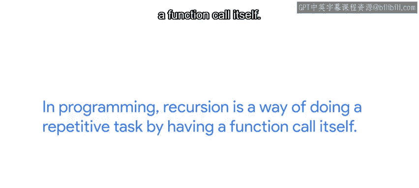
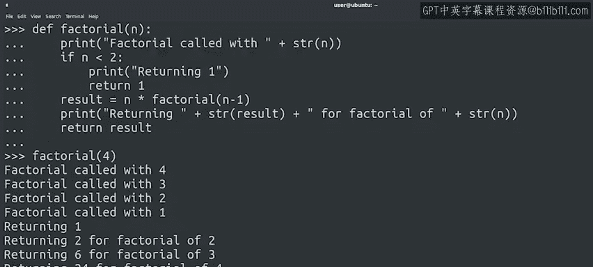

#  045：什么是递归（可选）🔁


在本节课中，我们将要学习一种新的编程技术——递归。我们将了解递归的基本概念、工作原理，并通过具体例子来理解它如何解决复杂问题。

欢迎回来。完成上一个测验后感觉如何？

我们开始学习一些可以在代码中实现的非常酷的技巧。谁能想到循环可以如此迷人？😊 目前我们已经发现了两种可以在Python中使用的循环技术：`while`循环和`for`循环。当某个条件为真时，我们使用`while`循环来重复执行操作。当我们想要遍历序列中的元素时，则使用`for`循环。

现在，我们将探讨第三种技术——递归。但在深入之前，你可能已经注意到本视频标记为“可选”。这是因为，虽然递归是软件工程中一种非常常见的技术，但在自动化领域中使用得并不多。尽管如此，我们认为了解递归并知道如何使用它对你来说仍然很有价值。你可能会在他人编写的代码中看到它，或者遇到一个用递归解决是最佳方案的问题。因此，虽然接下来的几个视频标记为可选，且其内容不计入评分，但它们仍然非常有价值。当然，如果你更愿意专注于需要评分的概念，可以自由跳过它们。

让我们开始吧。递归是将相同的过程重复应用于一个更小的问题。😊

## 递归的直观理解

你玩过俄罗斯套娃吗？它们是递归的一个绝佳视觉示例。每个套娃内部都有一个更小的套娃。当你打开一个套娃找到里面更小的那个时，你会一直继续，直到到达最小的那个无法再打开的套娃。

递归让我们通过将问题简化为一个更简单的问题来处理复杂问题。😊

以我们的俄罗斯套娃为例，它们都嵌套在彼此内部。想象一下，我们想知道总共有多少个套娃。我们需要一个一个地打开每个套娃，直到最后一个，然后数一数我们打开了多少个。这就是递归在起作用。

以下是另一个更复杂问题的例子。想象你排在一个队伍中，想知道你前面有多少人。我得说，我受不了排长队。无论如何，如果队伍很长，在不离开队伍并失去位置的情况下，可能很难数清人数。因此，你可以问你前面的人，他们前面有多少人。由于这个人处于和你相同的情况，他们必须问他们前面的人同样的问题，以此类推，直到问题传到队伍的第一个人。这个人可以自信地回答，他前面没有人。然后，队伍中的第二个人可以回答“1”。他后面的人回答“2”，以此类推，直到答案传回给你。

好吧，我知道让所有人都配合你，只为了让你知道自己在队伍中的位置，这种可能性很小，但这是可视化递归工作原理的一个有用方法。

## 编程中的递归

那么，这在编程中如何体现呢？在编程中，递归是一种通过让函数调用自身来执行重复任务的方式。😊

一个递归函数会调用自身，通常使用一个修改过的参数，直到达到一个特定条件。这个条件被称为**基线条件**。在我们之前的例子中，基线条件就是最小的俄罗斯套娃或队伍最前面的人。

让我们看一个递归函数的例子，以理解我们在这里讨论的内容。

## 递归函数示例：阶乘



我们定义一个名为`factorial`的函数。在函数的开头，我们有一个条件块，定义了基线条件，即当`n`小于2时，它直接返回值`1`。😊

在基线条件之后，我们有一行代码，`factorial`函数用`n-1`作为参数调用自身。这被称为**递归情况**。这创建了一个循环：每次函数执行时，它都会用一个更小的数字调用自身，直到达到基线条件。一旦达到基线条件，它返回值`1`，然后之前调用的函数将其乘以`2`，再之前调用的函数将其乘以`3`，依此类推。这个循环会一直持续，直到第一个被调用的`factorial`函数返回期望的结果。

这有点复杂，对吧？让我们添加一些`print`语句来确切地看看它是如何工作的。😊

```python
def factorial(n):
    print(f"计算 {n} 的阶乘")
    if n < 2:
        print(f"达到基线条件，n={n}，返回 1")
        return 1
    else:
        result = n * factorial(n-1)
        print(f"计算 {n} 的阶乘完成，结果是 {result}")
        return result

# 调用函数
print(factorial(5))
```

在这里，我们可以看到函数不断调用自身，直到达到基线条件。之后，每个函数返回前一个函数的值乘以`n`，直到原始函数返回结果。

很酷，😊

## 总结与前瞻

本节课中，我们一起学习了递归的概念。我们了解到递归是一种通过函数调用自身来解决问题的方法，它包含一个关键的基线条件来终止循环。我们通过俄罗斯套娃和排队的例子直观地理解了递归，并通过阶乘函数的代码示例看到了它的具体实现。



下一节，我们将探讨更多关于何时使用递归以及何时最好避免使用它的例子。