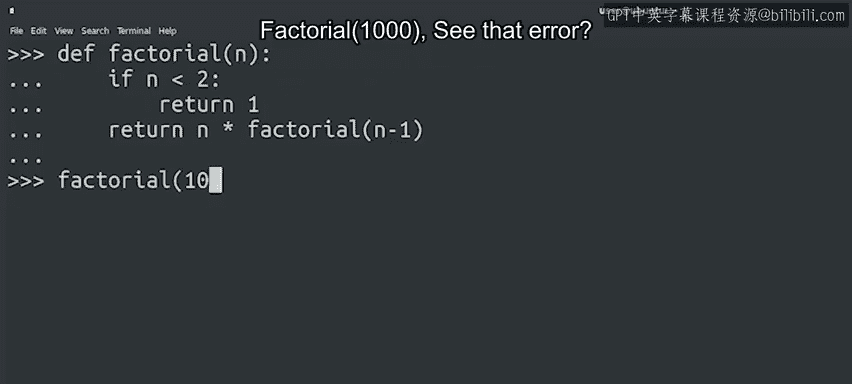

#  046：在IT背景下的递归实践 🧠


在本节课中，我们将学习递归函数在IT自动化任务中的实际应用。我们将探讨为什么在某些场景下，递归比循环更合适，并通过具体的IT示例来理解其工作原理。

---

## 什么是递归函数？

上一节我们介绍了递归函数的基本概念，包括如何编写基线条件和递归条件。现在，我们来看看为什么在特定情况下，递归函数比`for`或`while`循环更有效。

某些特定问题的解决方案，在使用递归函数时更易于编写和理解。许多数学函数，如阶乘或前所有数字之和，就是很好的例子。如果一个数学函数已经用递归术语定义，那么将其代码编写为递归函数就非常直接。

---

## 递归在IT自动化中的应用

递归不仅限于数学函数。让我们通过几个例子，看看它如何帮助IT专家自动化任务。

### 示例一：统计目录中的文件数量

假设你需要编写一个工具，遍历计算机中的一系列目录，并计算每个目录中包含的文件数量。在列出目录中的文件时，你可能会发现其中包含子目录，并且你希望同时统计这些子目录中的文件。

这时使用递归非常合适。基线条件是一个没有子目录的目录。对于这种情况，函数只需返回文件数量。

递归条件则是为每个包含的子目录调用递归函数。给定函数调用的返回值将是该目录中的所有文件数量，加上所有包含的子目录中的文件数量。

一个可以包含其他目录的文件目录是递归结构的一个例子，因为目录可以包含子目录，子目录又可以包含更多子目录，依此类推。

当对递归结构进行操作时，通常使用递归函数比`for`或`while`循环更容易。


以下是该逻辑的简化代码描述：
```python
def count_files(directory):
    total = 0
    # 统计当前目录的直接文件
    total += len(list_files_in_current_dir(directory))
    # 遍历所有子目录并递归调用
    for subdirectory in list_subdirectories(directory):
        total += count_files(subdirectory) # 递归调用
    return total
```

### 示例二：管理嵌套用户组

另一个IT领域的递归结构示例是处理可以包含其他组的用户组。在使用Active Directory或LDAP等管理工具时，我们经常遇到这种情况。

假设你的组管理软件允许你创建同时包含用户和其他组作为成员的组，并且你想要列出属于给定组的所有真实用户。

在这里，你可以使用递归函数来遍历这些组。基线条件是一个只包含用户的组，列出所有用户。

递归条件意味着遍历所有包含的组，列出其中的所有用户，然后列出当前组中包含的任何用户。

以下是该逻辑的简化代码描述：
```python
def list_all_users(group):
    users = []
    # 添加当前组的直接用户
    users.extend(get_direct_users(group))
    # 遍历所有子组并递归调用
    for subgroup in get_subgroups(group):
        users.extend(list_all_users(subgroup)) # 递归调用
    return users
```

---

## 递归的限制与注意事项

需要指出的是，在某些语言中，递归调用的次数是有限制的。在Python中，默认情况下，你可以递归调用一个函数1000次，直到达到限制。

这对于像子目录或用户组这样嵌套深度不会达到数千层的情况来说是可以的，但对于我们在上一个视频中看到的数学函数来说，可能就不够了。

让我们回到上一个视频中的阶乘例子，尝试用`n=1000`来调用它。

`factorial(1000)`



你会看到一个错误，它告诉我们已经达到了递归调用的最大限制。因此，虽然你可以在许多不同场景中使用递归，但我们只建议在你需要遍历一个不会达到1000层嵌套的递归结构时使用它。

---

## 总结

本节课中，我们一起学习了递归在IT自动化中的实际应用。我们探讨了递归为何适合处理像目录树和嵌套用户组这样的递归结构，并通过具体示例理解了其实现方式。同时，我们也了解了Python中递归深度的默认限制，明确了其适用的场景。现在，递归已成为你不断增长的脚本工具箱中的一员，在需要时可以随时使用。