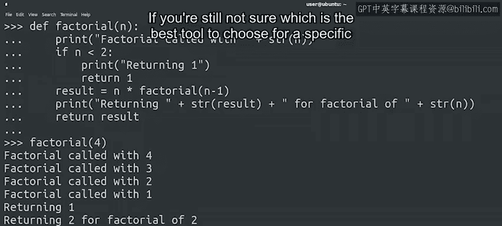

#  047：Python循环总结 🎯

在本节课中，我们将要学习Python中用于执行重复任务的三种主要方法：`while`循环、`for`循环和递归。我们将回顾每种方法的核心概念、适用场景，并帮助你理解如何在实际编程中选择合适的工具。


---

我们已经走过了很长的学习路程，你已经掌握了很多知识。

现在是一个很好的时机，停下来给自己一个大大的鼓励。在这个模块中，我们研究了可以用来告诉计算机重复执行操作的方法。

Python为我们提供了三种不同的方式来执行重复任务：`while`循环、`for`循环和递归。

## `while`循环 🔄

上一节我们介绍了循环的概念，本节中我们来看看第一种循环方式。

当希望**在某个条件为真时**持续执行一个操作，或者**直到该条件变为假时**停止，我们使用`while`循环。

以下是`while`循环的基本语法结构：

```python
while condition:
    # 要重复执行的代码块
```

## `for`循环 📊

接下来，我们看看第二种循环方式。

当我们想要**遍历一个序列（如列表、字符串）的元素**或**一个数字范围**时，我们使用`for`循环。

以下是`for`循环的基本语法结构：



```python
for element in sequence:
    # 对每个元素执行的代码块
```

## 递归 🧩

最后，我们探讨第三种实现重复操作的方法：递归。

当一个问题**最适合通过分解为更小的步骤来解决**，然后**将这些步骤组合起来形成更大的解决方案**时，我们使用递归。

递归的核心是一个函数调用自身。以下是递归函数的基本结构：

```python
def recursive_function(parameters):
    if base_case_condition:  # 基线条件
        return base_case_value
    else:                    # 递归条件
        return recursive_function(modified_parameters)
```

---

如果你仍然不确定针对特定问题应该选择哪种最佳工具，请不要担心，这很正常。

随着你不断练习和提升自动化技能，在不同选项之间做出选择将变得自然而然。

因此，下次当你发现自己一遍又一遍地做相同或类似的事情时，那就是一个信号，提醒你看看是否可以使用循环来让计算机为你完成这项工作。

接下来，又是测试时间，我们将进行下一个分级评估。和往常一样，请记住，你可以在参加评估前花费任意多的时间。按照自己的节奏进行，复习我们涵盖的所有内容并练习示例。

这样，循环就绝不会让你感到困惑。

---

本节课中我们一起学习了Python中实现重复操作的三种核心方法：`while`循环、`for`循环和递归。我们了解了每种方法的适用场景和基本语法，并强调了通过练习来培养选择合适工具的能力。掌握这些循环结构是自动化任务和构建高效程序的关键一步。