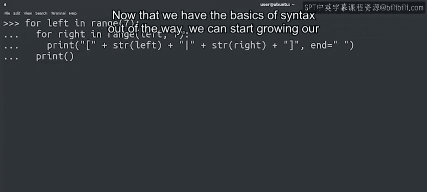

#  049：Python基础数据结构介绍 🧱

在本节课中，我们将要学习Python中几种核心的数据结构：字符串、列表和字典。掌握这些结构是编写自动化脚本的关键，它们能帮助我们更高效地组织和处理数据。

---

欢迎回来。祝贺你坚持学习到这里。

我很高兴你没有在上一个模块关于循环的内容中掉队。

你做得很好，取得了巨大的进步。在之前的视频中，我们介绍了Python语法的基本要素。我们讨论了如何定义函数。

如何让计算机根据条件执行不同的操作？

以及如何使用`while`循环、`for`循环和递归让它重复执行操作。

---

既然我们已经掌握了语法基础，现在可以开始扩展我们的Python知识了，这将让我们能够执行越来越多有趣的操作。

请记住，本课程的主要目标之一是帮助你学会编写能自动执行操作的简短Python脚本。你已经朝着这个目标迈出了一大步。

在接下来的视频中，我们将学习一系列新的、超级有用的技能，以丰富你的编程工具箱。

我们将探索Python语言提供的一些数据类型，以帮助我们解决脚本中的常见问题。

具体来说，我们将深入探讨**字符串**、**列表**和**字典**。

虽然我们已经在脚本中使用过字符串，但我们仅仅触及了在Python中利用它们所能做的事情的表面。

我们也在一些例子中遇到过列表，但还有很多关于列表的内容我们尚未了解。

而字典对我们来说是一个全新的、值得深入钻研的数据类型。

这些都是超级灵活的数据类型或数据结构。

我们将使用它们来编写各种Python脚本。

因此，花些时间了解它们，学习何时使用它们以及如何最大限度地利用它们，是一个好主意。

我们有许多新的、令人兴奋的概念要去发现。那么，让我们直接开始吧。