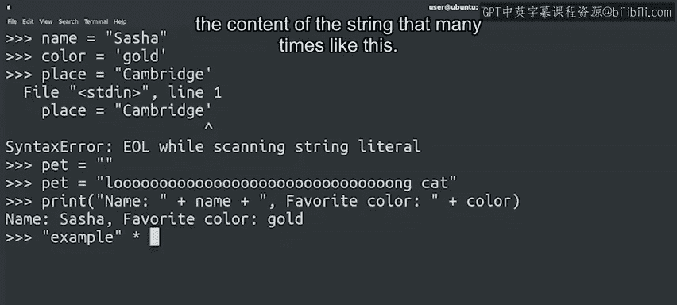

#  050：Python字符串基础入门 🧵


## 概述

在本节课中，我们将要学习Python编程语言中的字符串数据类型。字符串是用于表示文本数据的基本类型，在IT自动化脚本中处理文件名、用户信息、配置内容等都离不开它。我们将从字符串的基本定义开始，逐步了解其特性和常见操作。

---

## 什么是字符串？🤔

到目前为止，我们已经在很多示例中使用过字符串，但尚未详细探讨它们。

在深入细节之前，我们先回顾一下目前所学的知识，并补充几点。

首先，快速回顾一下。字符串是Python中用于表示一段文本的数据类型。

它写在引号之间，可以是双引号，也可以是单引号，由你选择。

使用哪种引号并不重要，只要它们匹配即可。

如果我们混淆了双引号和单引号，Python会报错，返回一个语法错误，提示无法找到字符串的结尾。



字符串可以短至零个字符，通常称为空字符串。也可以非常长。

我们还学习了可以使用加号来组合字符串以构建更长的字符串，这个操作称为拼接。

一个不太常见的操作是将字符串乘以一个数字，这会将字符串的内容重复相应的次数，如下所示：

```python
"Ha" * 3
# 结果是：'HaHaHa'
```

如果我们想知道一个字符串的长度，可以使用`len()`函数，我们在之前的视频中见过。`len()`函数会告诉我们字符串中包含的字符数。

---

## 字符串的用途 📝

我们可以用字符串来表示许多不同的事物。

它们可以保存用户名、机器名、电子邮件地址、文件名以及任何其他文本。

我们将要交互的很多数据都将以字符串形式存储。因此，了解如何使用它们非常重要。

在我们的脚本中，可以对字符串进行大量操作。

以下是几个具体的应用场景：

*   **检查文件名**：通过查看文件名，检查它们是否符合我们的命名规范。
*   **创建电子邮件列表**：通过检查系统用户并拼接上我们的域名来生成。
*   **处理文件内容**：文本文件的内容也是字符串。例如，将一批配置文件中的默认值从“true”替换为“false”。

你可以想到更多代码需要处理字符串的例子。但为了有效地使用字符串，我们需要了解Python中提供了哪些可用的操作。

在接下来的几节中，我们将介绍一些可以对字符串执行的操作，包括如何访问其部分内容以及如何修改它们。

---

## 总结

本节课中，我们一起学习了Python字符串的基础知识。我们明确了字符串是用于表示文本的数据类型，可以使用单引号或双引号定义。我们回顾了字符串拼接和重复乘法等基本操作，并了解了`len()`函数用于获取字符串长度。最后，我们探讨了字符串在IT自动化中的实际应用场景，例如处理文件名和文件内容，为后续深入学习字符串操作打下了基础。