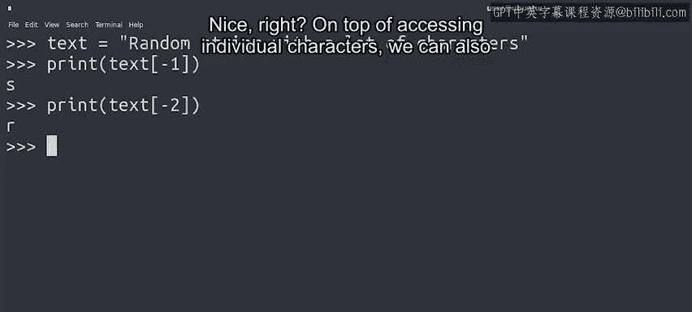
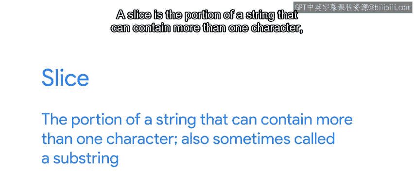
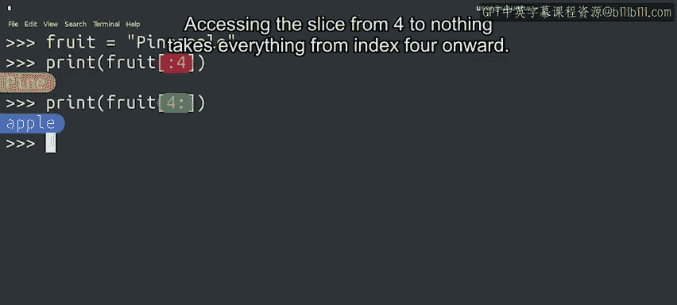

#  051：字符串的组成部分 🧵


在本节课中，我们将要学习Python中字符串的基本组成部分，包括如何访问单个字符、使用切片获取子字符串，以及理解索引的工作原理。这些技能对于处理文本数据至关重要。

---

## 字符串索引：访问特定字符 🔍

上一节我们介绍了使用`for`循环遍历字符串。本节中我们来看看如何访问字符串中的特定字符。

例如，当文本过长需要截取部分显示，或需要提取短语中每个单词的首字母制作缩写时，我们可以使用**字符串索引**操作。该操作使用方括号和位置编号访问给定位置或索引的字符。

```python
示例：string[0]
```

初次尝试可能会令人困惑。我们请求第一个字符，但得到的是第二个字符。这是因为Python从0开始计数索引，与`range`函数的行为一致。因此，要访问第一个字符，需要使用索引0。

了解索引从0开始后，字符串的最后一个索引始终是字符串长度减一。例如，一个长度为6的字符串，其最后一个索引是5。尝试访问超出范围的索引（如索引6）将引发“索引超出范围”错误。

若想打印字符串的最后一个字符但不知道其长度，可以使用**负索引**。负索引允许从字符串末尾开始访问位置。

```python
示例：string[-1]
```

---

## 字符串切片：获取子字符串 ✂️



除了访问单个字符，我们还可以访问字符串的**切片**。切片是包含多个字符的字符串部分，有时也称为子字符串。



我们通过使用冒号作为分隔符创建范围来实现切片。

```python
示例：string[1:4]
```

用于访问字符串切片的范围与`range`函数创建的范围类似：包含起始数字，但不包含结束数字（结束数字减一）。例如，`string[1:4]`从索引1（字符串的第二个字母）开始，到索引3（字符串的第四个字母）结束。

范围还可以只包含两个索引中的一个。在这种情况下，未指定的索引默认为0（起始值）或字符串长度（结束值）。

以下是切片操作的示例：

*   从起始到索引4：获取字符串的前四个字符（索引0到3）。
*   从索引4到结束：获取从索引4开始的所有字符。



---

## 总结与练习建议 📚

本节课中我们一起学习了字符串索引和切片的核心概念。所有索引操作起初可能令人困惑，但通过持续练习可以掌握。后续课程提供了大量练习来帮助巩固这些技能。

现在我们已经知道如何选择、切片和访问所需的字符串部分，接下来将学习如何修改它们。