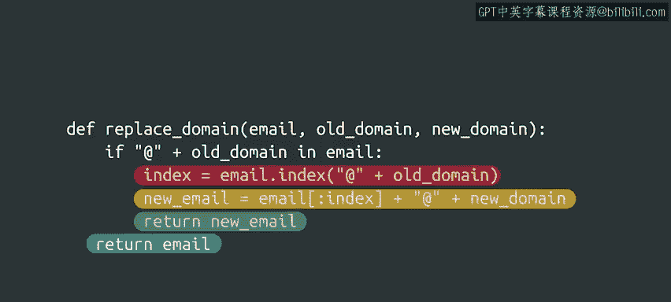

#  052：Python字符串操作基础（第51课）🔤


在本节课中，我们将要学习Python中字符串的基本操作，包括如何访问和修改字符串中的字符，以及如何使用一些内置方法来处理字符串。我们还会通过一个实际的例子来巩固所学知识。

---

## 字符串的不可变性 🔒

上一节我们介绍了如何访问字符串中的特定字符。本节中我们来看看如何修改它们。

想象你有一个字符串，其中包含一个错误的字符，你想要修正它。考虑到你学过的字符串索引知识，你可能会尝试通过访问相应的索引来修改字符。

让我们看看如果尝试这样做会发生什么。

```python
message = "Hello, World!"
message[7] = 'w'
```

输出：
```
TypeError: 'str' object does not support item assignment
```

在这种情况下，我们被告知字符串不支持项赋值。这意味着我们不能更改单个字符，因为Python中的字符串是不可变的。

“不可变”只是一个花哨的词汇，意味着它们不能被修改。

我们可以做的是基于旧字符串创建一个新字符串，像这样：

```python
message = "Hello, World!"
new_message = message[:7] + 'w' + message[8:]
print(new_message)
```

输出：
```
Hello, world!
```

很好，我们修正了拼写错误。

但这意味着`message`变量永远不能改变吗？并非如此。我们可以为同一个变量分配一个新值。让我们这样做几次来看看它是如何工作的。

```python
message = "Hello, World!"
message = "Hello, world!"
message = "Hello, Python!"
```

我们在这里做的是给`message`变量一个全新的值。我们并没有改变之前分配给它的底层字符串。我们分配了一个具有不同内容的全新字符串。

如果这看起来有点复杂，没关系。你现在不需要担心这个。每当我们编写的程序与此相关时，我们都会指出来。

---

## 查找字符位置 🔍

我们弄清楚了如何从旧消息创建新消息。但我们如何知道要更改哪个字符呢？让我们尝试一些不同的方法。

```python
message = "Hello, World!"
index = message.index('W')
print(index)
```

输出：
```
7
```

在这种情况下，我们使用一个方法来获取某个字符的索引。

方法是一个与特定类关联的函数。我们稍后会更多地讨论类和方法。现在，你需要知道的是，这是一个应用于变量的函数，我们可以通过在变量后面加一个点来调用它。

让我们再试几次。

```python
message = "Hello, World!"
print(message.index('o'))
print(message.index('World'))
```

输出：
```
4
7
```

`index`方法返回给定子字符串在字符串中的索引。我们传递的子字符串可以任意长或短。

如果子字符串不止一个呢？

```python
message = "Mississippi"
print(message.index('s'))
```

输出：
```
2
```

这里我们知道有两个's'字符，但我们只得到一个值。这是因为`index`方法只返回第一个匹配的位置。

如果字符串中没有我们要找的子字符串会发生什么？

```python
message = "Hello, World!"
print(message.index('z'))
```

输出：
```
ValueError: substring not found
```

`index`方法无法返回一个数字，因为子字符串不存在。所以我们得到一个值错误。

---

## 检查子字符串是否存在 ✅

我们说如果子字符串不存在，我们会得到一个错误。那么我们如何知道一个子字符串是否包含在字符串中以避免错误呢？让我们来看看。

我们可以使用关键字`in`来检查子字符串是否包含在字符串中。

我们在使用`for`循环时遇到过关键字`in`。在那种情况下，它用于迭代。在这里，它是一个条件，可以是真或假。

如果子字符串是字符串的一部分，则为真；如果不是，则为假。

```python
message = "Hello, World!"
print('World' in message)
print('Python' in message)
```

输出：
```
True
False
```

所以在这里，'dragon'这个子字符串不是字符串的一部分。遗憾的是，我们不能养龙作为宠物。

---

## 实践：更新电子邮件域名 📧

我们刚刚涵盖了一堆新内容，你做得非常棒。让我们把所有这些东西放在一起来解决一个现实世界的问题。

想象一下，你的公司最近开始使用一个新域名，但公司很多电子邮件地址仍然在使用旧域名。你想编写一个程序，在任何过时的电子邮件地址中将旧域名替换为新域名。

替换域名的函数如下所示：

```python
def replace_domain(email, old_domain, new_domain):
    if "@" + old_domain in email:
        index = email.index("@" + old_domain)
        new_email = email[:index] + "@" + new_domain
        return new_email
    return email
```

这个函数比其他函数复杂一些。所以让我们逐行分析。

首先，我们定义`replace_domain`函数，它接受三个参数：要检查的电子邮件地址、旧域名和新域名。

将所有值作为参数而不是直接放在代码中，使我们的函数可重用。我们不仅仅是更改一个域名为另一个。我们有一个适用于所有域名的函数。非常棒。

在函数体的第一行，我们使用关键字`in`检查电子邮件地址中是否包含“@”符号和旧域名的连接。

我们检查这个是为了确保电子邮件在“@”符号后面的部分包含旧域名。

如果条件为真，则需要更新电子邮件地址。为此，我们首先找出旧域名（包括“@”符号）开始的索引。

我们知道这个索引将是一个有效的数字，因为我们已经检查了子字符串存在。



因此，使用这个索引，我们创建新的电子邮件。这是一个字符串，包含旧电子邮件直到我们计算出的索引的第一部分，然后是“@”符号和新域名。

最后，我们返回这个新电子邮件。

如果电子邮件不包含新域名，那么我们可以直接返回它，这就是我们在最后一行所做的。

---

## 总结 📝

本节课中我们一起学习了Python字符串的基本操作。我们了解到字符串是不可变的，这意味着不能直接修改其中的字符，但可以通过创建新字符串来实现修改。我们学习了如何使用`index()`方法查找子字符串的位置，以及如何使用`in`关键字检查子字符串是否存在。最后，我们通过一个更新电子邮件域名的实际例子，将所学知识综合应用，解决了实际问题。

这些概念是处理文本数据的基础，在后续的编程工作中会经常用到。如果你觉得某些部分有难度，可以重新观看视频或向学习社区寻求帮助。当你准备好继续前进时，我们将在下一个视频中学习更多方便的字符串方法。