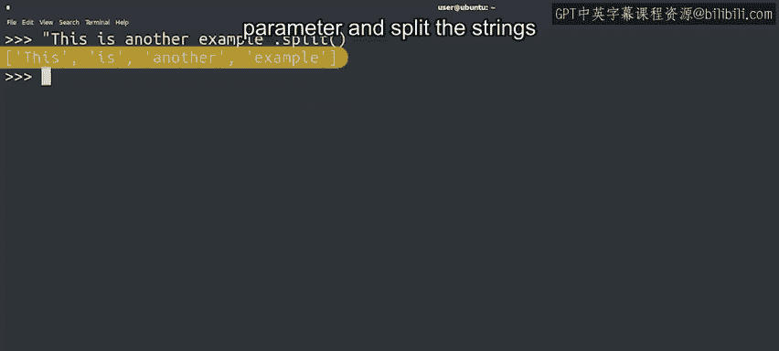

#  053：Python字符串进阶操作 🧵


## 课程编号：P53

在本节课中，我们将要学习更多用于处理和转换字符串的Python方法。我们将探索如何改变字符串的大小写、清理用户输入、获取字符串信息，以及如何拆分和连接字符串。

---

我们之前提到过，有许多令人兴奋的新概念即将到来。现在，我们将通过一系列有趣的方法来结束关于字符串的课程，这些方法可以转换我们的字符串文本。

到目前为止，我们已经学习了使用索引技术访问字符串部分的方法，通过切片和连接创建新字符串，使用`index`方法查找字符串中的字符，甚至测试一个字符串是否包含另一个字符串。除了这些强大的字符串处理功能外，`str`类还提供了许多其他处理文本的方法。

现在，我们将展示如何使用其中一些方法。请记住，目标不是让你记住所有内容，而是让你了解在Python中可以用字符串做什么。

---

### 字符串转换与格式化方法

一些字符串方法允许你对字符串文本执行转换或格式化操作，例如`upper()`及其相反的方法`lower()`。

以下是几个关键方法及其用法：

*   **`str.upper()`**: 将字符串中的所有字符转换为大写。
    ```python
    text = "Hello World"
    print(text.upper())  # 输出: HELLO WORLD
    ```
*   **`str.lower()`**: 将字符串中的所有字符转换为小写。
    ```python
    text = "Hello World"
    print(text.lower())  # 输出: hello world
    ```

在处理用户输入时，这些方法非常有用。假设你想检查用户对某个问题的回答是否为“yes”，你无需关心用户输入的是大写还是小写，只需将答案转换为你想要的格式即可。

---

### 清理用户输入

另一个处理用户输入时非常有用的方法是`strip()`。此方法会去除字符串周围（开头和结尾）的空格。

如果我们向用户询问答案，通常不关心任何周围的空格。因此，使用`strip()`方法去除任何空白字符是一个好主意。

以下是相关方法：

*   **`str.strip()`**: 移除字符串开头和结尾的空白字符（包括空格、制表符`\t`、换行符`\n`）。
    ```python
    user_input = "  yes  \n"
    print(user_input.strip())  # 输出: "yes"
    ```
*   **`str.lstrip()`**: 仅移除字符串**开头（左侧）**的空白字符。
*   **`str.rstrip()`**: 仅移除字符串**结尾（右侧）**的空白字符。

这意味着`strip()`不仅移除空格，还移除制表符和换行符，这些通常是我们不希望出现在用户提供的字符串中的字符。

---

### 获取字符串信息

其他方法可以为你提供关于字符串本身的信息。

以下是几个用于检查字符串内容的方法：

*   **`str.count(substring)`**: 返回给定子字符串在字符串中出现的次数。
    ```python
    sentence = "She sells seashells by the seashore."
    print(sentence.count("sea"))  # 输出: 2
    ```
*   **`str.endswith(substring)`**: 返回字符串是否以某个子字符串结尾。
    ```python
    filename = "document.pdf"
    print(filename.endswith(".pdf"))  # 输出: True
    ```
*   **`str.isnumeric()`**: 返回字符串是否仅由数字组成。
    ```python
    num_str = "12345"
    print(num_str.isnumeric())  # 输出: True
    ```

补充一点，如果我们有一个由数字组成的字符串，可以使用`int()`函数将其转换为实际的整数。

---

### 字符串的拆分与连接

在之前的视频中，我们展示了可以使用加号`+`来连接字符串。

`join()`方法也可用于连接字符串。要使用`join()`方法，必须在将用于连接的字符串上调用它。该方法接收一个字符串列表，并返回一个字符串，其中列表中的每个字符串都由初始字符串连接起来。

让我们看一个例子：



```python
words = ["Hello", "world", "from", "Python"]
separator = " "
result = separator.join(words)
print(result)  # 输出: Hello world from Python
```

最后，我们也可以将一个字符串拆分成一个字符串列表。`split()`方法返回初始字符串中所有单词组成的列表，它会自动按任何空白字符进行拆分。它可以选择性地接受一个参数，按另一个字符（如逗号或点）来拆分字符串。

```python
data = "apple,banana,cherry"
items = data.split(",")
print(items)  # 输出: ['apple', 'banana', 'cherry']
```

---

你是否开始看到这些字符串方法在你的IT工作中可能很有用？好的，我们刚刚学习了一堆新方法，但还有更多可以用于字符串的方法。我们在下一份速查表中包含了我们讨论过的方法和一些新方法。

你还会在那里找到完整Python文档的链接，它提供了每个可用方法的所有信息。正如我们之前所说，不要担心试图记住所有内容。通过练习，你会掌握这些概念。文档总是在那里，如果你需要的话。

---

在本节课中，我们一起学习了多种处理字符串的Python方法。我们了解了如何转换字符串的大小写以规范化用户输入，如何使用`strip()`系列方法清理字符串两端的空白字符，以及如何使用`count()`、`endswith()`和`isnumeric()`等方法获取字符串的特定信息。最后，我们探索了如何使用`join()`方法连接字符串列表，以及如何使用`split()`方法将字符串拆分为列表。掌握这些方法将极大地增强你处理和操作文本数据的能力。