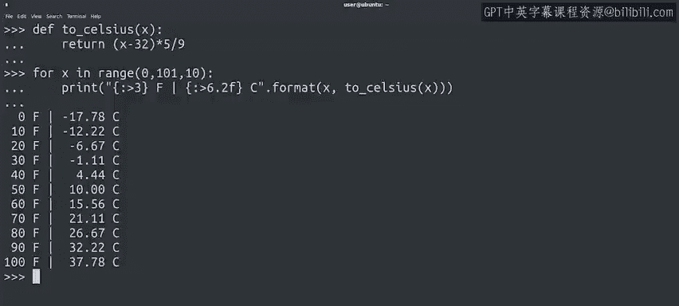

#  054：Python字符串格式化 📝


## 概述

在本节课中，我们将要学习Python中一种更优雅、更强大的字符串构建方法：使用`format()`方法进行字符串格式化。我们将逐步了解其基本用法、高级特性，以及如何利用它来美化程序输出和生成清晰的日志信息。

---

## 从拼接字符串到格式化字符串

上一节我们介绍了使用加号（`+`）拼接字符串和使用`str()`函数转换数字的方法。这种方法虽然可行，但在处理复杂字符串时并不理想。

本节中我们来看看如何使用`format()`方法更高效地构建字符串。

**基本用法示例：**
```python
name = "Mikel"
number = 42
message = "Hello {}! Your number is {}.".format(name, number)
print(message)
# 输出：Hello Mikel! Your number is 42.
```
在上面的代码中，我们使用花括号`{}`作为占位符，然后通过`format()`方法将变量`name`和`number`依次填入。`format()`方法会自动处理字符串和整数等不同类型的数据，我们无需手动转换。

---

## 使用命名占位符提高可读性

为了使格式化字符串更具可读性，尤其是在文本可能被重写或翻译、变量顺序可能改变的情况下，我们可以在花括号内使用变量名作为占位符。

以下是使用命名占位符的方法：
```python
message = "Hello {name}! Your number is {num}.".format(name="Mikel", num=42)
print(message)
# 输出：Hello Mikel! Your number is 42.
```
使用这种方式时，传递给`format()`方法的参数顺序不再重要，只需确保参数名与占位符名称匹配即可。

---

## 格式化数字输出

`format()`方法的功能远不止于此。我们接下来看看如何格式化数字，例如控制小数位数。

假设我们需要计算含税价格，并希望结果只显示两位小数。

**控制小数位数示例：**
```python
price = 7.5
tax_rate = 0.09
price_with_tax = price * (1 + tax_rate) # 结果为 8.175
formatted_price = "The price with tax is ${:.2f}.".format(price_with_tax)
print(formatted_price)
# 输出：The price with tax is $8.18.
```
在`{:.2f}`这个格式化表达式中，冒号`:`后面是格式说明。`.2f`表示将数字格式化为浮点数（`f`），并保留两位小数（`.2`）。

---

## 美化输出：对齐与格式化

还记得我们在华氏度与摄氏度转换表中，输出因过多小数位而显得杂乱吗？使用`format()`方法可以轻松解决这个问题。

**对齐与格式化示例：**
```python
# 假设我们有两个温度值
f_temp = 98.6
c_temp = (f_temp - 32) * 5/9 # 计算结果约为 37.0

# 使用格式化使其对齐美观
print("{:>3.0f} degrees Fahrenheit is {:>6.2f} degrees Celsius.".format(f_temp, c_temp))
# 输出： 99 degrees Fahrenheit is  37.00 degrees Celsius.
```
以下是表达式的含义：
*   `{:>3.0f}`：将第一个数字（`f_temp`）格式化为整数（`.0f`），并右对齐（`>`）在总共3个字符的宽度内。
*   `{:>6.2f}`：将第二个数字（`c_temp`）格式化为保留两位小数的浮点数（`.2f`），并右对齐（`>`）在总共6个字符的宽度内。

通过这种方式，我们可以让程序的输出看起来更整齐、更专业，同时也能生成更有用的日志和调试信息。



---

## 总结

本节课中我们一起学习了Python中`format()`方法的核心用法。我们从基本的占位符替换开始，逐步深入到使用命名参数、控制数字格式（如小数位数）以及对齐文本输出。

记住，字符串格式化是一个强大的工具，它能让你的代码更简洁，输出更美观。无需一次性记住所有格式规则，在实践中遇到时查阅即可。在后续课程中，我们也会在需要时解释新的格式化选项，并为你提供速查表以供参考。