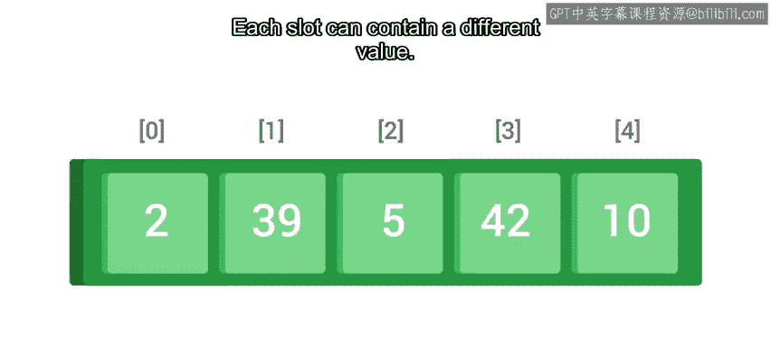
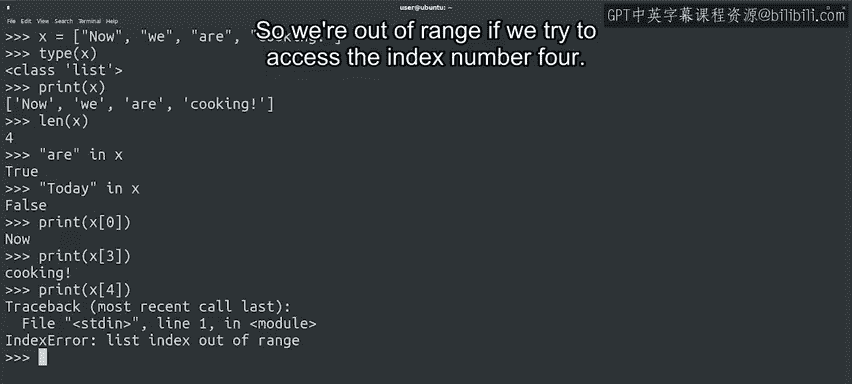
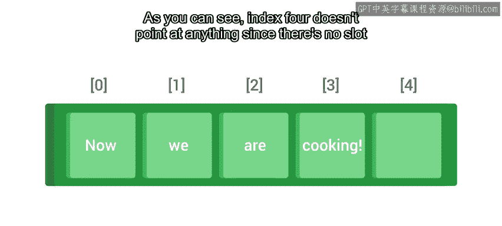
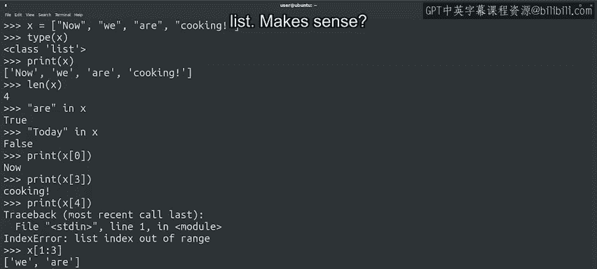

#  055：什么是列表？📚


在本节课中，我们将要学习Python中一个非常重要的数据结构——列表。列表允许我们存储和操作一组有序的元素，这在处理如文件名集合、网络数据包大小等场景时非常有用。

## 概述

正如我们所知，Python提供了许多现成的数据类型。我们已经详细了解了整数、浮点数、布尔值和字符串，但这些数据类型的功能有限。最终，在我们的脚本中，我们需要编写能够操作项目集合的代码，例如代表目录中所有文件名的字符串列表，或代表网络数据包大小的整数列表。这时，列表数据类型就派上用场了。

你可以将列表想象成一个长盒子，盒子内部的空间被划分成不同的槽位。每个槽位可以包含一个不同的值。

## 创建与查看列表

与之前首次接触Python列表时提到的一样，我们使用方括号来指示列表的开始和结束。让我们看一个例子。



```python
x = ["a", "b", "c", "d"]
```

这里我们创建了一个名为`x`的新变量，并将其内容设置为一个字符串列表。我们可以使用之前见过的`type`函数来检查`x`的类型。

```python
print(type(x))  # 输出：<class 'list'>
```

很好，Python告诉我们这是一个列表。与其他变量一样，我们可以使用`print`函数显示整个列表的内容。

```python
print(x)  # 输出：['a', 'b', 'c', 'd']
```

## 列表长度与成员检查

列表的长度是指它包含多少个元素。要获取这个值，我们将使用与字符串相同的`len`函数。

```python
print(len(x))  # 输出：4
```

没错，我们的列表有四个元素。当为列表调用`len`时，每个字符串本身有多长并不重要，重要的是列表有多少个元素。

要检查列表是否包含某个特定元素，可以使用关键字`in`，如下例所示。

```python
print("a" in x)  # 输出：True
print("e" in x)  # 输出：False
```

同样，就像我们将其用于字符串时一样，此检查的结果是一个布尔值，我们可以将其用作分支或循环的条件。

## 索引与切片

我们还可以使用索引来访问单个元素，具体取决于它们在列表中的位置。为此，我们使用方括号和我们想要访问的索引，就像对字符串所做的那样。

```python
print(x[0])  # 输出：'a'
print(x[1])  # 输出：'b'
```

请记住，第一个元素的索引是0。这意味着列表的最后一个索引将是列表长度减1。

```python
print(x[len(x) - 1])  # 输出：'d'
```



如果我们尝试访问列表末尾之后的元素会发生什么？

你可能已经预料到了。我们会得到一个索引错误。我们不能超出列表的末尾。



```python
# print(x[4])  # 这将引发 IndexError: list index out of range
```

记住，因为列表索引从0开始，访问索引4处的项目意味着我们试图访问列表中的第五个元素。列表中只有四个元素，所以如果我们尝试访问索引号4，就超出了范围。

如果这看起来有点令人困惑，下面的可视化图示可能会帮助你理解。正如你所见，索引4没有指向任何东西，因为我们的列表中没有槽位4。

与字符串类似，我们也可以使用索引来创建列表的切片。为此，我们使用由冒号分隔的两个数字范围。同样，第二个元素不包含在切片中。所以范围是到第二个索引减1。



```python
print(x[1:3])  # 输出：['b', 'c']
```

这里我们从索引1开始，一直到小于3的值，即2。我们也可以将范围索引之一留空。第一个值默认为0，第二个值默认为列表的长度。

```python
print(x[:2])   # 输出：['a', 'b']
print(x[2:])   # 输出：['c', 'd']
```

## 列表与序列

如果所有这些听起来与我们之前关于字符串的讲解非常相似，那么本课程的目的就达到了。这是因为在Python中，字符串和列表是非常相似的数据类型。字符串和列表都是序列的例子。还有其他序列类型，它们都共享一系列操作，例如使用`for`循环进行迭代、使用索引、使用`len`函数获取序列长度、使用加号连接两个序列以及使用`in`来验证序列是否包含某个元素。

所以这是个好消息：理解索引虽然困难，但一旦你掌握了一种数据类型的索引，你几乎就掌握了所有数据类型的索引。所以你实际上知道的比你想象的要多得多。

## 总结

本节课中我们一起学习了Python列表的基础知识。我们了解了如何创建列表、检查其长度和成员、使用索引访问元素以及创建切片。我们还认识到列表是序列的一种，与字符串共享许多操作特性。掌握了这些，你就为学习更多列表特有的操作打下了坚实的基础。

接下来，我们将学习一些更多专门针对列表的操作。