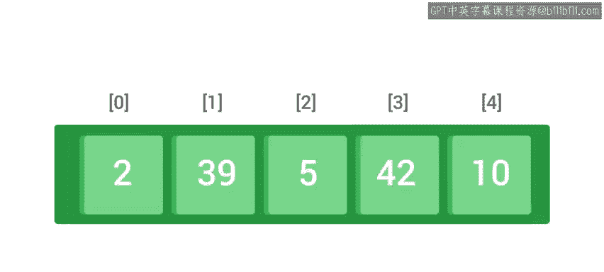
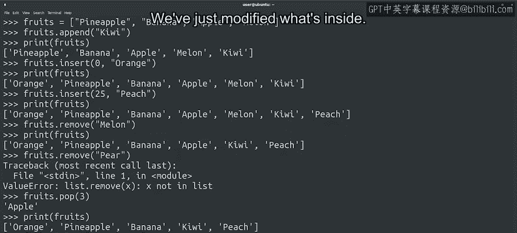

#  056：修改列表内容 📝


在本节课中，我们将要学习如何修改Python列表的内容。列表与字符串的一个重要区别在于列表是可变的，这意味着我们可以添加、移除或修改列表中的元素。想象列表是一个长盒子，修改列表就是保持盒子不变，但改变盒子里的物品。

## 列表与字符串的区别 🔄

上一节我们介绍了列表的基本概念，本节中我们来看看列表与字符串的一个关键区别：可变性。列表是**可变**的，而字符串是不可变的。这意味着列表的内容可以更改，而字符串一旦创建就不能修改。

## 修改列表的方法 🛠️



现在，我们将逐一介绍用于修改列表的方法。如果这些细节看起来有些多，不用担心。像往常一样，课程最后会有备忘单，并且我们会有很多机会练习这些方法。你不需要死记硬背，当然，你也可以随时复习任何不清楚的内容。

### 添加元素到列表

我们将从最简单的修改开始：使用`append`方法向列表添加元素。

以下是`append`方法的使用示例：

```python
fruits = ["Pineapple", "Banana", "Apple", "Melon"]
fruits.append("Kiwi")
print(fruits)  # 输出: ['Pineapple', 'Banana', 'Apple', 'Melon', 'Kiwi']
```

`append`方法在列表末尾添加一个新元素。无论列表多长，元素总是被添加到末尾。你可以从一个空列表开始，然后使用`append`添加所有项目。

如果希望在特定位置插入元素，而不是在末尾，可以使用`insert`方法。

以下是`insert`方法的使用示例：

```python
fruits.insert(0, "Orange")
print(fruits)  # 输出: ['Orange', 'Pineapple', 'Banana', 'Apple', 'Melon', 'Kiwi']
```

`insert`方法将第一个参数作为索引，第二个参数作为元素。它将元素添加到列表中的该索引位置。要将其添加为第一个元素，我们使用索引0。我们也可以使用任何其他数字。

如果使用的数字大于列表的长度，不会出现错误。元素只会被添加到末尾。通常，你会在开头使用索引0的`insert`，或在末尾使用`append`。

### 从列表中移除元素

我们可以根据要移除的元素值来移除列表中的元素。

以下是`remove`方法的使用示例：

```python
fruits.remove("Banana")
print(fruits)  # 输出: ['Orange', 'Pineapple', 'Apple', 'Melon', 'Kiwi']
```

`remove`方法从列表中移除我们传递给它的元素的第一个出现项。如果元素不在列表中，我们会得到一个值错误，告诉我们该元素不在列表中。

另一种移除元素的方法是使用`pop`方法，它接收一个索引。

以下是`pop`方法的使用示例：

```python
removed_fruit = fruits.pop(3)
print(removed_fruit)  # 输出: Melon
print(fruits)         # 输出: ['Orange', 'Pineapple', 'Apple', 'Kiwi']
```

`pop`方法返回在传递的索引处被移除的元素。

### 修改列表中的元素

修改列表内容的最后一种方法是通过为该位置分配其他内容来更改项目。

以下是修改元素的示例：

```python
fruits[2] = "Strawberry"
print(fruits)  # 输出: ['Orange', 'Pineapple', 'Strawberry', 'Kiwi']
```

我们的`fruits`变量的内容自本视频开始以来已经改变了很多，但它始终是同一个变量，同一个盒子。我们只是修改了里面的内容。



## 列表修改的实际应用 💼

修改列表内容在我们操作列表时会出现在大量的脚本中。如果列表包含网络上的主机，你可以在主机上线或离线时添加或移除主机。如果列表包含被授权运行某个进程的用户，你可以在权限被授予或移除时添加或移除用户，等等。

## 总结 📚

本节课中我们一起学习了多种修改列表内容的方法，包括添加、移除和更改列表中存储的元素。每当你需要编写一个处理可变数量元素的程序时，你都会使用列表。如果你需要一个固定数量元素的序列，我们将在下一个视频中介绍。