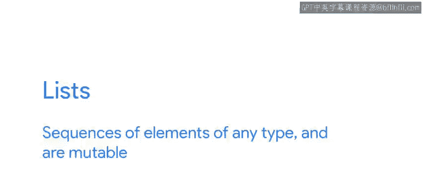
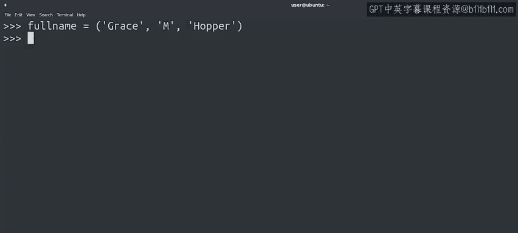
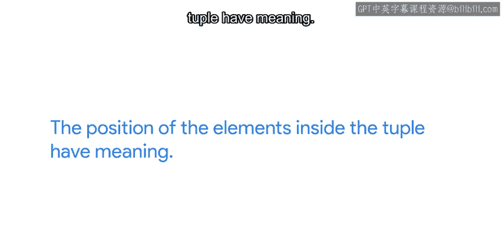
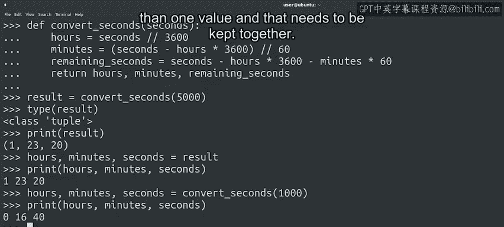

#  057：Python中的列表与元组 🧩


## 概述

在本节课中，我们将要学习Python中的两种重要序列数据类型：列表（List）和元组（Tuple）。我们将了解它们的定义、特性、区别以及各自适用的场景，帮助你理解何时该使用列表，何时该使用元组。

---



## 序列数据类型简介

正如之前提到的，Python中有多种数据类型属于序列。字符串（Str）是字符的序列，并且是不可变的。列表（List）是任意类型元素的序列，并且是可变的。

---

## 什么是元组？ 🤔

第三种序列数据类型，与列表密切相关，就是元组（Tuple）。元组是任意类型元素的序列，但它是不可变的。我们使用圆括号 `()` 来定义元组，而不是方括号 `[]`。

你可能会想，既然列表已经很好了，为什么我们还需要另一种序列类型？是的，列表非常强大。它们可以容纳任意数量的元素，并且我们可以随意添加、删除和修改其内容。

但是，在某些情况下，我们希望确保某个特定位置或索引的元素指向一个特定的事物并且不会改变。在这些情况下，列表就无法帮助我们了。

---

## 元组的含义与不可变性

在我们的例子中，有一个表示某人全名的元组。元组的第一个元素是名字，第二个元素是中间名首字母，第三个元素是姓氏。

如果我们在其中任意位置添加另一个元素，那么这个元素代表什么呢？这只会造成混淆，我们的代码也不知道该如何处理它。这就是为什么不允许修改元组。

换句话说，当使用元组时，元素在元组内的位置具有特定的含义。

---



## 元组的常见用途

元组在Python中有许多不同的用途。一个常见的例子是函数的返回值。当一个函数返回多个值时，它实际上返回的是一个元组。



还记得我们之前看到的将秒数转换为小时、分钟和秒的函数吗？这里再次展示以作提醒：

```python
def convert_seconds(seconds):
    hours = seconds // 3600
    minutes = (seconds - hours * 3600) // 60
    remaining_seconds = seconds - hours * 3600 - minutes * 60
    return hours, minutes, remaining_seconds
```

这个函数返回三个值。换句话说，它返回一个包含三个元素的元组。让我们尝试一下：

```python
result = convert_seconds(5000)
print(type(result))  # 输出: <class 'tuple'>
print(result)        # 输出: (1, 23, 20)
```

我们看到结果是一个元组。打印它，可以看到它包含我们期望的三个元素。请记住，由于这是一个元组，顺序很重要：第一个元素代表小时，第二个代表分钟，第三个代表秒。

---

## 元组解包

我们可以对元组做一件有趣的事情，那就是解包（Unpack）。这意味着我们可以将一个包含三个元素的元组拆分成三个独立的变量。由于顺序不会改变，我们知道这些变量代表什么，就像这样：

```python
hours, minutes, seconds = result
print(hours, minutes, seconds)  # 输出: 1 23 20
```

现在，我们已经将元组拆分成了三个独立的值。我们之前也看到过，在调用函数时可以直接进行解包，而无需中间结果变量：

```python
h, m, s = convert_seconds(5000)
```

在Python中，使用元组来表示具有多个值且需要保持在一起的数据是非常常见的。

---

## 元组的应用实例

例如，你可以使用一个元组来存储文件名及其大小，或者存储一个人的姓名和电子邮件地址，或者在某个时间点存储系统的日期、时间和总体健康状况。



你能看出这些不同的数据类型如何帮助你自动化一些IT工作吗？这很酷，对吧？

---

## 列表与元组的选择

起初，知道何时使用元组、何时使用列表可能有点模糊，但不用担心，随着我们处理更多的例子，这一点会变得更加清晰。

---

## 总结

本节课中，我们一起学习了Python中的列表和元组。我们了解到列表是**可变**的序列，使用方括号 `[]` 定义，适合存储需要频繁修改的数据集合。而元组是**不可变**的序列，使用圆括号 `()` 定义，适合用于表示固定的、有特定含义的数据组合（如函数的多返回值或记录结构）。理解它们的区别将帮助你在编程中做出更合适的数据结构选择。