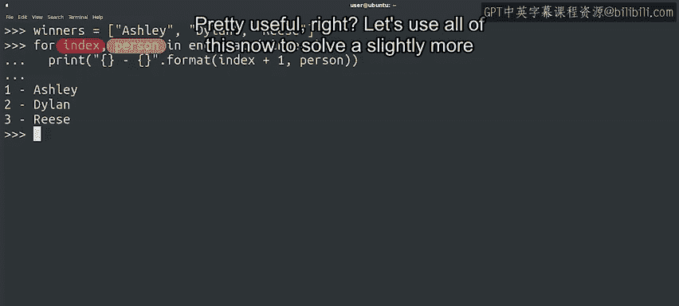
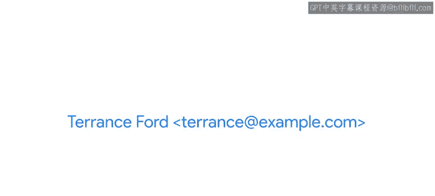
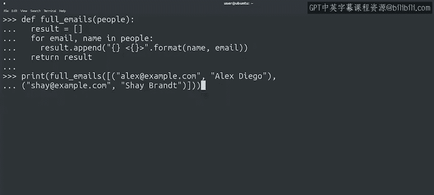

#  058：遍历列表和元组 📚


在本节课中，我们将学习如何使用循环来遍历列表和元组，并探索一些实用的技巧，例如使用`enumerate`函数获取元素索引，以及如何安全地处理列表。

---

## 遍历列表 🔄

上一节我们介绍了循环的基本概念，本节中我们来看看如何用循环遍历列表。

我们创建一个动物列表，并计算所有动物名称的总字符数和平均长度。

```python
animals = ["lion", "zebra", "dolphin", "monkey"]
chars = 0
for animal in animals:
    chars += len(animal)
print("Total characters: {}, Average length: {}".format(chars, chars/len(animals)))
```

在这段代码中，我们遍历了一个字符串列表。对于每个字符串，我们获取其长度并将其添加到总字符数中。最后，我们打印出总数和平均值，平均值通过总数除以列表长度得到。

---

## 使用`enumerate`获取索引 🔢

如果你在遍历列表时想知道元素的索引，可以使用`range`函数并通过索引访问元素，或者直接使用`enumerate`函数。



以下是使用`enumerate`的示例：

```python
winners = ["Ashley", "Dylan", "Reese"]
for index, person in enumerate(winners):
    print("{} - {}".format(index + 1, person))
```

`enumerate`函数为列表中的每个元素返回一个元组。元组的第一个值是元素在序列中的索引，第二个值是序列中的元素本身。



---

## 实践：格式化电子邮件列表 📧

现在，我们利用所学知识解决一个稍复杂的问题。假设有一个包含元组的列表，每个元组有两个字符串：电子邮件地址和全名。我们需要编写一个函数，创建一个新列表，其中每个字符串包含姓名和用尖括号括起来的电子邮件地址。

以下是实现步骤：

首先，定义一个接收人员列表的函数。

```python
def full_emails(people):
    result = []
    for email, name in people:
        result.append("{} <{}>".format(name, email))
    return result
```

然后，测试这个函数。

```python
print(full_emails([("alex@example.com", "Alex Diego"),
                   ("shay@example.com", "Shay Brandt")]))
```



---

## 常见错误与注意事项 ⚠️

由于我们经常在循环中使用`range`函数，你可能会想用它来遍历列表的索引，然后通过索引访问元素。如果你之前习惯其他编程语言，可能尤其倾向于这样做，因为在某些语言中，访问列表元素的唯一方式是使用索引。

这种方法虽然可行，但不够优雅。在Python中，更地道的做法是直接遍历列表元素，或者在需要索引时使用`enumerate`函数。

此外，如果你在遍历列表的同时修改它，需要格外小心。在迭代过程中删除元素可能导致意外结果。在这种情况下，最好使用列表的副本。

---

## 总结 📝

本节课中我们一起学习了如何遍历列表和元组，使用`enumerate`函数获取元素索引，以及如何安全地处理列表。列表是Python中非常强大的工具，掌握这些技巧将帮助你在IT自动化任务中更高效地处理数据。

接下来，我们将学习一种创建列表的强大技术。