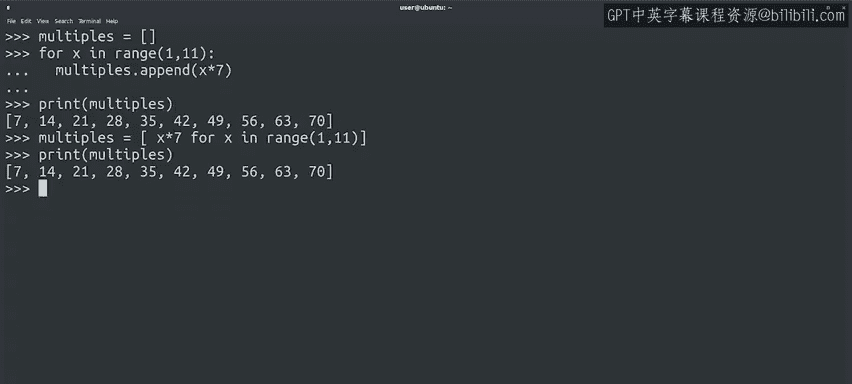
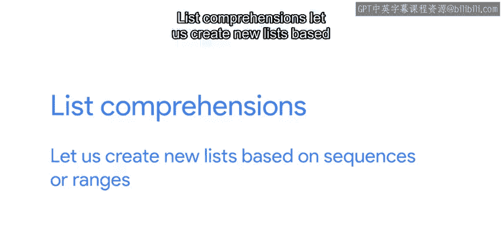
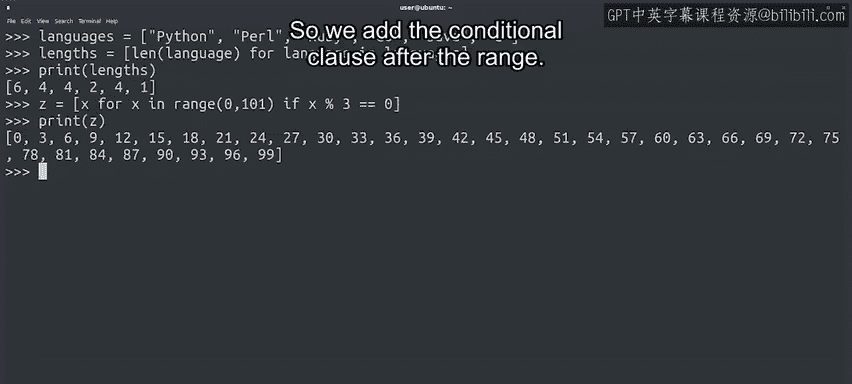

#  059：Python列表推导式 🧠


## 概述

在本节课中，我们将要学习Python中一种高效创建列表的方法——列表推导式。我们将通过具体示例，了解其基本语法、应用场景以及如何结合条件语句使用。

---

## 列表推导式简介

上一节我们介绍了使用循环和`append()`方法创建列表。本节中我们来看看如何使用列表推导式更简洁地实现相同功能。

列表推导式允许我们基于序列或范围快速生成新列表。其基本语法模仿自然语言的表达方式，旨在使代码更简洁。

### 创建基于范围的列表



假设我们需要创建一个包含7到70之间7的倍数的列表。使用传统方法，代码如下：

```python
multiples = []
for x in range(1, 11):
    multiples.append(x * 7)
print(multiples)
```



使用列表推导式，我们可以将上述代码简化为一行：

```python
multiples = [x * 7 for x in range(1, 11)]
print(multiples)
```

两种方法输出结果相同，但列表推导式使代码更加紧凑。

### 基于现有序列创建列表

列表推导式不仅适用于数字范围，也适用于任何Python序列，如列表、元组或字符串。

例如，我们有一个编程语言名称的列表，并希望生成一个包含各名称长度的新列表：

```python
languages = ["Python", "Java", "C++", "JavaScript"]
lengths = [len(language) for language in languages]
print(lengths)
```

### 在列表推导式中使用条件

列表推导式允许我们添加条件语句，以过滤元素。

例如，生成0到100之间所有能被3整除的数字列表：

```python
z = [x for x in range(0, 101) if x % 3 == 0]
print(z)
```



这里，`if x % 3 == 0`是一个条件子句，确保只有满足条件的`x`被包含在新列表中。

---

## 使用建议

在Python编程中使用列表推导式是可选的。有时它能使代码更清晰、更易读；但若试图在一行中塞入过多逻辑，也可能降低可读性。

总的来说，了解列表推导式是有益的，尤其是在阅读他人代码时。

---

## 总结

本节课中我们一起学习了Python列表推导式。我们了解了其基本语法，如何基于范围或序列创建列表，以及如何结合条件语句过滤元素。列表推导式是一种强大的工具，能帮助我们编写更简洁、高效的代码。

在接下来的阅读材料中，你将找到更多关于列表和元组操作的常见方法及官方文档链接。完成阅读后，你可以在随后的测验中练习新学到的技能。😊