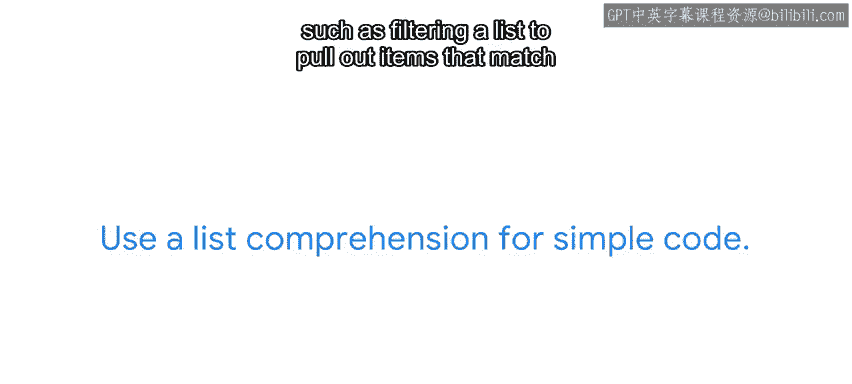
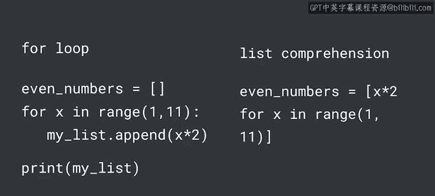
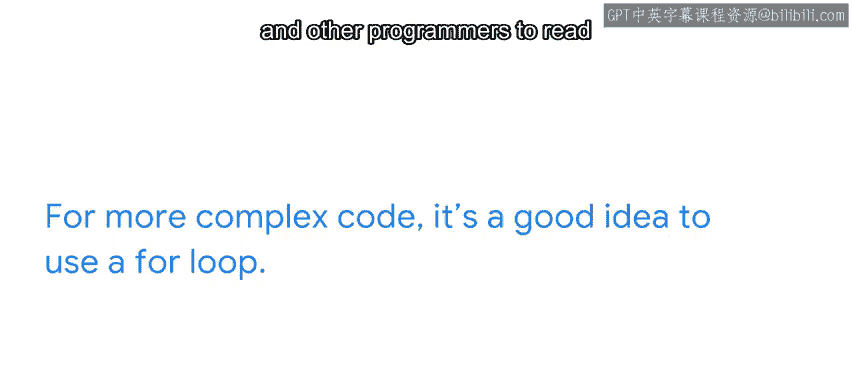
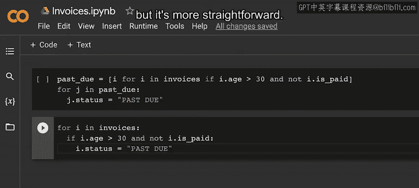
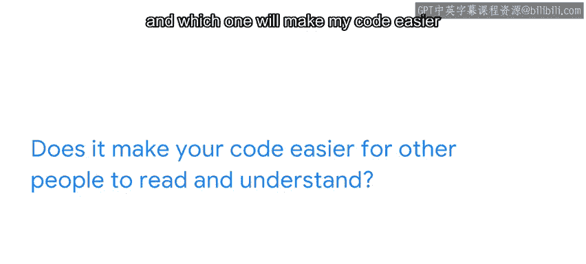

#  060：Python列表推导式与for循环的选择指南 📘


在本节课中，我们将学习如何在Python中选择使用列表推导式或for循环。我们将回顾两者的基本概念，探讨它们各自的适用场景，并提供一些实用的决策指南。

---

## 回顾：列表推导式与for循环

上一节我们介绍了列表推导式和for循环的基本用法。本节中我们来看看如何在实际编程中选择使用它们。

for循环用于迭代一系列值，例如数字、字母等。其基本结构如下：

```python
for item in sequence:
    # 执行操作
```

列表推导式允许我们基于序列或范围创建新列表。它是构建新列表的一种简洁方式，基本结构如下：

```python
new_list = [expression for item in sequence if condition]
```

列表推导式将for循环、条件判断和列表构建全部压缩在一行代码中完成。

---

## 何时使用列表推导式？何时使用for循环？ 🤔

列表推导式和for循环功能相似，那么如何选择呢？简短的回答是：这取决于你的判断。两种方法本质上可以互换，没有严格的标准或最佳实践。选择使用列表推导式还是for循环完全由你决定。

尽管如此，许多程序员在决策时会考虑以下因素。

---

## 列表推导式的适用场景





程序员通常在代码较为简单时使用列表推导式，例如过滤列表以提取匹配项或将列表中的单词大写。如果代码可以放在一行内，那么使用列表推导式可能更合适。

以下是一个列表推导式的示例：

```python
# 过滤出长度大于3的单词
words = ["cat", "window", "defenestrate"]
long_words = [word for word in words if len(word) > 3]
```

在这个例子中，列表推导式简洁地完成了过滤操作。

---

## for循环的适用场景



对于更复杂的代码，通常建议使用for循环。for循环能更清晰地展示处理过程，使你和他人更容易阅读和维护代码。

例如，假设你在一家公司工作，需要维护一张发票列表。你需要计算列表中所有项目的销售税和应付余额，并首先更新逾期发票的状态。虽然可以用列表推导式完成，但代码会变得复杂且难以理解。

以下是使用列表推导式更新逾期发票状态的示例：

```python
invoices = [...]  # 假设这是一个发票对象列表
past_due = [i for i in invoices if i.age > 30 and not i.paid]
for j in past_due:
    j.status = "Past Due"
```

在这个代码中，列表推导式用于筛选出逾期超过30天且未支付的发票，然后for循环更新这些发票的状态。虽然功能正确，但可读性较差。

---

## for循环的清晰示例

相比之下，使用for循环可以使代码更直观：

```python
for invoice in invoices:
    if invoice.age > 30 and not invoice.paid:
        invoice.status = "Past Due"
```

这段代码与之前的列表推导式示例结果相同，但更直接。它清晰地展示了每一步操作，便于编码和理解。



---

## 决策指南：如何选择？ 🧭

回到最初的问题：何时使用for循环？何时使用列表推导式？以下是一些问题，可以帮助你做出决策：



- 哪种方法能使我的代码既清晰又简洁？
- 哪种方法能使其他人更容易阅读和理解我的代码？

记住，大多数开发者喜欢简短、精炼且切中要点的代码。无论选择哪种编码策略，请为所有变量、数据集和列表使用有意义的名称。始终假设其他人会阅读你的代码。

---

## 总结

本节课中我们一起学习了如何在列表推导式和for循环之间做出选择。我们回顾了两者的基本概念，探讨了它们各自的适用场景，并提供了一些实用的决策指南。现在你已经掌握了做出最佳决策所需的信息，可以继续深入Python学习，不断提升你的知识和技能。 😊