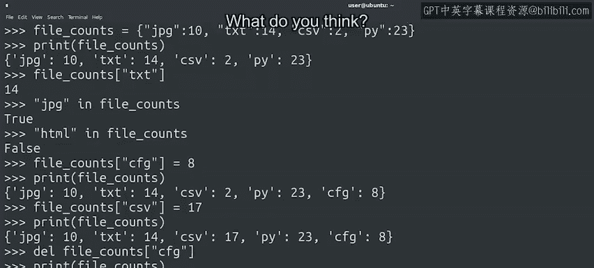

#  061：什么是字典 📚


## 概述

在本节课中，我们将要学习Python中的另一种重要数据结构——**字典**。我们将了解字典的基本概念、如何创建字典、如何访问和修改字典中的数据，以及它与之前学过的列表有何不同。

---

## 什么是字典？ 🤔

上一节我们介绍了列表和字符串，它们是非常有用的工具。本节中我们来看看另一种数据类型：**字典**。

与列表类似，字典用于将元素组织成集合。但与列表不同，你不能通过位置来访问字典中的元素。字典内部的数据采用**键**和**值**的配对形式。要获取字典中的值，你需要使用其对应的键。

另一个不同点是：在列表中，索引必须是数字；而在字典中，你可以使用多种不同的数据类型作为键，例如字符串、整数、浮点数、元组等。

字典的名称来源于其工作方式类似于人类语言中的词典。在英语词典中，单词对应着定义。在Python字典中，单词就是**键**，定义就是**值**。

## 创建字典 🛠️


你可以用类似于创建空列表的方式来创建一个空字典，区别在于字典使用**花括号** `{}` 来定义其内容。

```python
x = {}
type(x)
```

创建已初始化的字典与我们在之前视频中创建已初始化列表或元组的语法没有太大不同。但我们不是一系列带有值的槽，而是一系列指向值的键。

以下是创建字典的示例：

```python
file_counts = {
    "jpeg": 10,
    "txt": 14,
    "csv": 2,
    "py": 23
}
print(file_counts)
```

在这个 `file_counts` 字典中，我们存储了键（如 `"jpeg"`）和对应的整数值（如 `10`）。创建字典时，我们在键和值之间使用冒号，并用逗号分隔每个键值对。

在字典中，像这样混合和匹配键和值的数据类型是完全可行的，并且非常有用。在这个例子中，我们使用字典来存储每种文件扩展名对应的文件数量。将文件扩展名编码为字符串是合理的，而将计数表示为整数也很自然。

## 访问字典值 🔑

假设你想找出字典中有多少个文本文件。为此，你需要使用键 `"txt"` 来访问其关联的值。

执行此操作的语法可能看起来很熟悉，因为我们在索引字符串、列表和元组的示例中使用了类似的方法。

```python
file_counts["txt"]
```

你还可以使用 `in` 关键字来检查字典中是否包含某个键。

以下是检查几个键的示例：

```python
"jpeg" in file_counts  # 返回 True
"html" in file_counts  # 返回 False
```

## 修改字典 ✏️

字典是**可变的**。这意味着我们可以添加、删除和替换条目。

要向字典中添加条目，只需使用方括号创建键并为其分配一个新值。

让我们在字典中为新的 `"cfg"` 文件扩展名添加一个文件计数 `8`。

```python
file_counts["cfg"] = 8
print(file_counts)
```

这引出了一个关于字典的有趣问题：如果我们尝试添加一个字典中已经存在的键，会发生什么？

```python
file_counts["csv"] = 17
print(file_counts)
```

当你使用一个已经存在的键来设置值时，与该键配对的旧值会被替换。正如你在本例中所见，与 `"csv"` 键关联的值过去是 `2`，但现在变成了 `17`。

字典中的键是唯一的。如果我们尝试为同一个键存储两个不同的值，我们只会用后一个替换前一个。

## 删除字典元素 🗑️

最后，我们可以使用 `del` 关键字从字典中删除元素，方法是传递字典和要删除元素的键，就像我们试图访问它一样。

```python
del file_counts["cfg"]
print(file_counts)
```



## 总结

本节课中我们一起学习了Python字典。我们了解了字典是一种通过**键值对**组织数据的数据结构，它与列表不同，通过唯一的键来访问值。我们学习了如何创建字典、如何访问和修改其中的数据，以及如何删除条目。字典在处理需要快速通过特定标识符查找信息的场景时非常有用。

在接下来的课程中，我们将探索一些可以用字典完成的有趣操作。