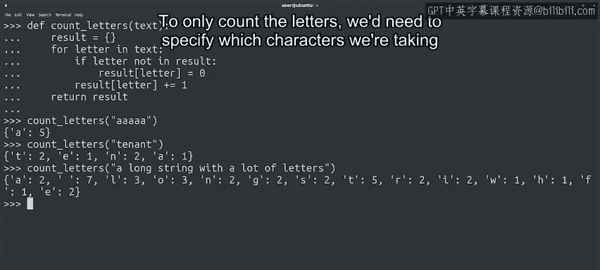

#  062：遍历字典内容 📖


在本节课中，我们将学习如何使用循环来遍历字典的内容。我们将探讨如何访问字典的键、值以及键值对，并了解字典在数据统计和分析中的实际应用。

---

## 遍历字典的基本方法 🔄

上一节我们介绍了字典的基本结构，本节中我们来看看如何遍历字典的内容。

与字符串、列表和元组类似，你可以使用 `for` 循环来遍历字典的内容。让我们看看具体如何操作。

```python
file_counts = {"jpg": 10, "txt": 14, "csv": 2, "py": 23}
for extension in file_counts:
    print(extension)
```

如果你在 `for` 循环中使用字典，迭代变量将遍历字典中的键。

---

## 访问键和值 🔑

如果你想访问与键相关联的值，有两种方法。你可以将键用作字典的索引，或者使用 `items()` 方法。`items()` 方法会为字典中的每个元素返回一个元组。元组的第一个元素是键，第二个元素是值。

让我们用示例字典来尝试一下。

```python
for extension, amount in file_counts.items():
    print("There are {} files with the .{} extension".format(amount, extension))
```

---

## 单独获取键或值 📝

有时你可能只对字典的键感兴趣，有时可能只想要值。你可以使用对应的字典方法来访问它们。

```python
file_counts.keys()
file_counts.values()
```

这些方法返回与字典相关的特殊数据类型，但你无需确切知道它们是什么。你只需要像遍历任何序列一样遍历它们。

```python
for value in file_counts.values():
    print(value)
```

以下是关键方法总结：
*   我们可以使用 `items()` 来获取键值对。
*   使用 `keys()` 来获取键。
*   使用 `values()` 来获取值。

这并不难，对吧？

---

## 字典在计数中的应用 🧮

因为每个键只能出现一次，所以字典是计数元素和分析频率的绝佳工具。

让我们看一个简单的例子，统计一段文本中每个字母出现的次数。

```python
def count_letters(text):
    result = {}
    for letter in text:
        if letter not in result:
            result[letter] = 0
        result[letter] += 1
    return result
```

在这段代码中，我们首先初始化一个空字典，然后遍历给定字符串中的每个字母。对于每个字母，我们检查它是否已存在于字典中。如果不存在，我们就在字典中初始化一个值为0的条目。最后，我们增加字典中该字母的计数。

总结一下，我们创建了一个字典，其中键是字符串中出现的每个字母，值是该字母出现的次数。

让我们尝试几个示例字符串。

```python
print(count_letters("aaaaa"))
print(count_letters("tenant"))
print(count_letters("a long string with a lot of letters"))
```

在这里，你可以看到字典可以包含任意数量的条目，键值对总是统计字符串中每个字母的数量。

另外，你是否注意到我们的简单代码没有区分实际字母和特殊字符（如空格）？如果只想统计字母，我们需要指定要考虑哪些字符。



---

## 实际应用场景 💡

这项技术起初可能看起来简单，但在很多情况下非常有用。例如，假设你正在分析服务器日志，并希望统计日志文件中每种类型的错误出现了多少次。

你可以轻松地使用字典来实现这一点，将错误类型作为键，每次遇到该错误类型时就增加关联的值。

你是否开始看到字典在编写脚本时是多么有用的工具了？

---

## 总结 📚

本节课中我们一起学习了如何遍历字典。我们掌握了使用 `for` 循环遍历字典的键，以及使用 `items()`、`keys()` 和 `values()` 方法来分别访问键值对、键和值。我们还探讨了字典在数据计数和频率分析中的强大应用，例如统计字母出现次数或分析日志错误类型。理解这些遍历技巧是有效使用字典进行数据操作的关键。