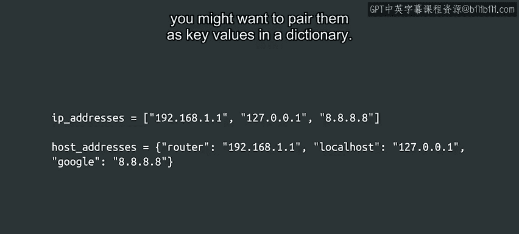
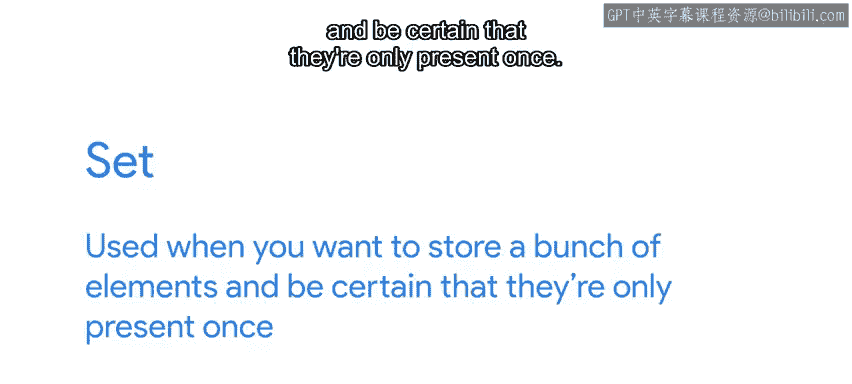

#  063：Python字典与列表对比指南 📚

在本节课中，我们将学习Python中两种重要的数据结构：列表（List）和字典（Dictionary）。我们将探讨它们各自的特点、适用场景以及如何根据实际需求选择合适的数据结构。

---

## 列表与字典的基本用途 🧩

列表和字典都非常有用，它们在不同情况下各有优势。

那么，何时使用列表最佳，何时又该选择字典呢？这取决于你想要表示的信息类型。

如果你有一系列信息需要在脚本中收集和使用，那么列表可能是合适的选择。例如，如果你想存储一系列需要ping的IP地址，可以将它们全部放入一个列表中并进行遍历。

或者，如果你有一个主机名及其对应IP地址的列表，你可能希望将它们作为键值对存储在字典中。

---

## 字典的搜索效率优势 ⚡

由于字典的工作原理，在其中搜索元素非常容易且快速。

假设你有一个字典，其中用户名作为键，它们所属的组作为值。无论你有10个用户还是10000个用户，访问给定用户的条目所需的时间都是相同的。这很神奇。

但这对于列表来说并非如此。如果你有一个包含10个元素的列表，需要检查某个元素是否在列表中，这会是一个非常快速的检查。但如果你的列表有10000个元素，检查你要找的元素是否存在将花费更长的时间。

因此，一般来说，当你计划搜索特定元素时，应该使用字典。

---

## 存储数据类型的差异 🔢

另一个有趣的差异是列表和字典中可以存储的值的类型。

在列表中，你可以存储任何数据类型。在字典中，我们可以为值存储任何数据类型，但键被限制为特定类型。

允许哪些类型的推理可能很复杂，我们不想用不必要的细节让你感到困惑。因此，作为一个经验法则，你可以使用任何不可变的数据类型（如数字、布尔值、字符串和元组）作为字典的键。

另一方面，正如我们所说，与键关联的值可以是任何类型，包括列表甚至其他字典。你可以使用它们来表示更复杂的数据结构，例如文件系统中的目录树。

---

## 字典在系统管理中的应用 🖥️

在系统管理中，我们需要处理大量不同的键值对，因此我经常使用字典。当需要编写脚本从大型数据集中提取特定键以操作或修改关联值时，字典尤其有用。

但这并不总是那么严肃。有一次，仅仅为了好玩，我希望能够查找每个迪士尼主角对应的反派角色。于是我创建了一个字典，存储像“白雪公主”这样的键，其值为“邪恶皇后”。很不错，对吧？

---

## 其他数据结构：集合（Set）介绍 🔄

还有更多我们尚未探讨的数据类型。其中之一是集合（Set），它有点像列表和字典的交叉。

当你想要存储一堆元素，并确保它们只出现一次时，可以使用集合。集合的元素也必须是不可变的。

你可以将其视为没有关联值的字典键，或者将其看作一个列表，其中重要的不是元素的顺序，而是元素是否在列表中。

---

## 总结与展望 📈

我们已经涵盖了很多内容，但这仅仅触及了字典在脚本中能做的事情的表面。

随着你在IT职业生涯中的进步，你会遇到很多情况，其中字典是组织数据的最简单方法。如果你感兴趣，可以在官方文档中了解更多关于字典的信息。你可以在下一篇阅读材料中找到相关链接。

在本节课中，我们一起学习了列表和字典的核心区别、各自的优势以及适用场景。记住，**列表适合存储有序序列**，而**字典适合通过键快速查找值**。掌握这两种数据结构，将帮助你更高效地处理各种编程任务。