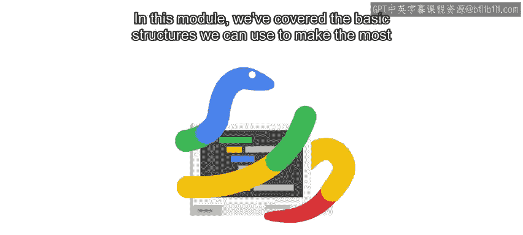

#  064：Python基础数据结构总结 🧱
## 课程编号：P64

在本节课中，我们将要学习Python中三种核心数据结构——字符串、列表和字典——的基本概念与应用。我们还会简要介绍元组和集合这两种关联数据类型。掌握这些结构是编写高效Python脚本、解决实际IT自动化问题的关键。

---

上一节我们介绍了本模块的学习目标，本节中我们来看看这些数据结构的具体内容及其重要性。

字符串、列表和字典是Python中最常用、最基础的数据结构。理解并熟练运用它们，能够让你编写的程序处理更复杂、更有趣的任务。

正如我们反复强调的，掌握这些结构并知道在何种场景下使用哪一种，关键在于**实践**。你编写的、运用这些概念的脚本越多，在需要时选择正确工具就会变得越容易。

---

### 核心数据结构详解

以下是三种核心数据结构及其关键特性的介绍：

*   **字符串**
    *   用于表示文本信息。
    *   由一系列字符组成，是不可变序列。
    *   可以使用索引和切片进行访问。
    *   示例代码：`my_string = “Hello, World!”`

*   **列表**
    *   用于存储有序的元素集合。
    *   元素可以是任何数据类型，列表本身是可变序列。
    *   同样支持索引、切片，并可以方便地添加或删除元素。
    *   示例代码：`my_list = [1, ‘apple’, True]`

*   **字典**
    *   用于存储键值对映射关系。
    *   通过唯一的键来快速访问对应的值，是无序集合。
    *   非常适合用于表示具有关联关系的数据。
    *   示例代码：`my_dict = {‘name’: ‘Alice’, ‘age’: 30}`

---

### 关联数据类型

除了上述三种核心结构，还有两种重要的关联数据类型值得了解：

*   **元组**
    *   类似于列表，但它是**不可变**序列。
    *   一旦创建，其内容无法修改。
    *   通常用于保证数据不会被意外改变的场景。
    *   示例代码：`my_tuple = (10, 20, 30)`

*   **集合**
    *   用于存储**唯一**且**无序**的元素集合。
    *   支持数学上的集合运算，如并集、交集。
    *   示例代码：`my_set = {1, 2, 3, 3}` （最终 `my_set` 为 `{1, 2, 3}`）

---

### 学习建议与鼓励

我们刚刚学习了许多新概念，如果感到有些吃力，这完全正常。每个学习编程的人在某些阶段都会有这样的感受。

如果你对已学内容中的任何部分感到不确定，现在是重新观看课程视频的好时机。你会惊讶于自己已经掌握了这么多知识。通常，第二次复习就能帮助你理解那些当前看似棘手的问题。

IT行业的工作需要解决问题能力和坚持不懈的精神。你能坚持学习到这里，本身就证明了你有掌握脚本编写所需的毅力。请坚持下去，我保证这会变得越来越容易。

---

### 课程总结

本节课中我们一起学习了Python的三种核心数据结构：**字符串**、**列表**和**字典**，并简要了解了**元组**和**集合**。掌握这些结构是有效进行Python编程和IT自动化的基石。

为了帮助你巩固所有新知识，我们准备了一个分级评估测试。请在感觉准备充分后完成它，不用着急，记住：你能行！😊