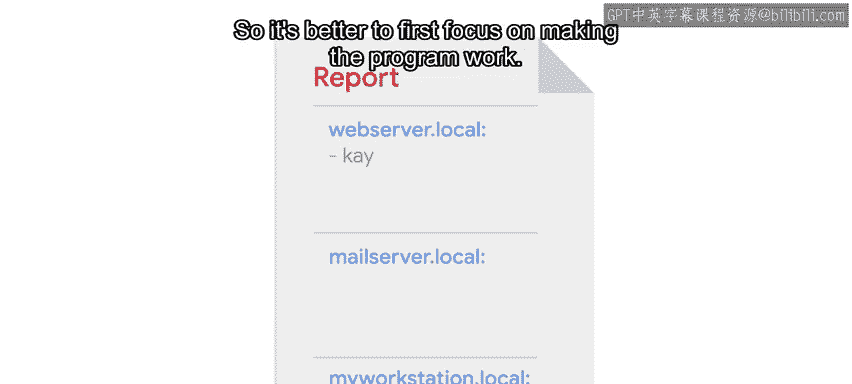

#  067：问题陈述与需求分析 🎯

在本节课中，我们将学习如何为一个具体的IT自动化任务定义清晰的问题陈述，并分析其输入、输出及核心需求。我们将为一个虚构的公司创建一份每日报告，用于追踪哪些用户登录了哪些机器。

---

## 概述

想象一下，你是一家中型公司的IT专家。你的经理希望创建一份每日报告，用于追踪机器的使用情况。具体来说，她想知道当前哪些用户连接到了哪些机器。你的任务就是创建这份报告。

在你的公司，有一个系统会收集网络上每台机器发生的所有事件。在收集的众多事件中，它记录了用户每次登录或注销计算机的时间。利用这些信息，我们需要编写一个脚本，生成一份报告，列出在特定时间点哪些用户登录了哪些机器。

---

## 输入分析

在着手解决问题之前，我们需要明确脚本的输入和输出信息。我们可以通过查看脚本所在系统的其余部分来弄清楚这一点。

在我们的报告场景中，输入是一个事件列表。每个事件都是`Event`类的一个实例。`Event`类包含以下属性：
*   事件发生的日期 (`date`)
*   事件发生的机器名称 (`machine`)
*   涉及的用户 (`user`)
*   事件类型 (`type`)

在这个场景中，我们只关心“登录”(login)和“注销”(logout)这两种事件类型。事件类型是字符串，我们关心的两个值是 `"login"` 和 `"logout"`。

我们的脚本将接收一个`Event`对象列表，并访问这些事件的属性。然后，我们将利用这些信息来判断用户当前是否登录了某台机器。

---

## 输出设计

接下来，我们谈谈输出。我们需要生成一份报告，列出所有机器名称，并且针对每台机器，列出当前登录的用户。然后，我们希望将这些信息打印到屏幕上。

我们被委派生成报告，因此可以自行决定报告的具体呈现形式。一种选择是：在一行的开头打印机器名称，然后在单独的行上列出当前用户，并向右缩进。或者，我们也可以打印机器名称，后跟一个冒号，然后在同一行上用逗号分隔所有用户名。

在设计报告格式时，很容易陷入“让它看起来更美观”的部分。我曾掉入过这个陷阱。但真正重要的是脚本解决问题的能力。因此，最好首先专注于让程序运行起来。之后你总可以花时间让报告看起来更美观。目前，我们保持简单，采用打印机器名称后跟所有当前用户（用逗号分隔）的方法。

---

## 问题陈述总结

好的，我们现在对需要做什么有了清晰的认识。我们已经明确了问题陈述：**我们需要处理一个`Event`对象列表，利用它们的`date`、`type`、`machine`和`user`属性，生成一份报告，列出当前登录到各台机器的所有用户。**

我们有了一个良好的开端。下一步，我们将进行研究，以确定实际完成此任务的最佳方法。

---

## 本节课总结

在本节课中，我们一起学习了如何为一个IT自动化任务（生成用户登录报告）进行需求分析。我们明确了脚本的输入是包含特定属性的`Event`对象列表，输出是格式化的机器与当前登录用户对应关系。我们强调了在开发初期应优先关注功能实现而非界面美化。接下来，我们将研究实现这一目标的具体方法。