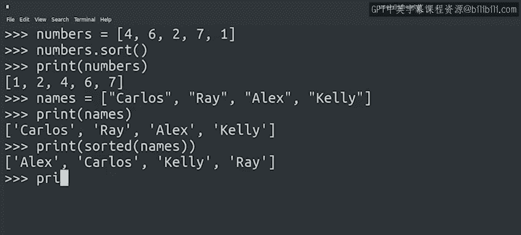

#  068：问题研究与列表排序 🧠


在本节课中，我们将学习如何通过研究来解决问题，并掌握在Python中对列表进行排序的方法。我们将从理解问题开始，逐步探索可用的工具，最终确定解决方案。

---

## 概述

我们面临的问题是需要处理一系列事件对象，并评估这些对象的属性，以输出当前登录到某台机器的所有用户报告。为了正确解决这个问题，我们必须按时间顺序处理事件，并学会如何对列表进行排序。

---


## 问题理解与参数明确

上一节我们明确了问题：输入事件对象列表，通过评估对象属性输出当前登录用户报告。本节中，我们来看看如何通过研究找到合适的工具来解决这个问题。

要确定哪些用户当前登录到机器，我们需要检查他们的登录和登出时间。

如果用户登录后已登出，则不再处于登录状态。如果尚未登出，则仍处于登录状态。在编程中，明确参数至关重要。

此外，这告诉我们，为了正确解决问题，必须按时间顺序处理事件。否则，如果先处理登出事件再处理对应的登录事件，代码可能会产生不可预测的行为。

---

## 研究：Python中的列表排序

那么，如何在Python中对列表进行排序？我们需要进行一些研究。

在搜索引擎中输入“sort lists Python”，会得到许多提到列表的`sort`方法和`sorted`函数的结果。

这两种选项的区别在于：`sort`方法会修改原列表，而`sorted`函数会返回一个新的排序列表。除此之外，它们的工作方式完全相同。

让我们通过实际操作来检查这一区别。

首先，创建一个数字列表并调用`sort`方法进行排序：

```python
numbers = [3, 1, 4, 1, 5, 9, 2]
numbers.sort()
print(numbers)  # 输出：[1, 1, 2, 3, 4, 5, 9]
```

可以看到列表元素已被排序。



现在，尝试使用`sorted`函数的例子：

```python
names = ["Charlie", "Alice", "Bob"]
sorted_names = sorted(names)
print(sorted_names)  # 输出：['Alice', 'Bob', 'Charlie']
print(names)         # 输出：['Charlie', 'Alice', 'Bob']
```

再次打印原列表以确认它未被修改。

所以，`sorted`函数返回了一个新的排序列表，而原列表保持不变。

很好，我们现在知道了如何在Python中对列表进行排序。对于这个问题，修改原列表是可以接受的，因此我们将使用`sort`方法。

---

## 自定义排序条件

但是，请注意这两种方法默认都按字母顺序排序。这是Python的默认方式。

如果我们想根据不同的条件来组织列表呢？

再次查看在线文档，我们会发现`sort`方法可以接受几个参数。其中一个参数叫做`key`，它允许我们使用一个函数作为排序键。

让我们在名字列表上尝试一下。除了按字母顺序排序，我们还可以按每个字符串的长度排序。还记得我们可以使用哪个函数来实现吗？

是的，我们可以将`len`函数作为`key`传递：

```python
names = ["Charlie", "Alice", "Bob"]
names.sort(key=len)
print(names)  # 输出：['Bob', 'Alice', 'Charlie']
```

我们现在知道了如何根据函数的返回值对列表元素进行排序。

在我们的报告场景中，元素将是`Event`类的实例，我们希望按日期排序，日期是`Event`类的一个属性。

一种方法是编写一个名为`get_event_date`的函数，该函数返回事件对象中存储的日期。

如果我们能够修改类，也可以将其作为`Event`类的一个方法。但由于我们正在处理生成这些事件的更大系统，我们将假设不能直接向类添加方法。因此，我们将创建自己的函数。

---

## 总结

本节课中，我们一起学习了如何通过研究来解决问题，并掌握了在Python中对列表进行排序的方法。我们明确了问题参数的重要性，探索了`sort`方法和`sorted`函数的区别，并学会了如何使用`key`参数进行自定义排序。在下一课中，我们将深入探讨构建脚本的计划。