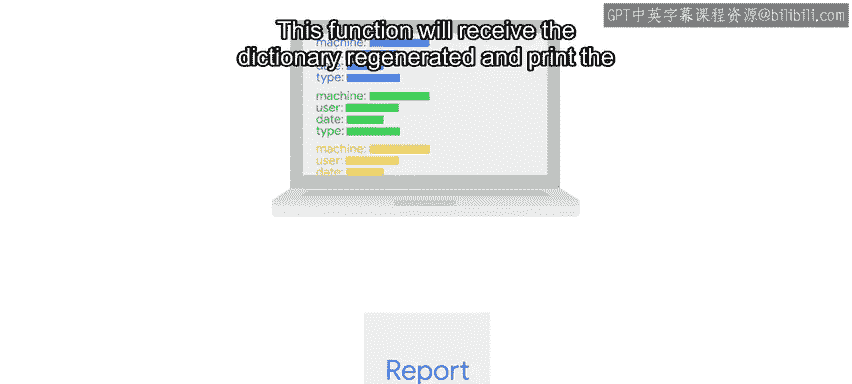

#  069：问题解决步骤之计划 🗺️

在本节课中，我们将学习如何为编程问题制定解决方案计划。我们将通过一个具体案例——处理用户登录/登出事件并生成报告——来演示如何将问题分解，并规划代码的结构和逻辑。

---

上一节我们介绍了如何定义问题陈述和研究可用工具。本节中，我们来看看如何为我们的解决方案制定一个清晰的计划。

我们知道输入将是一个事件列表，我们需要按时间对其进行排序。每个事件都包含机器名、用户名以及事件类型（登录或登出）。我们的脚本需要追踪用户在机器上的登录和登出状态。

那么，我们该如何实现呢？让我们思考对每个事件需要做什么，并找出最佳策略。

当处理一个事件时，我们会看到某人与一台机器发生了交互。如果事件是登录，我们需要将该用户添加到该机器的已登录用户组中。如果是登出，则需要从该组中移除该用户。

在这种情况下，使用一个集合来存储当前用户是合理的，在登录时添加用户，在登出时移除用户。

很好，但是，如果给定机器的当前用户存储在一个集合中，我们如何知道哪个集合对应我们正在查看的机器呢？

知道这一点的最简单方法是将这些信息存储在一个字典中。我们将使用机器名作为键，将该机器的当前用户集合作为值。

以下是处理每个事件的基本逻辑步骤：
*   首先，检查字典中是否已存在该机器。这是必要的，因为这可能是我们第一次处理该机器的事件。
*   如果机器不存在，则创建一个新条目。
*   如果机器已存在，则根据事件类型更新现有条目：如果是登录事件则添加用户，如果是登出事件则移除用户。

---

处理完所有事件后，我们希望打印生成的信息报告。

这是一个完全独立的任务，因此应该是一个单独的函数。这个函数将接收我们生成的字典，并负责打印报告。

将数据处理功能和屏幕打印功能分开是非常重要的。这是因为，如果我们想修改报告的打印方式，我们只需要更改负责打印的函数；或者，如果我们在数据处理逻辑中发现错误，也只需要更改处理函数。这种分离还允许我们使用相同的数据处理函数来生成不同类型的报告，例如生成一个PDF文件。

---

太好了！我们现在知道了需要做什么、如何去做，以及如何构建我们的代码。接下来，我们就可以进入实质性的部分——实际编写代码了。

---

本节课中，我们一起学习了为编程问题制定计划的关键步骤。我们明确了使用字典（以机器名为键，用户集合为值）来跟踪状态的核心数据结构，并强调了将数据处理（`process_data`）与结果输出（`generate_report`）分离的良好编程实践。这为下一步实际编写清晰、可维护的代码打下了坚实的基础。