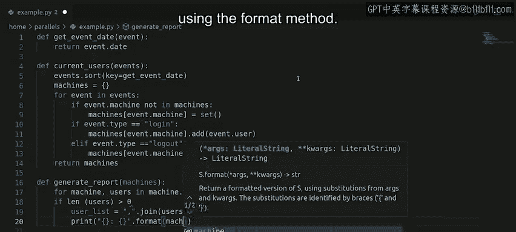

#  070：编写脚本 - 第70课 🖥️


在本节课中，我们将学习如何将之前讨论的概念整合起来，编写一个完整的脚本。我们将处理事件数据，生成一份报告，展示当前登录每台计算机的用户。我们将使用Python字典和集合来存储数据，并编写函数来排序事件、处理数据以及生成最终报告。

---

## 概述 📋

我们已经学习了处理事件以生成报告所需的步骤。我们知道如何按时间顺序对事件列表进行排序，以及如何使用字典和集合来跟踪每台计算机的当前用户。我们还知道需要编写一个函数来生成字典，以及另一个函数来打印报告。现在，我们将把这些知识整合起来，编写完整的代码。

---

## 编写排序辅助函数 🔧

上一节我们介绍了处理事件的整体思路，本节中我们来看看如何实现第一步：按时间排序事件。

我们将定义一个简单的辅助函数，作为`sort`方法的参数，用于对事件列表进行排序。

```python
def get_event_date(event):
    return event.date
```

---

## 创建处理函数：`current_users` 🛠️

现在，我们开始编写处理函数，我们将其命名为`current_users`。

首先，我们定义这个函数。在函数内部，我们使用`sort`方法并传入刚刚创建的`get_event_date`函数作为`key`，来对事件进行排序。

```python
def current_users(events):
    events.sort(key=get_event_date)
```

在开始遍历事件列表之前，我们需要创建一个字典，用于存储计算机名和其用户集合。

```python
    machines = {}
```

现在，我们准备遍历事件列表。

以下是遍历和处理每个事件的步骤：

1.  检查事件影响的计算机是否已在字典中。如果不在，则将其添加到字典中，并将值设为一个空集合。
2.  对于登录事件，将用户添加到该计算机的集合中。
3.  对于登出事件，将用户从该计算机的集合中移除。

```python
    for event in events:
        if event.machine not in machines:
            machines[event.machine] = set()
        if event.type == "login":
            machines[event.machine].add(event.user)
        elif event.type == "logout":
            machines[event.machine].remove(event.user)
```

遍历完所有事件后，字典`machines`将包含所有出现过的计算机作为键，其对应的值是一个包含该计算机当前登录用户的集合。最后，函数返回这个字典。

```python
    return machines
```

---

## 创建报告生成函数：`generate_report` 📄

我们已经有了一个包含数据的字典，现在需要将其打印出来。为此，我们创建一个名为`generate_report`的新函数。

在我们的报告中，需要遍历字典中的键和值。我们将使用`items()`方法，它返回字典中每个键值对。

在打印任何内容之前，我们需要确保不打印当前没有用户登录的计算机。这种情况可能发生在用户登录后又登出时。为了避免这种情况，我们告诉计算机只在用户集合元素数大于零时才打印。

我们之前提到，我们希望打印计算机名，后跟登录该计算机的用户，用逗号分隔。为此，我们使用`join()`方法为该计算机生成已登录用户的字符串。



最后，我们使用`format()`方法生成我们想要的最终输出字符串。

```python
def generate_report(machines):
    for machine, users in machines.items():
        if len(users) > 0:
            user_list = ", ".join(users)
            print("{}: {}".format(machine, user_list))
```

---

## 总结 🎯

本节课中我们一起学习了如何将多个步骤组合成一个完整的脚本。我们编写了用于排序事件的辅助函数`get_event_date`，创建了处理事件并返回计算机-用户字典的核心函数`current_users`，最后编写了格式化并打印报告的函数`generate_report`。

我们已经编写了解决问题所需的所有函数。这是一个很好的时机，可以暂停一下，回顾从问题描述到编写代码的每个步骤，确保不仅清楚我们使用了哪个函数，而且明白为什么使用它。

如果还有任何不清楚的地方，请记住，讨论区随时可以为你提供帮助。在接下来的视频中，我们将执行这段代码，看看它是否正常工作。让我们拭目以待，测试我们的代码吧。