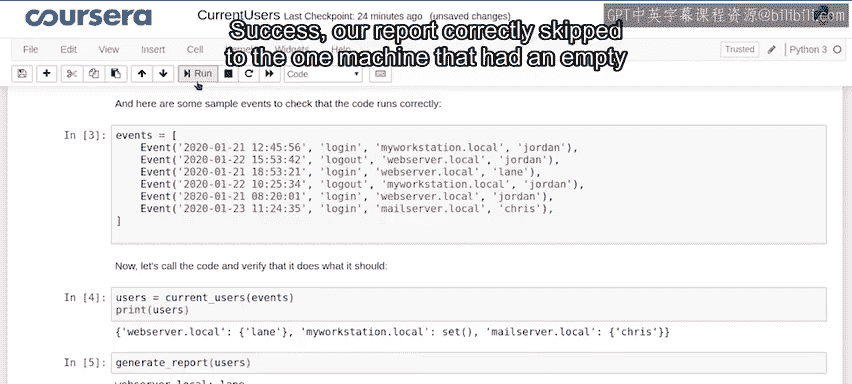

#  071：代码汇总与测试 🧪

在本节课中，我们将学习如何将之前编写的代码整合到一个Jupyter Notebook中，并进行测试，以确保其按预期工作。我们还将探讨在实际IT环境中可能遇到的一些边界情况。


---

## 代码整合与测试 🛠️

上一节中，我们根据研究和计划编写了解决问题的代码。现在，我们将所有代码放入一个Jupyter Notebook中，并执行它以观察结果。

以下是我们当前代码的样子，正如我们在上一个视频中所写：

```python
# 示例代码：事件处理与报告生成
def process_events(events):
    machine_events = {}
    for event in events:
        if event.machine not in machine_events:
            machine_events[event.machine] = set()
        if event.type == "login":
            machine_events[event.machine].add(event.user)
        elif event.type == "logout":
            machine_events[event.machine].discard(event.user)
    return machine_events

def generate_report(machine_events):
    for machine, users in machine_events.items():
        if len(users) > 0:
            print(f"Machine: {machine}, Users logged in: {', '.join(users)}")
```

为了验证代码是否按预期工作，我们需要一个事件类来模拟场景。我们将使用一个非常简单的事件类。

```python
class Event:
    def __init__(self, event_date, event_type, machine_name, user):
        self.date = event_date
        self.type = event_type
        self.machine = machine_name
        self.user = user
```

使用这个构造函数，我们将创建一些事件并将它们添加到列表中。

```python
events = [
    Event('2023-10-01', 'login', 'webserver', 'jordan'),
    Event('2023-10-02', 'logout', 'mailserver', 'chris'),
    Event('2023-10-03', 'login', 'webserver', 'jordan'),
    Event('2023-10-04', 'logout', 'webserver', 'jordan'),
    Event('2023-10-05', 'login', 'mailserver', 'taylor'),
]
```

现在，我们有一系列事件。它们目前是未排序的，涉及几台机器和一些用户。我们将把这些事件输入到我们的函数中，看看会发生什么。

一切准备就绪，让我们执行代码。

```python
machine_events = process_events(events)
print(machine_events)
```

输出结果：
```
{'webserver': set(), 'mailserver': {'taylor'}}
```

太好了！我们的代码正确地创建了一个以机器名称为键的字典。其中有一个空集合和两个包含一个值的集合。现在，让我们尝试生成报告。

```python
generate_report(machine_events)
```

输出结果：
```
Machine: mailserver, Users logged in: taylor
```

成功！我们的报告正确地跳过了那台拥有空集合的机器。这很棒。

---

## 边界情况探讨 🤔

在IT世界中，可能会发生许多其他情况。例如，如果我们遇到一个用户从未登录过却尝试注销的事件，我们应该如何处理？

以下是一些可能的处理方式：



- **忽略注销事件**：如果用户未登录，则忽略该事件。
- **记录错误**：将此类事件记录为错误，以便进一步调查。
- **发出警告**：在报告中添加警告信息，提示可能存在异常。

我们将在下一个练习中尝试解决这个问题。

---

## 总结 📝

本节课中，我们一起学习了如何将代码整合到Jupyter Notebook中并进行测试。我们创建了一个简单的事件类，模拟了IT环境中的登录和注销事件，并成功生成了报告。此外，我们还探讨了在实际应用中可能遇到的边界情况，为下一步的练习做好了准备。

通过本节课的学习，你应该能够理解代码测试的重要性，并学会如何处理实际场景中的异常情况。