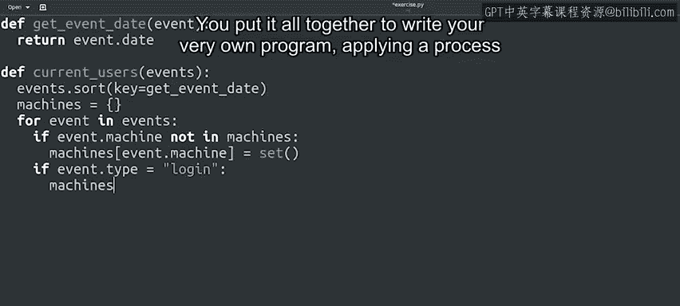

#  072：祝贺与回顾 🎉

在本节课中，我们将回顾整个课程的学习历程，总结你已掌握的Python编程技能，并展望未来的学习方向。

---

## 概述

你已成功完成整个课程。这些概念学习起来并不轻松。

回想你刚开始这段旅程时的情景。你是否还记得观看最初那些视频时的感受？可能有些紧张、害怕，甚至兴奋，或许这些情绪同时存在。

你跟随我一起学习，观看了所有视频，并在内容变得复杂时坚持了下来。你应当为自己感到骄傲。现在，花点时间反思你当前所处的位置。

## 已掌握的技能回顾

上一节我们概述了学习历程，本节中我们来看看你具体掌握了哪些核心编程技能。

你从对编程知之甚少或一无所知，到现在能够编写各种复杂的函数。

以下是你在本课程中掌握的关键编程概念和结构：

*   **条件语句**：使用 `if`、`elif`、`else` 来控制程序流程。
*   **循环**：使用 `for` 循环和 `while` 循环来重复执行代码块。
*   **字符串**：处理和操作文本数据。
*   **列表**：使用 `[]` 创建和操作有序的元素集合。
*   **字典**：使用 `{}` 创建和操作键值对集合。

你甚至创建了自己的对象。你将所有这些知识结合起来，编写了属于自己的程序，应用了可能在日常IT工作中会用到的流程。

## 学习收获与未来展望

我们介绍了具体的编程技能，现在来谈谈你的整体收获和未来可能性。

希望你学习的过程和我教学的过程一样充满乐趣。你掌握了所有这些内容，这令人印象深刻。我希望这只是你Python旅程的开始。

在IT领域建立成功的职业生涯需要毅力、勇气和韧劲。通过坚持到现在，你已经证明了拥有大量这些品质。它同样需要技能和知识，而基础的Python无疑是你的IT工具箱中一个强大的工具。

了解如何编写脚本将使你在寻求职业发展时脱颖而出。我敢打赌，你现在会发现周围到处都是任务，并会激发你如何用脚本将其自动化的想法。可能性是无穷无尽的，而这仅仅是个开始。

## 总结与下一站

记住我们在最初视频中说过的话：千里之行，始于足下。还有很多令人兴奋的东西等待你去学习。

我们希望你能加入我们的下一门课程。在那里，我们将学习Python如何与计算机操作系统交互，以体验即将到来的内容。请留意下一个视频，我们将与你的下一位讲师Roger交流。

本节课中我们一起回顾了整个学习旅程，总结了从条件语句、循环到创建对象等核心Python技能。你已为IT自动化打下了坚实基础。现在，我祝愿你一切顺利。我期待在更广阔的天地里看到你和你的代码。