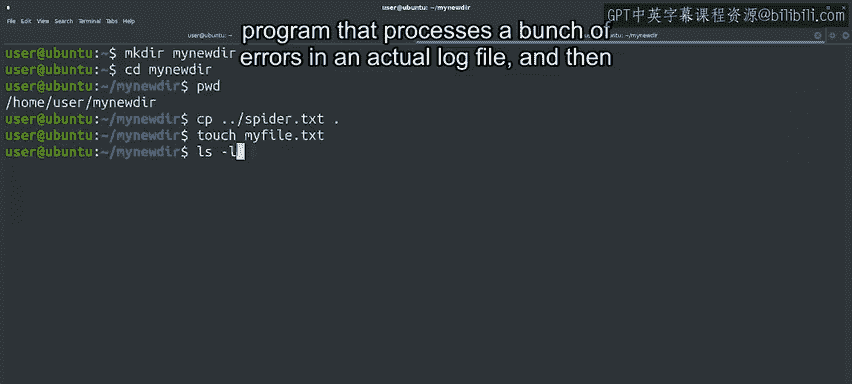
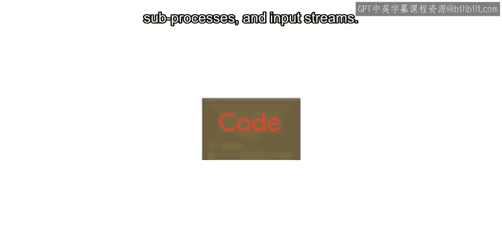
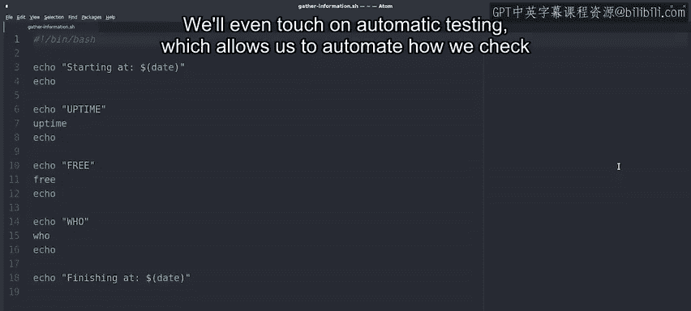
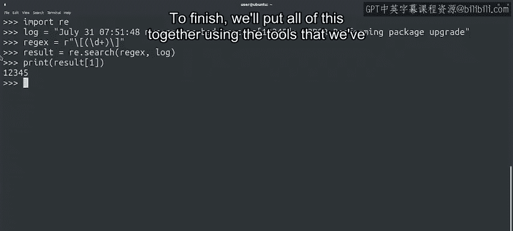
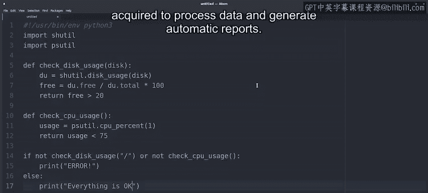

#  074：Python自动化与操作系统控制 🚀

在本节课中，我们将一起了解《用Python进行IT自动化办公》课程的整体框架、学习目标以及课程内容安排。无论你是刚刚完成Python入门课程，还是直接从这里开始，本课程都将帮助你掌握如何利用Python脚本控制操作系统、处理文件与文本，并最终实现自动化任务。

---

## 概述

如果你已经完成了Python入门课程，欢迎回来。如果你跳过了入门课程，这是我们的第一次见面，同样欢迎加入。在IT领域，编程技能能为你打开无数机会的大门。Python脚本是IT工具箱中一个强大的工具，而你已经迈出了学习Python的第一步。

我的名字是Roger Martinez，是Google的硬件系统管理员。我所在的团队负责维护和监控Google硬件工程师用于设计和测试硅芯片的服务器。我非常荣幸能成为本课程的讲师。

本课程由Google独家开发和设计，每门课程都在不同的园区进行，以带给你更多Google的独特体验。请放心，课程内容比我的笑话要扎实得多。

---

## 为什么这门课程对我很重要

多年前，当我在新泽西开始大学生活时，我并不清楚自己想学什么。一位朋友建议我了解一下IT课程。虽然我一直喜欢摆弄电脑，但我从未想过IT能成为我的职业。

当我走进那间教室时，我感到格格不入。教室里没有人和我长相相似，口音相同，或来自相似的背景。第二天，我退出了那门课，再也没有回去。回想起来，我有些后悔那个决定。如果我当时坚持下来，也许下一个走进教室的拉丁裔或其他少数族裔学生就会感到他们属于这里。

多元化的想法、经验和背景对IT行业乃至任何行业都至关重要。多元化的代表性对于向下一代展示他们属于这个领域并能在其中茁壮成长，意义重大。因此，教授这门课程对我而言意义非凡。也许它能以某种方式，帮助更多人推开那扇门，永不回头。

---

## 课程目标与内容

好了，关于我的部分就到这里。让我们来谈谈课程。学完本课程的最后一个视频后，你将能够：

*   操作计算机操作系统上的文件和进程。
*   学习**正则表达式**，这是一个处理文本文件的强大工具。
*   学会使用Linux命令行。
*   编写一个程序，处理实际日志文件中的一系列错误，并生成摘要报告。这是一项超级实用的技能，在本课程结束时你将掌握它。

现在听起来可能有些挑战，但你一定能做到。

---

## 课程大纲

以下是本课程将涵盖的核心内容：

我们将从探索如何在本地执行Python、以及如何跨不同Python文件组织和使用代码开始。

*   **本地执行与代码组织**：学习如何运行Python脚本并管理多文件项目。

接着，我们将学习如何读写不同类型的文件，并使用子进程和输入流。

*   **文件操作与子进程**：掌握使用Python处理文件和与系统命令交互的方法。

我们还将深入探讨Bash脚本和正则表达式，这两者对于系统工作者来说都是非常强大的工具。

*   **Bash脚本与正则表达式**：利用Shell脚本和模式匹配来高效处理文本和系统任务。

我们甚至会接触自动化测试，它允许我们自动检查代码是否正确。

*   **自动化测试**：学习编写测试来验证代码功能，确保自动化脚本的可靠性。

最后，我们将综合运用所学的所有工具来处理数据并生成自动报告。

*   **综合项目：数据处理与自动报告**：将所学技能整合，完成一个实际的自动化任务。

我们还将解释如何在你的机器上设置自己的开发环境，并强烈建议你完成这一步。你需要拥有管理员权限来安装软件，或者请管理员为你安装。设置开发环境是能够编写和部署强大自动化工具的关键一步。

---

## 学习环境与预备知识

在本课程中，我们将使用Quicklabs，这是一个允许你在Linux虚拟机上测试代码的环境。这让你能在需要编写代码解决问题的同时，体验真实的Linux场景。

本课程的示例和练习将使用Linux。Linux是运行服务器的行业标准，因此我们选择了它。不过在某些时候，我们也会讨论在Windows或MacOS上如何完成相同任务，以给你更全面的认识。

虽然我们会大量使用Linux，但你不需要在自己的机器上运行Linux来跟随学习。你需要做的是确保已安装Python，并且知道如何安装额外的Python模块。别担心，我们稍后会详细讲解这些。

你已经学习了编程的基础构建模块。在本课程中，我们将研究你在日常活动中可能遇到的不同任务，并学习如何通过编程来解决它们。

如果你参加了Python入门课程，我打赌你会很快注意到一个不同点：我们将比以前使用更多的**模块**。这里我说的“模块”不是指本课程的章节，而是指我们可以用来为脚本获取额外功能的**Python模块**。

请记住，可能会有些复杂的主题和视频，第一次观看时可能无法100%理解。这完全正常。请慢慢来，如果需要，可以多看几遍视频。我保证你会掌握的。同时，请记住你可以使用讨论区与其他学习者联系，并提出你可能有的任何问题。

---

## 总结

本节课中，我们一起了解了《用Python进行IT自动化办公》课程的意义、讲师背景、核心学习目标以及详细的内容大纲。我们即将共同踏上一段有趣而迷人的Python宇宙之旅。那么，让我们开始吧！😊